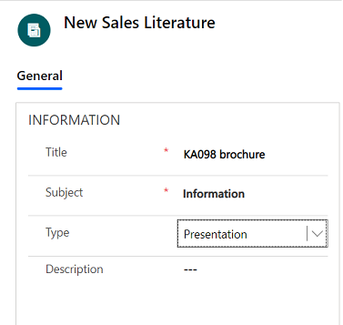
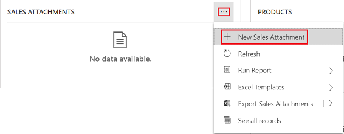

# Manage sales literature

Sales literature in [!INCLUDE[pn-dyn-365-sales](../includes/pn-dyn-365-sales.md)] stores sales-related information such as brochures or detailed specifications of products. Think of sales literature as a central repository for your organization’s sales information (in the form of sales attachments) that lets you share information with other users.

You can associate a sales literature to a competitor or a product.

## License and role requirements

| &nbsp; | &nbsp; |
|-----------------------|---------|
| **License** | Dynamics 365 Sales Enterprise or Dynamics 365 Sales Premium  More information: [Dynamics 365 Sales pricing](https://dynamics.microsoft.com/sales/pricing/) |
| **Security roles** | Salesperson and above    See [Predefined security roles for Sales](security-roles-for-sales.md)|
|||

## Create a sales literature record

1. [!INCLUDE[proc_permissions_admin_cust_mgr_vp_sales_ceo](../includes/proc-permissions-admin-cust-mgr-vp-sales-ceo.md)]  
  
2. Select the site map , and then under **Collaterals**, select **Sales Literature**.

3. Select **New**.

4. Fill in the information such as **Title**, **Subject**, and **Type**. Use the handy tooltips as a guide.

   > [!div class="mx-imgBorder"]
   > 

5. Select **Save**.   

5. In the **Sales Attachments** section, select the **More Commands** button , and then select **New Sales Attachment**. 

   > [!div class="mx-imgBorder"]
   > 

6. In the **New Sales Attachment** form, enter a **Title** and **Abstract** for the attachment, and then select **Choose File** to select a file to be attached.

7. Select **Save** or **Save & Close**.

There are two ways to send the sales literature to other users:

- Select the **Send as Email** option in the **Sales Literature** form.

- Select the **Add Sales Literature** option in [!INCLUDE[pn-dyn-365-app-outlook](../includes/pn-dyn-365-app-outlook.md)]. [!INCLUDE[proc-more-information](../includes/proc-more-information.md)] [Add sales literature or a knowledge base article to a email](../outlook-app/user/add-literature-or-kb.md)

[!INCLUDE[cant-find-option](../includes/cant-find-option.md)] 

### See also  
[Create or edit a competitor record](create-edit-competitor-record-sales.md)  
[Set up a product](create-product-sales.md)  
[User Guide](user-guide.md)

[!INCLUDE[footer-include](../includes/footer-banner.md)]
