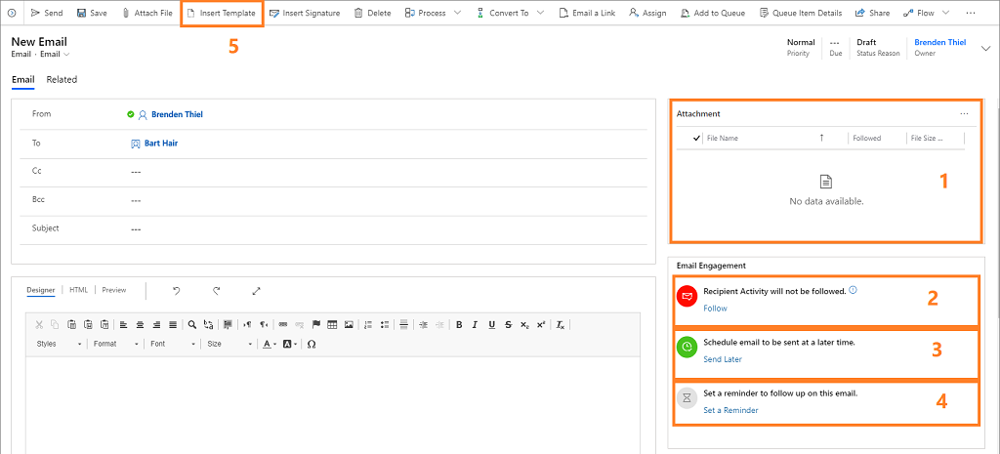
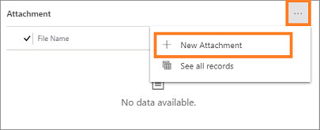
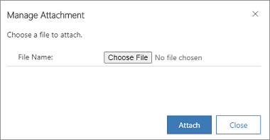
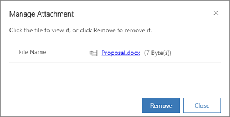
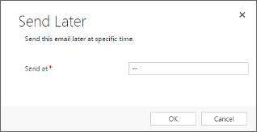
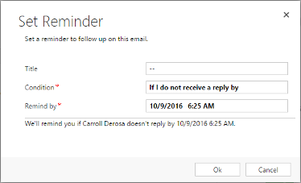

# Create and send email message     

When email engagement is enabled in your organization, all of the controls required to create and send an email with some or all of its features enabled are available on the **New Email** page, as shown in the following image. This page is shown whenever you create an email in Dynamics 365 Sales.  
  
  
  
The following email engagement features are indicated in the image:  
  
1. **Followed (and unfollowed) attachments**: This table lists all of the files attached to your email and indicates the followed status of each of them. Controls for adding, removing, and modifying the attachments are also provided in this area.  
  
2. **Enable/disable following controls**: Here you can enable or disable following for the current message. Additional controls and links are provided here as needed, such as information about recipients that may be configured not to allow following.  

    > [!NOTE]
    > Users can only follow emails through an Email form.
  
3. **Delivery scheduling controls**: Here you can view and set the delivery time for your message. Advise for recommended delivery times can also be shown here, such as information related to the recipient's time zone.  
  
4. **Follow-up reminder controls**: Here you can view and set a follow-up reminder, which might display an alert if the message remains unopened for three days.  
  
5. **Insert Template button**: Select the button to insert standard text for any of several general purposes (such as a meeting follow-up). You can select from various available templates, and email engagement provides advice on which template to choose based on previous performance.  
  
   See the remainder of this article for complete details about how to use these controls.  
  
> [!TIP]
>  The **Email** page doesn't include any features to help you add a link to your message, but if you are using [!INCLUDE[pn_Internet_Explorer](../includes/pn-internet-explorer.md)] then you can do it by selecting  the text you want to add the link to, and then pressing Ctrl-K to open a window where you can define the link target. 

## License and role requirements

| Requirement type | You must have |  
|-----------------------|---------|
| **License** | Dynamics 365 Sales Premium or Dynamics 365 Sales Enterprise  More information: [Dynamics 365 Sales pricing](https://dynamics.microsoft.com/sales/pricing/) |
| **Security roles** | Any primary sales role, such as salesperson or sales manager   More information: [Primary sales roles](security-roles-for-sales.md#primary-sales-roles)|

## Create a new message     

You can activate email engagement features for any email that you send from within Dynamics 365 Sales. The main record for the message (typically the record are looking at when you create it), is set as its **Regarding** value, though the various to, from, and copy-to email addresses can also affect the places where you're able to see the message and where its KPIs may apply.  
  
 To add an email activity to a record:  
  
1.  Open the record you want to add the activity to (typically a contact, opportunity, lead, or account).  
  
2.  In the middle of the page, select **Activities** > **More Commands** > **Email**.  
  
3.  Add recipients, a message subject, and body text as usual. Speed up your writing by using a template if it's appropriate, and use the handy tooltips for help with other settings. See also the other subsections in this section for details about setting up the various engagement features.  
  
4.  When you're ready to send the message, select **Send** (or select **Save** if you want to save a draft and finish it later).  

## Choose and apply the most effective email template     

Email templates are standard messages that you send often, such as introductions, confirmations, thank-you messages, and reminders. They can include dynamic values (such as sender or recipient data). They give you a quick start when you're writing common messages.  
  
The email engagement feature automatically analyzes the performance of all messages sent through Dynamics 365 Sales and identifies your most successful templates. It shows all available templates, but highlights the ones that were found to generate the most opens, replies, or sales.  
  
To use a template:  
  
1.  Create a new message as described previously in [Create a new message](#NewMessage).  
  
2.  On the command bar, select **Insert Template**. When you use a template, you'll  usually choose it right away, immediately after creating the message and before you do anything else.  
  
3.  On the **Insert Template** pop-up window, choose the language and then choose a template from the **Search Template** lookup.   
  
      
  
4.  Select **Select**. Template content is loaded into your message.  
  
5.  Customize the template content as needed and enable any other email engagement features that you want to use, as described in the other sections of this article.  
  
6.  When you're ready to send the message, select **Send** (or select **Save** if you want to save a draft and finish it later).  
  
[!INCLUDE[proc_more_information](../includes/proc-more-information.md)] [Create templates for email](/dynamics365/customer-engagement/admin/create-templates-email)  
  
## Enable or disable following for individual messages     

Followed emails can tell you when a recipient opened the message, replied to the message, opened an attachment, or clicked a link.  
  
When email engagement is enabled on your site, it will also be enabled by default for all messages you create in Dynamics 365 Sales, if none of the recipients are set up to block followed messages. [!INCLUDE[proc_more_information](../includes/proc-more-information.md)] [Set following to Do Not Allow to respect individuals' privacy and preferences](#set-individuals-privacy-and-preferences)  
  
Use the controls at the top of the **Email Engagement** area to view and edit the follow state for your message, as summarized in the following table.  
  
|Follow state|Description|  
|------------------|-----------------|  
||Indicates that the current email will be followed. All links are followed, and followed attachments are enabled (but still optional). This is the default status for all new email messages when email engagement is enabled for your site and all of the recipients allow following. Select the **Don't Follow** link to disable following for this message.|  
||Indicates that the current email won't be followed. No links are followed and followed attachments are also disabled. Select the **Follow** link to enable following (if permitted).|  
||Indicates that one or more of the current email's recipients have following set to Do Not Allow, which means that you can't follow this message unless you remove the recipients that don't allow following (or change their settings). You now have the following options:   -   Select the **View Preferences** link to open a pop-up window that shows the name and following  preference for each recipient. From here you can open any recipient's record by clicking their name in the list. -   If you've attempted to fix the issue by removing recipients or changing settings, then select **Retry Follow** to try again. -   Select **Don't Follow** to stop attempting to follow this message.|  
  
>[!NOTE]
>Within about 15 minutes of the first time a followed message is registered as opened, the system notifies you by creating a new action card for the relationship assistant. The card provides links to the message, related records, and action buttons to generate a call activity, snooze the alert, or dismiss it. [!INCLUDE[proc_more_information](../includes/proc-more-information.md)] [Guide customer communications with assistant](assistant.md).  
  
## Add followed attachments  
  
>[!NOTE]
>To follow attachments, [!INCLUDE[pn_onedrive_for_business](../includes/pn-onedrive-for-business.md)] must be available to your [!INCLUDE[pn_dynamics_crm](../includes/pn-dynamics-crm.md)] server and Document Management for Email must be enabled. Talk to your administrator if you think these features are missing from your server. [!INCLUDE[proc_more_information](../includes/proc-more-information.md)] [Enable Email engagement](configure-email-engagement.md)  
  
Followed attachments can tell you when a recipient opens an attachment. To add one or more followed attachments:  
  
1. Create a new message as described previously in [Create a new message](#NewMessage).  
  
2. Make sure that following is enabled for the message as described previously in [Enable or disable following for individual messages](#EnableTrackingOnMessages). You can't add followed attachments if the message recipients are set to not allow following, but you can still add unfollowed attachments. You can also mix followed and unfollowed attachments in any message that is enabled for following.  
  
3. Select **Save** on the toolbar to save your message. This enables the attachment feature for this message.  
  
4. From the **Attachment** section, select **More Commands** > **New Attachment**.  
  
     
  
    The **Manage Attachment** dialog opens.  
  
     
  
6. Select **Choose File** to open a file-browser window, then locate and select the file.  
  
7. Your selected file name is now shown in the **Manage Attachment** window. Select **Attach** to upload the file, which may take several seconds, depending on its size.  
  
     
  
8. Select **Follow** button to enable tracking of the attachment. The button text changes to **Do Not Follow**, which indicates that the attachment is now being followed (select again to stop following the attachment).
  
9. Select **Close** to close the pop-up window.  
  
10. Your file is now listed in the **Attachment** area. Each attachment listed here indicates its size and follow status.  
  
11. Finish authoring your message, and enable any other email engagement features that you want to use, as described in the other sections of this article.  
  
12. When you're ready to send the message, select **Send** (or select **Save** if you want to save a draft and finish it later).  
  
## Choose the most effective delivery time   

Your email messages may receive more or less attention depending on when they arrive in recipients' inboxes. For example, many people start their day with a full inbox, so messages that arrive overnight must compete with one another for attention and may get put off or even forgotten, while emails arriving later in the day may get noticed and handled right away. Write your email messages when it's convenient for you, but let Dynamics 365 Sales deliver them when it's best for your recipients.  
  
The system will sometimes suggest a recommended delivery time, which works as follows:  
  
- Suggestions are based on the  recipient's time zone.  
  
- The system assumes a standard workday of 8:00 AM to 5:00 PM, Monday to Friday, and suggests the next closest working hour if you're currently working outside of this range in the recipient's time zone.  
  
- No suggestion is provided if you've more than one recipient or if address information isn't available for that recipient.  
  
- [!INCLUDE[pn_bing_maps](../includes/pn-bing-maps.md)] must be enabled for your system to enable the time zone calculation.  
  
If no advice is given, or if you prefer to use your own logic, then you can always specify any delivery time you choose.  
  
You can use this feature both with followed and unfollowed messages.  
  
1. Create a new message as described previously in [Create a new message](#NewMessage).  
  
2. Finish authoring your message, and enable any other email engagement features that you want to use, as described in the other sections of this article.  
  
3. Take a look at the **Send Later** row  in the **Email Engagement** area. If the system has any information that suggests a preferred delivery time, it shows some advice here. Even if no message is shown, you can decide to delay the delivery anyway.  
  
     
  
4. To delay the message, select the **Send Later** link to open the **Send Later** pop-up window.  
  
     
  
   If the system recommended a time or date, then that information is pre-filled, otherwise it shows a blank date and time. In either case, it uses *your local time* (not the recipients'). Use the **Set at** controls here to set your preferred delivery time and date, and then select **OK** to save your setting and close the window.  
  
5. The **Delay Send**  button now turns green, and links for **Change Schedule** and **Remove Delay** are provided in case you need to change the delay or send right away. You can change the schedule anytime from now until it gets sent.  
  
     
  
6. Finish authoring your message, and enable any other email engagement features that you want to use, as described in the other sections of this article.  
  
7. When you're ready to send the message, select **Send**.  
  
   To specify a delayed send time for a message:  
  
>[!NOTE]
>Scheduled messages are listed as such in the **Activities** list for the **Regarding** record. Until the scheduled time arrives, you can still delete or reschedule the message from there. You can also edit the follow-up reminder date or time, but all other settings are read-only once you select **Send**.  
  
## Set a message follow-up reminder  

 Do you want to be reminded to follow up on an important email for some reason? Then set a follow-up reminder.  
  
1. Create a new message as described previously in [Create a new message](#NewMessage).  
  
2. Finish authoring your message, and enable any other email engagement features that you want to use, as described in the other sections of this article.  
  
3. Select **Set Reminder** link under the **Email Engagement** heading.  
  
     
  
4. The **Set Reminder** pop-up window opens.  
  
     
  
5. Enter a **Title** for your reminder. This is the text that you see when the reminder is triggered, so enter enough text to ensure that you know what the reminder is about when the time comes.  
  
6. Use the **Condition** drop-down list to choose one of the following reminder conditions:  
  
   - **If I do not receive a reply by**: Triggers the reminder if no reply has been received by the specified time and date (only available for followed messages).  
  
   - **If the email is not opened by**: Triggers the reminder if the message hasn't been opened by the specified time and date (only available for followed messages).  
  
   - **Remind me anyway at**: Triggers the reminder at the specified time and date, no matter what.  
  
7. Use the **Remind by** setting to establish the date and time you would like the reminder to be shown, provided the **Condition** is met.  
  
8. Select **OK** to save the reminder.  
  
9. The **Set Reminder** button now turns blue, and a short summary of your reminder settings is shown (once the reminder time passes, this text updates to indicate this). The link text next to the button now reads **Change Reminder**, and a **Remove Reminder** link is also added. As the names suggest, you can select here to edit or remove the reminder.  
  
     
  
10. Finish authoring your message and enable any other email engagement features that you want to use, as described in the other sections of this article.  
  
11. When you're ready to send the message, select **Send**.  
  
    When the reminder gets triggered, the system notifies you by creating a new action card for the Relationship Assistant. The card is given high priority, so you should see it right away. The card provides links to the message, related records, and action buttons to dismiss or snooze the alert. [!INCLUDE[proc_more_information](../includes/proc-more-information.md)] [Guide customer communications with assistant](assistant.md).  

[!INCLUDE [cant-find-option](../includes/cant-find-option.md)]

### See also

[Enable email engagement](configure-email-engagement.md)  
[View message interactions with email engagement](email-engagement.md)  
[Understand email history](understand-email-history.md)    
[Configure privacy and preferences](configure-individuals-privacy-preferences.md)

