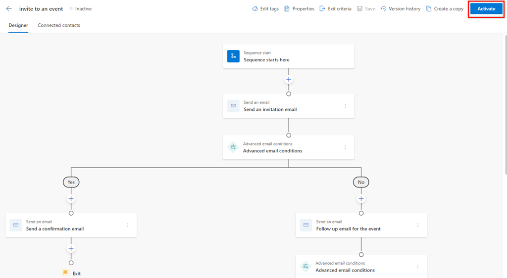
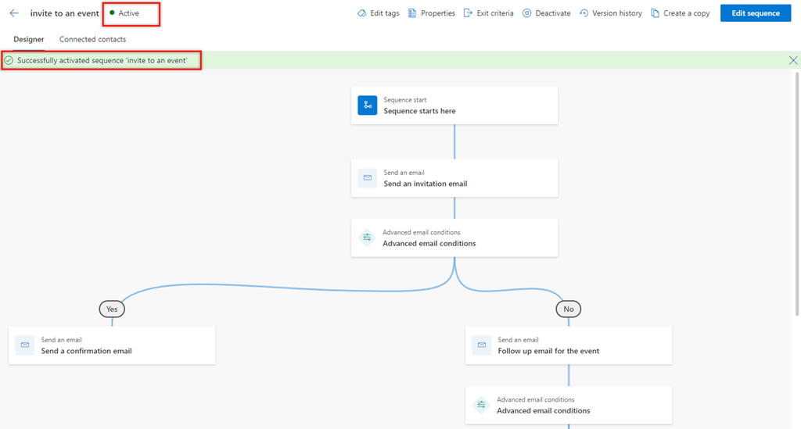

# Create and connect sequence for yourself

Create sequences to automate your work and personalize communication while reaching out to prospects.

## License and role requirements
| Requirement type | You must have |
|-----------------------|---------|
| **License** | Dynamics 365 Sales Enterprise, Dynamics 365 Sales Premium, or [Microsoft Relationship Sales](https://dynamics.microsoft.com/en-in/sales/relationship-sales/)  More information: [Dynamics 365 Sales pricing](https://dynamics.microsoft.com/sales/pricing/) |
| **Security roles** | Salesperson    More information: [Predefined security roles for Sales](security-roles-for-sales.md)|

## What is a sequence?

Sequences enforce best practices by introducing a set of consecutive activities for you to follow during the course of your day. You can create and connect sequences to records such as, leads, opportunities, and accounts, that appear in your work queue, to help prioritize activities to focus on selling, be more productive, and better align to business processes.     
When you create a sequence, you define a set of activities that you want to perform&mdash;and the order to perform them in&mdash;as they handle records. This lets you concentrate on selling and gives you a better understanding of what to do next.   

## Permissions required to create and connect sequences

- When Sales accelerator workspace is not enabled in your organization, you can create and connect sequences through the **Salesperson** role. Also, delete and edit the sequences that you have created.

- When Sales accelerator workspace is enabled in your organization and the access is restricted to specific security roles, then only the users with that specific roles can create and connect the sequences. To get access to create and connect sequences, contact your administrator to provide permissions for your security role. More information: [Manage access and record type](enable-configure-sales-accelerator.md#manage-access-and-record-type).   

>[!NOTE]
>If you have the the Sequence Manager role and to create sequences, go to [Create and activate a sequence](create-and-activate-a-sequence.md).

## Who has access to my sequences?

The sequences that you create are available for your business unit. Other sellers can only view, connect, or create a copy of your sequence. However, administrators and users with **Sequence Manager** role have all the privileges such as, edit and delete to the sequence.  

## How to create sequences?

Create sequences using the sequence designer. To access the sequence designer, use the following ways:

- [Personal settings](#personal-settings)
- [Up next widget](#up-next-widget)
- [Record grid view](#record-grid-view)

### Personal settings

Personal settings is the recommended way to access the sequence designer. Here, you can create, edit, delete and connect sequences.   

**To access the sequence designer**:

1. Sign in to your sales app, and in the lower-left corner of the page, go to **Change area** > **Personal settings**.    
       
2. On the **Personal settings** page, under **Sales accelerator** > **Sequence** and select **+ New sequence**.    
    
    :::image type="content" source="media/sequence-seller-select-new-sequence-sequences-page.png" alt-text="Screenshot of the sequences page to select new sequence.":::
        
    The **Create a sequence** dialog opens. To continue creating the sequence, go to [Create sequence](#create-sequence).
    
### Up next widget

The **Up next** widget is available on the out-of-the-box contact, opportunity, lead, and account forms. When you open a record, by default, the main form displays the **Up next** widget. For example, whe you open a lead record, the **Lead** form displays the **Up next** widget. 
        
:::image type="content" source="media/sequence-seller-connect-sequence-upnext-widget.png" alt-text="Screenshot of the up next widget to connect sequence.":::

When a sequence is not connected to a record, the **Up next** widget displays a message to connect a sequence.  

Select **Connect *record type* to a sequence** and the **Connect *record type* to sequence** dialog opens. In this example, we opened the connect sequence dialog for leads which has no sequences.
    
:::image type="content" source="media/sequence-seller-connect-lead-sequence.png" alt-text="Screenshot of the connect lead to sequence.":::

>[!NOTE]
>If sequences are available for the record type, the list is displayed. To create a sequence, select **Create new sequence**. 

Select **Create a new sequence** and the **Create a sequence** dialog opens in a new tab. To continue creating the sequence, go to [Create sequence](#create-sequence)

### Record grid view

While connecting a record to a sequence, you can create a new sequence, if there are no sequences available for the record type or the existing list doesn't meet your requirements.

Open the record type such as, lead, contact, or opportunity in the grid view for which you want to create the sequence. Select a record and then select **Connect sequence**. In this example, we opened the **Accounts** grid view and connecting a sequence.

:::image type="content" source="media/sequence-seller-accounts-grid-connect-sequence.png" alt-text="Screenshot of the account grid view to connect a sequence."::: 

The **Connect account to sequence** dialog opens. 

>[!NOTE]
>If sequences are available for the record type, the list is displayed. To create a sequence, select **Create new sequence**. 

Select **Create a new sequence** and the **Create a sequence** dialog opens in a new tab. To continue creating the sequence, go to [Create sequence](#create-sequence)

## Create sequence

Now that you're in the process of creating the sequence, follow these steps:

1. On the **Create a sequence** dialog, select one of the following options to create the sequence:  
    
    - **Use template**: Use the templates to quickly set up sequences. Sequence templates provide a set of activities to guide sellers with the next best action to take to achieve a task, such as getting introduced to a lead and winning the deal. More information: [Sequence templates](sequence-templates.md)  
    When using the Up next widget or record grid view to create sequence, the templates displayed here are relevant for that record type.    

    - **Start from blank**: Use a blank sequence to create a sequence from scratch.   
        
    :::image type="content" source="media/sequence-select-option-create-sequence.png" alt-text="Select an option to create a sequence.":::
    
2. In the **Define sequence properties** dialog, enter the following information.

    | Parameter | Description |
    |-----------|-------------|
    | Sequence name | The name of the sequence. |
    | Description | A description of the sequence. (Optional) |
    | Entity | The entity type for which you want to apply this sequence. By default, the Lead entity type is selected. |   

    :::image type="content" source="media/sequence-create-sequence.png" alt-text="Create a sequence dialog.":::

3. Select **Next**.     
    The sequence designer page opens.

    > [!div class="mx-imgBorder"]
    >    

    By default, the **Sequence start here** step is added to sequence as the first step.  

4. After the **Sequence start here** step, select the **Add** icon (**+**) and configure the sequence steps.
    
    For a sequence, the steps are categorized into the following four groups:
    - **Steps**: The step in a sequence is an engagement task that a seller performs for sales outreach such as, email, phone call, and task. More information: [Add steps to sequence](steps-sequence.md)
    - **Conditions**: The condition step in a sequence determines the next course of action that the sequence will take after the condition is either met or not, based on the completed activity. More information: [Add the conditions steps](adaptive-sequence.md)
    - **Commands**: The command step in a sequence determines the next course of action according to the value given in the field or the stage of a business process. More information: [Add command steps to sequences](command-sequence.md)  
    - **LinkedIn**: The LinkedIn activity step in a sequence allows sellers to diversify their day-to-day activities by including the social selling functions. You can use LinkedIn's vast network with recommended actions that your sellers can take to build deeper connections. More information: [Add LinkedIn activities to sequence](linkedin-activities-sequence.md)
       
5. Select the **Add** icon, and then repeat step 4 for all the activities that you want to add to the sequence.
6. Save the sequence.  

Now, you can activate the sequence. 

## Activate sequence

1. Open a sequence and then select **Activate**.
    >[!NOTE]
    >You can have up to 250 active sequences at a time in your organization.        

    > [!div class="mx-imgBorder"]
    >   

1. Select **Activate** in the confirmation message that appears.   
    > [!NOTE]
    > An error might occur if you've added **Set wait time** as the last activity of the sequence. You must delete this last **Set wait time** activity, and then save and activate the sequence.       

    The sequence is activated and listed in the sequence designer home page. Also, you can see the status of the sequence beside the name and a confirmation message.  

    > [!div class="mx-imgBorder"]
    >   

Next, you connect the active sequence to records. 

## Connect sequences to records

More information: [Connect a sequence to records](connect-a-sequence-to-records.md)

 

