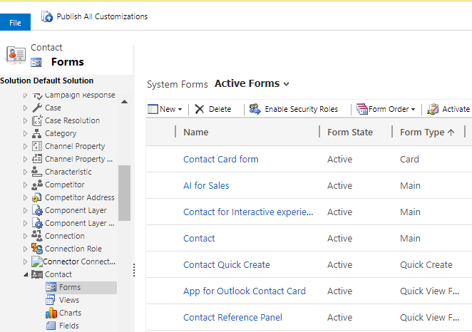
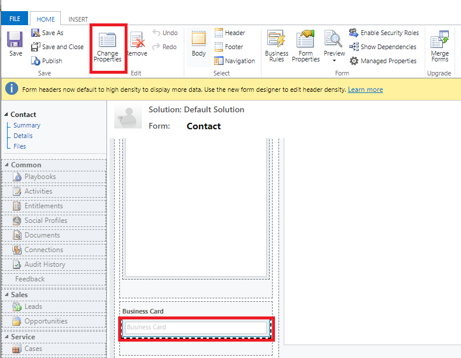
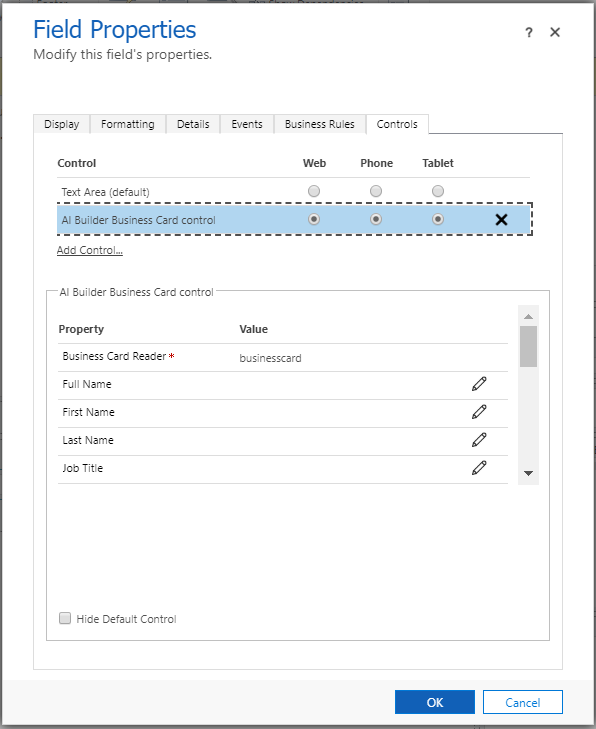

# Customize the business card scanner control
 
Customize how the data from the scanned business cards maps to the fields in the **Contact** and **Lead** forms.

## License and role requirements

| &nbsp; | &nbsp; |
|-----------------------|---------|
| **License** | Dynamics 365 Sales Enterprise or Dynamics 365 Sales Premium  More information: [Dynamics 365 Sales pricing](https://dynamics.microsoft.com/sales/pricing/) |
| **Security roles** | System Administrator   See [Predefined security roles for Sales](security-roles-for-sales.md)|
|||

[!INCLUDE[cc-data-platform-banner](../includes/cc-data-platform-banner.md)]

## Customize the mapping

Dynamics 365 Sales comes with an out-of-the-box business card control that defines the mapping of what information from the business card goes in which fields of the **Contact** or **Lead** forms. If you have custom fields on your **Contact** or **Lead** form and you want the data from the business card to be populated in these fields, edit the default mappings of the business card control.

> [!IMPORTANT]
> - To learn about the availability of the business card feature in a region, see [Feature availability by region](/ai-builder/availability-region#availability-and-release-status-of-features-by-region).
> - To know about the business card scan limits with your user license, see the [Microsoft Dynamics 365 Licensing Guide](https://go.microsoft.com/fwlink/p/?LinkId=866544).

To customize the mappings:

1.  In your app, select the **Settings** icon, and then select **Advanced Settings**.

    > [!div class="mx-imgBorder"]
    > 

    The **Business Management** page opens.

2.  On the navigation bar, select **Settings**, and then under **Customization**, select **Customizations**.

3.  Select **Customize the System**.

4.  Under **Components** in the solution explorer, expand **Entities**, and then expand the **Contact** or **Lead** entity.

5.  Select **Forms**.

    > [!div class="mx-imgBorder"]
    > 

6.  Open the form of type **Quick Create**.

7.  Locate and select the **Business Card** field on the form, and select **Change Properties** in the **Edit** group.

    > [!div class="mx-imgBorder"]
    > 

8.  In the **Field Properties** dialog box, select **AI Builder Business Card control** on the **Control** tab.

    > [!div class="mx-imgBorder"]
    > 

9.  Select the property that you want to change the mapping for, and select the **Edit** icon  to change the value the field maps to.
10. When done, select **OK**.

> [!NOTE]
> Salespeople must have the Microsoft Dataverse User role assigned to them to use the business card scan control.

[!INCLUDE [cant-find-option](../includes/cant-find-option.md)]

### See also

[Scan business cards](scan-business-cards.md)  
[Use the business card reader in model-driven apps](/ai-builder/business-card-reader-component-model-driven)

[!INCLUDE[footer-include](../includes/footer-banner.md)]
