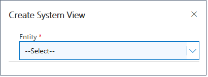
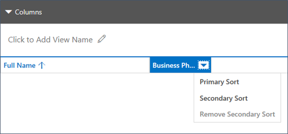
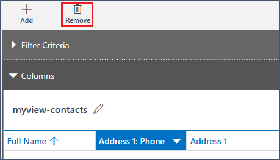

# Customize views 

In Dynamics 365 Sales, use views to define how a list of records for a specific entity is displayed. 

## License and role requirements

| &nbsp; | &nbsp; |  
|-----------------------|---------|
| **License** | Dynamics 365 Sales Premium, Dynamics 365 Sales Enterprise, or Dynamics 365 Sales Professional  More information: [Dynamics 365 Sales pricing](https://dynamics.microsoft.com/sales/pricing/) |
| **Security roles** | System Administrator, Sales Manager, Sales Professional Manager, and above    See [Predefined security roles for Sales](security-roles-for-sales.md)|
|||

## What's a view

A view defines: 

-   The columns to be displayed.

-   The width of columns displayed.

-   How the list of records is sorted by default. 

-   What default filters are applied to restrict which records will appear in the list. 

The records that are visible in individual views are displayed in a list, sometimes called a grid, which frequently provides options so that people can
change the default sorting, column widths, and filters to more easily see the data that’s important to them. Views also define the data source for charts that
are used in the application. 

## Types of views 

There are two types of views in Dynamics 365 Sales: 
- **System or public views** 

    System or public views are views that are included with the app or that are created by customizers and made available to some or all users. As a system administrator or system customizer, you can edit the views. System or public views are special views the application depends on, which exist for system entities or are automatically created when you create custom entities. These views have specific purposes and some additional capabilities.

- **Personal views** 

    Personal views are created by individual users. They are visible only to that user or to other users they choose to share their personal views with. As a user, you can create a new personal view based on a system or public view. You can't create a system or public view based on a personal view. 

## Create a system view

Depending on the license you have, select one of the following tabs for more information:

# [Sales Premium and Sales Enterprise](#tab/SE)

1. Sign in to [Power Apps](https://make.powerapps.com/).

2. Follow the instructions in [Create and edit public or system model-driven app views](/powerapps/maker/model-driven-apps/create-edit-views-app-designer?context=/dynamics365/context/sales-context) to create views.  

# [Sales Professional](#tab/SP)

This topic covers how to create system views as a customizer. 

### Open a system view

1.  In the site map, select **Sales Settings**.

2.  Under **Customization**, select **Views**.

    

3.  In the **Name** column, select the view to open it. Or, if you want to search for a view, under **List of system views** in the upper-left corner, in the **Search for records** box, enter all or part of the name of the view you want to search for, and then choose the magnifying glass icon. 

    

  
### Create a new system view

You can create your own views, specific to your organization's practices and processes. 

1.  In the site map, select **Sales Settings**.

2.  Under **Customization**, select **Views**.

3.  On the **Views** page, select **Create New** in the upper-right corner. 

4.  Select the entity to use for the view. 

    

5.  Select **Go to View Designer** at the bottom of the pane.

    

6.  To add a name, which is the name displayed in the list of views:

    1.  Select **Click to Add View Name** in the upper-left corner of the screen. 

    2.  Enter the name for your view. 

        The name is set when you click or tab outside the text box. You can change the name later by clicking it again, or by changing it in the **Properties** tab. 

### Add a column to your view

Views display records in a table that contains rows and columns. Each row is a record, and the fields from the records are determined by the columns you add to
the view. 

1.  In the designer, select **Add** in the upper-left corner.

2.  Select **Primary Entity** or **Related Entity** to display the list of available fields on the **Components** tab. 

3.  Do one of the following:

    -   Double-click the name of the field you want to add. It will be added as the last column in the view.

    -   Drag the field onto the grid. You can drag the field to position it before an existing column when you add it.

    -   Select the field and press Enter.

-   You can also move the columns around after they are added to your view. 

### Set column width

After adding the columns, you can change the width of the column. 

1.  Select the column in the view.

2.  In the **Properties** tab, set the width to the value you want by using the arrows to increase or decrease the column width.

### Set the primary and secondary column sort order

When a view is opened, the records displayed are sorted in the order you set when creating the view. You can sort on a single column or sort on two
columns with a primary and secondary sort order. When the view is opened, the records are sorted by the column defined as the primary sort, and then
by the column defined as the secondary sort.  

>[!NOTE]
>You can only set primary and secondary sort on columns from the primary entity. 

1.  Select the column to use as the primary or secondary sort. 

2.  In the drop-down menu, select **Primary Sort** or **Secondary Sort**. 

    

    > [!NOTE]
    > If you remove the column defined as the primary sort, the column defined as the secondary sort becomes the primary sort. 

### Set the order for the primary sort 

You can set the sort order to ascending or descending for the column defined as the primary sort column: 

1.  Select the column set as the primary sort. 

2.  Choose the arrow next to the name to change the order. 

    

When the arrow is pointing up, the sort order is ascending. When the arrow is pointing down, the sort order is descending. 

<!--note from editor: some of the co. names in the graphic above, eg "Litware" and "Coho Winery" not on approved list that I have access to on the CELA website.  -->

### Rearrange columns in a view 

You can change the order of the columns already included in your view. 

1.  Select the column you want to move.

2.  Drag the column to the position you want to move it to. 

    You will see a visual indicator when you hold the column over an allowed position. 

    

  
>[!NOTE]
>You can also rearrange columns by using the Ctrl+X and Ctrl+V keyboard shortcuts.

### Remove a column from a view 

You might want to remove a column from a default system view, or one that you added to a form but no longer want to use. 

1.  Select the column you want to remove. 

2.  Select **Remove**. 

    
   

### Define filter criteria 

You can set filter criteria so that only a subset of the records is displayed in a view. When someone opens the view, only the records that meet the defined
filter criteria are displayed. You can select fields from both the primary and related entities to filter on. 

1.  In the designer, expand the **Filter Criteria** section.

    

2.  Select **Add Filter**. 

3.  In the **Select** drop-down, select the field you want to filter on. 

4.  In the drop-down list in the second column, select the operator to use for the filter. The available operators depend on the selected field. 

    

5.  Enter a value to filter on in the field in the third column. 

### Group multiple filters

You can add multiple filters to your view if you want to filter records using
more than one field, and then group on fields: 

1.  Select **Add Filter** to add an additional filter to your view. 

2.  Select the operator to use and enter a value to filter on. 

3.  Select the check box next to each row of filter criteria. 

    

4.  Select **Group And** or **Group Or** to group the filters. 

    When you select **Group And**, records that meet both criteria are displayed in the view. When you select **Group Or**, records that meet any of the
    filter criteria are displayed. For example, in the preceding example, to show records for contacts with an address in Seattle or Portland, select **Group Or**. 

### Remove a filter group 

1.  Select the check box for the group. 

2.  Choose **Ungroup**. 

    

### Save a view 

As you are working on your view, save it often to avoid losing any changes. 

-   In the designer, choose one of the following in the upper-right corner:

    -   To save without closing the designer, select **Save**

    -   If you're finished customizing your view, select **Save and Close**.   
    
    >[!NOTE]
    >To make a copy of your view, select **Save As** to save the current view with a different name.   

### Publish a system view 
----------------------

When you're finished creating or updating a view, you need to publish it so people in your organization can use it: 

1.  Open the view you want to publish.  

2.  In the designer, select **Publish**. 

---

## Create a personal view

Create personal views with columns and filters that are relevant for you. You can open an existing view and modify the columns, apply filters, and save it as a personal view.

More information:
- [Edit columns in the view](/powerapps/user/grid-filters-advanced#column-editor)
- [Apply filters](/powerapps/user/grid-filters-advanced#filter-editor)
- [Create a personal view](/powerapps/user/grid-filters-advanced#create-personal-views)

[!INCLUDE [cant-find-option](../includes/cant-find-option.md)]

### See also

[Customize forms](customize-forms.md)  
[Customize business process flows](customize-business-process-flows.md)

[!INCLUDE[footer-include](../includes/footer-banner.md)]
