# Customize the ZoomInfo app     

After you install the ZoomInfo app, it's available as a standalone app, so every time sellers must come back to the app selection area and choose ZoomInfo to view the required information. 

As an administrator, you can customize the ZoomInfo app in the following ways:   
-	**Add ZoomInfo entry to the site map**: You can add the ZoomInfo entry to your Dynamics 365 Sales environment on the left navigation site map and provide easy access to ZoomInfo, including the Admin Portal and ZoomInfo Knowledge Center. More information: [Add ZoomInfo entry to site map](#add-zoominfo-entry-to-site-map).
-	**Add ZoomInfo form to table entities**: You can add the ZoomInfo form to standard or custom Account, Contacts, and Leads table entities to provide sellers with inline access to ZoomInfo data. More information: [Add ZoomInfo form to entities](#add-zoominfo-form-to-table-entities).

## License and role requirements

| &nbsp; | &nbsp; |
|-----------------------|---------|
| **License** | Dynamics 365 Sales Premium or Dynamics 365 Sales Enterprise  <br>More information: [Dynamics 365 Sales pricing](https://dynamics.microsoft.com/sales/pricing/) |
| **Security roles** | System Administrator <br> See [Predefined security roles for Sales](security-roles-for-sales.md)|
|||

## Prerequisites
Before you start, be sure you've met the following prerequisites:
-	The system administrator role is assigned to you. More information: [Assign a security role to a user](/power-platform/admin/create-users-assign-online-security-roles#assign-a-security-role-to-a-user).   
-	The ZoomInfo app is installed on your Dynamics 365 Sales organization. More information: [Install ZoomInfo app](install-zoominfo-app.md).   

## Add ZoomInfo entry to site map
By adding ZoomInfo entry to the left navigation site map of your Dynamics 365 Sales app, you allow sales teams to perform searches and administrators to access the Admin Portal in order to configure export preferences, custom mapping, and other settings. You can also add site map entry to the ZoomInfo Knowledge Center. 

**To add the entry to the site map:**  

1.	Sign in to the [Power Apps portal](https://make.preview.powerapps.com/) and choose the organization in which you’ve installed the ZoomInfo app.
2.	On the left navigation pane, select **Apps**. A list of apps that are available in the environment is displayed.    
3.	Select the **Sales Hub** app and then select **More options** (**…**) > **Edit**.   
    
    > [!div class="mx-imgBorder"]
    > 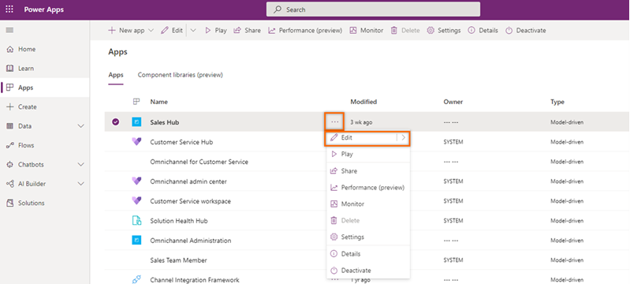

4.	On the App Designer page, under **Site Map**, select the pencil icon.
    
    > [!div class="mx-imgBorder"]
    > 
 
5.	Choose an existing area or add a new area to the site map and then, from the **Components** tab, drag and drop **Group**.
    
    > [!div class="mx-imgBorder"]
    > 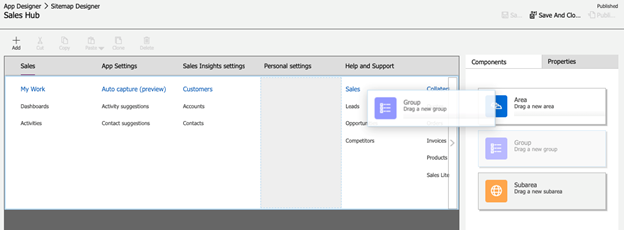
 
6.	On the **Properties** tab, under the **General** section, add the following group information:

    | Field | Description |
    |-------|-------------|
    | Title | Specifies the name of the group. Enter **ZoomInfo** as the title. |
    | ID | Specifies the unique identification number for the group. Use the default value. |

    > [!div class="mx-imgBorder"]
    > 

7.	Select the added ZoomInfo group and then, on the right pane under the **Components** tab, drag and drop the **Subarea**.

    > [!div class="mx-imgBorder"]
    > 
 
8.	Select the added subarea and then, on the right pane under the **Properties** tab, enter the following information to add **ZoomInfo** site map entry:

    | Field | Description |
    |-------|-------------|
    | Type | Web Resource |
    | URL | ZoomInfo |
    | Title | ZoomInfo |

    > [!div class="mx-imgBorder"]
    > 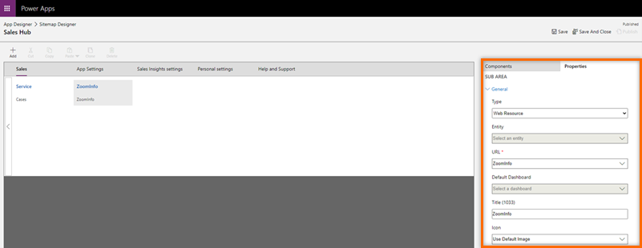

9.	Repeat **steps 7 and 8** to add site map entry to the **ZoomInfo Knowledge Center**. Enter the following information to the subarea:

    | Field | Description |
    |-------|-------------|
    | Type | URL |
    | URL | ```https://university.zoominfo.com/pages/knowledge-center-zoominfo-for-sales-home``` |
    | Title | Knowledge Center |

10.	Save and publish the changes.    
11.	(Optional) To verify the successful addition of the ZoomInfo site map, open the Dynamics 365 Sales Hub app. The ZoomInfo Group you added should be shown in the left navigation pane.

    > [!div class="mx-imgBorder"]
    > 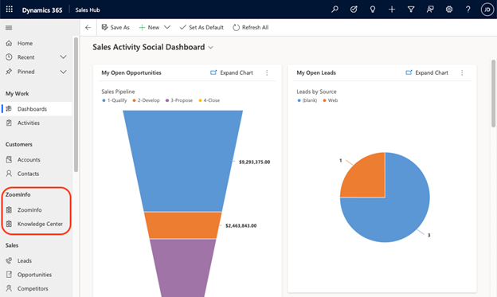   

## Add ZoomInfo form to table entities    
You can add the ZoomInfo form to standard or custom Account, Contacts, and Leads table entities. This allows sellers to access the ZoomInfo data without moving away from records.

To do this, follow this sequence of steps:
1.	[Create a solution](#create-a-solution)
2.	[Add solution components to table entity](#add-solution-components-to-table-entity)
3.	[Add form to table entity](#add-form-to-table-entity) 
4.	[Customize form components](#customize-form-components)

### Create a solution   
Create a solution to locate and work with the components you’ve customized and then apply them to your Dynamics 365 environment. This makes it easier to return to your custom solution to make future changes.  

**To create a solution:**    
1.	Sign in to the [Power Apps portal](https://make.preview.powerapps.com/) and choose the organization in which you’ve installed the ZoomInfo app.
2.	On the left navigation pane, select **Solutions**.   
3.	Select **+ New solution** and on the **New solution** pane, enter the information as described in the following table:    

    | Field | Description |
    |-------|-------------|
    | Display Name | The name shown in the list of solutions. You can change this later. |
    | Name | The unique name of the solution. This is generated using the value you enter in the Display Name column. You can edit this before you save the solution, but you can't change it once it's been saved. |
    | Publisher | You can select the default publisher or create a new publisher. We recommend creating a publisher for your organization to use consistently across the environments where you'll use the solution. |
    | Version | Enter a number for the version of your solution. This is only important if you export your solution, as the version number will be included in the file name. |

    > [!div class="mx-imgBorder"]
    > 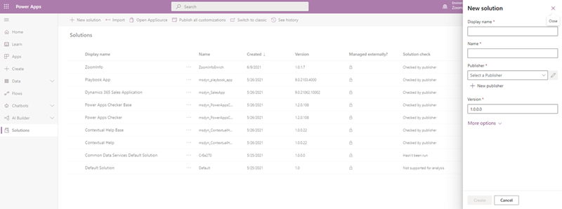   

4.	Select **Create**.  
    
    The new solution is created and listed in the solutions.

### Add solution components to table entity    
You can now add components that aren’t available in the solution. In this example, we're adding a table component to Account, Contacts, and Leads entities.   
1.	Open the solution you've created and select **Add existing** > **Table**.    

    > [!div class="mx-imgBorder"]
    >    

2.	On the **Add existing tables** pane, add the tables **Account**, **Contacts**, and **Leads**.

    > [!div class="mx-imgBorder"]
    > 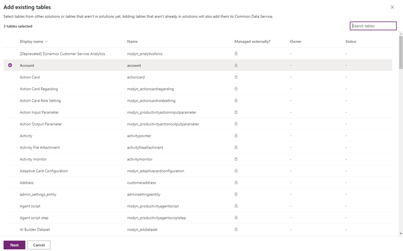   

3.	Select **Next**.    
    
    The three tables you selected are displayed.

### Add form to table entity   
Now that you've added the Account, Contacts, and Leads table entities to the solution component, add the form component for each table entity.    
1.	Under the **Account** section, select **Select components**.

    > [!div class="mx-imgBorder"]
    > 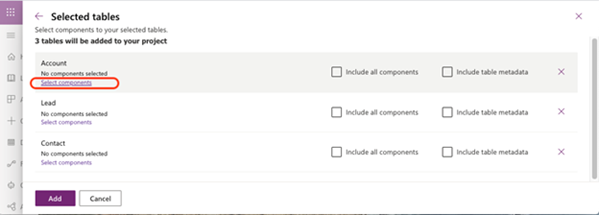   
 
2.	On the **Account** pane, select the **Forms** tab and then select **Account**.

    > [!div class="mx-imgBorder"]
    > 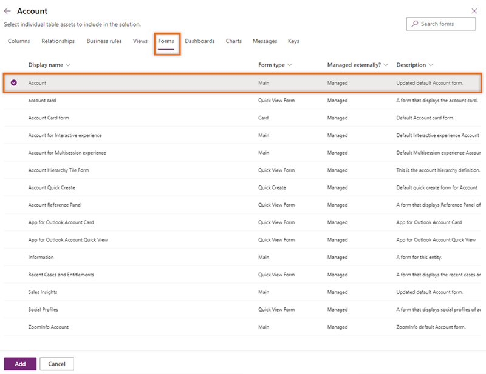   
 
3.	Select **Add**.   
    
    Under the **Account** section, you will see the message **1 form selected**, indicating that you've added the account form to the **Account** table.   

    > [!div class="mx-imgBorder"]
    > 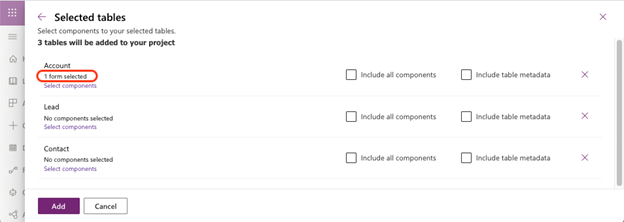   
 
4.	Repeat **steps 1 through 3** for the **Contact** and **Lead** table entities to add the corresponding contact and lead form to each.  
  
6.	Select **Add**.

    > [!div class="mx-imgBorder"]
    > 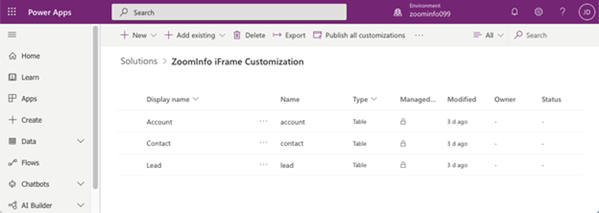

### Customize form components   
Now that you've added the forms to the table entities, you can customize how the ZoomInfo inline pages will display within the standard form component used with your Account, Leads, and Contacts pages. Perform the customization in classic mode.

1.	From the form page of the **Account** form, select **Switch to classic**.

    > [!div class="mx-imgBorder"]
    >    
 
2.	Select the **Insert** tab and then select **One column**.

    > [!div class="mx-imgBorder"]
    > 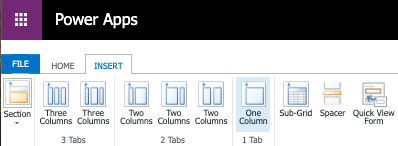   
 
    A new column is added as a **Tab**.

    > [!div class="mx-imgBorder"]
    > 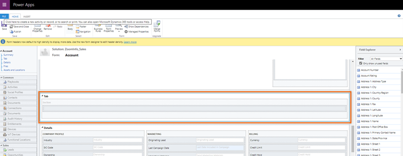   
 
3.	Select the **Tab** and then select **Change Properties**. The **Tab Properties** dialog opens.

    > [!div class="mx-imgBorder"]
    >    
  
4.	Enter the values for **Name** and **Label** as **ZoomInfo**, and then select **OK**. The tab is then renamed as **ZoomInfo**.

6.	Go to the **INSERT** tab in the **ZoomInfo** tab. Select the **Section** area and then select **Web Resource**. 
    The **Add Web Resource** dialog opens.

    > [!div class="mx-imgBorder"]
    > 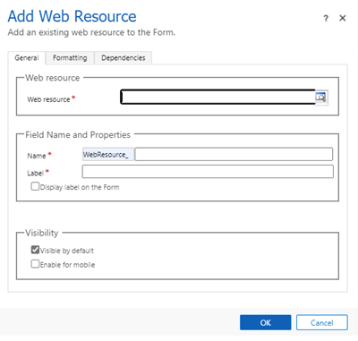   
 
6.	Under the **General** tab, enter the following information:   
    -	In the **Web resource** section, search and add the `zi_InlineIframe.html` file that is built into the ZoomInfo for Dynamics 365 app.
    -	In the **Field Name and Properties** section, enter the **Name** and **Label** as **ZoomInfo**.
    -	In the **Web Resource Properties** section, check to select the **Pass record object-type code and unique identifier as parameters** option. This option helps ZoomInfo with the object type passed to perform data matches.

    > [!div class="mx-imgBorder"]
    > 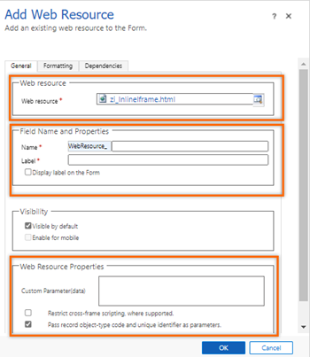   
 
7.	Under the **Formatting** tab, in the **Row Layout** section, change the **Number of Rows** value to **16** to accommodate the ZoomInfo data.  

    > [!div class="mx-imgBorder"]
    >    
 
8.	Select **OK**.
9.	Save and publish the form.   
    
    The **ZoomInfo** tab is added to the **Accounts** form. To verify, go to Dynamics 365 Sales Hub app and open the standard account page for a company. The **ZoomInfo** tab should be added to the account.  

    > [!div class="mx-imgBorder"]
    > 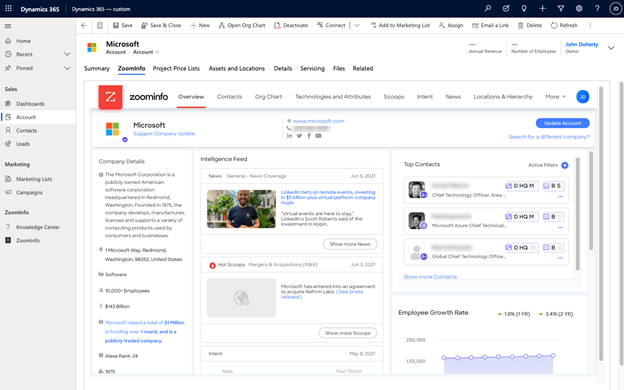   
 
10.	Repeat **steps 1 through 9** for the **Contact** and **Leads** forms.

[!INCLUDE[cant-find-option](../includes/cant-find-option.md)] 

### See also

[Install ZoomInfo app](install-zoominfo-app.md)   

[!INCLUDE[footer-include](../includes/footer-banner.md)]
