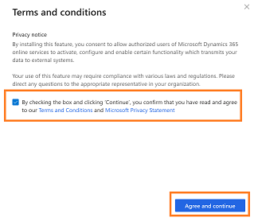

# Improve seller coaching and sales potential with conversation intelligence 

Conversation intelligence uses analytics and data science to gather data from sellers' call recordings and Dynamics 365 Sales. Conversation intelligence analyzes the data to provide you with the information and insights to intelligently manage your sales team and proactively coach sellers. To achieve this, conversation intelligence displays relevant key performance indicators (KPIs) and intelligent call data KPIs by team, seller, and call.

## License and role requirements
| Requirement type | You must have |
|-----------------------|---------|
| **License** | Dynamics 365 Sales Premium or Dynamics 365 Sales Enterprise  More information: [Dynamics 365 Sales pricing](https://dynamics.microsoft.com/sales/pricing/) |
| **Security roles** | Any primary sales role, such as salesperson or sales manager   More information: [Primary sales roles](security-roles-for-sales.md#primary-sales-roles)|

## How can I use conversation intelligence

>[!VIDEO https://www.microsoft.com/en-us/videoplayer/embed/RE4Ub4r]

>[!IMPORTANT]
>This feature is intended to help sales managers or supervisors enhance their team's performance. This feature isn't intended for use in making&mdash;and shouldn't be used to make&mdash;decisions that affect the employment of an employee or group of employees, including compensation, rewards, seniority, or other rights or entitlements. Customers are solely responsible for using Dynamics 365, this feature, and any associated feature or service in compliance with all applicable laws, including laws relating to accessing individual employee analytics and monitoring, recording, and storing communications with end users. This also includes adequately notifying end users that their communications with sales persons may be monitored, recorded, or stored and, as required by applicable laws, obtaining consent from end users before using the feature with them. Customers are also encouraged to have a mechanism in place to inform their sales persons that their communications with end users may be monitored, recorded, or stored.

Conversation intelligence is designed to help sales managers and sellers in their day-to-day job, providing the tools they need to track their sales performance in calls with leads and customers.

**As a sales manager, you can:**   
-	Understand what customers are talking about and design sales strategies and training, with business insights on trending tracked keywords, brands, competitors, and more. To learn more, see [View home page](dynamics365-sales-insights-app-home-page.md).   
-	View and compare what's happening in sales calls and get insights into best practices by learning more about the behaviors of your top sellers. To learn more, see [View team information](conversation-intelligence-team-overview.md).   
-	View your team's performance, with insights, customer sentiment, and conversational style. To learn more, see [View team information](conversation-intelligence-team-overview.md).   
-	View and understand each individual seller's conversation style, customer sentiment, insights, and call history. To learn more, see [View sales rep information](conversation-intelligence-seller-details.md).   
-	View insights on the status of your current sales period such as the sum of actual revenue, total estimated revenues, total deals won, and the average revenue generated. To learn more, see [View overall sales and seller insights](dynamics365-sales-insights-app-home-page.md).   
-	Listen to calls, read transcripts, see possible action items, view signals that occurred during the call (keywords, competitors, prices, and more), and business-critical insights. To learn more, see [View and understand call summary](../sales/view-and-understand-call-summary.md).    
-	Translate non-English call transcript to English. To learn more, see [View and understand call summary](../sales/view-and-understand-call-summary.md).   

**As a seller, you can:**   
-	View your conversation insights, customer sentiment, conversations style, sales pipeline, and call history. To learn more, see [View sales rep information](conversation-intelligence-seller-details.md).   
-	Listen to calls, read transcripts, see possible action items, view signals that occurred during the call (keywords, competitors, prices, and more), and business-critical insights. To learn more, see [View and understand call summary](../sales/view-and-understand-call-summary.md).   
-	Translate non-English call transcript to English. To learn more, see [View and understand call summary](../sales/view-and-understand-call-summary.md).

**As an administrator, you can:**   
-	Configure tracked keywords and competitors that your managers want to track for their teams' calls with customers. To learn more, see [Configure keywords and competitors to track](configure-keywords-competitors.md).   
    > [!NOTE]
    > Sales managers can also define tracked keywords and competitors. These tracked keywords and competitors apply only to their team.   
-	Configure how long you want to retain a team's or individual seller's data from your organization. To learn more, see [Data retention and deletion through Privacy](data-retention-deletion-policy.md).   
-	Manage environments and configure call data. To learn more, see [Connect conversation intelligence to an environment](connect-dynamics365-sales-environment.md) and [Configure conversation intelligence to connect call data](configure-conversation-intelligence-call-data.md).   
-	Monitor call and insight processing data. To learn more, see [Monitor call and insight processing](../sales/monitor-call-insight-processing.md).   
-	Configure the levels of hierarchy for which sales managers can view the call data. To learn more, see [Monitor call and insight processing](../sales/monitor-call-insight-processing.md).  

The next sections describe:   
- Recommendations for using conversation intelligence   
- How to get conversation intelligence   
- How to access conversation intelligence   

## What languages are supported? 

Currently, conversation intelligence supports the following languages: 

| Language | Code |
|----------|------|
| Arabic | ar_BH |
| Chinese simplified | zh_CN |
| Danish | da_DK |
| Dutch | nl_NL |
| English | en_US and en_GB |
| Finnish | fi_FI |
| French | fr_FR and fr_CA |
| German | de_DE |
| Hebrew | he_IL |
| Italian | it_IT |
| Japanese | ja_JP |
| Norwegian | nb_NO|
| Portuguese | pt_PT and pt_BR |
| Spanish | es_ES and es_MX |
| Swedish | sv_SE |

## Recommendations to use conversation intelligence   
Before you start using the application, we suggest you review the following requirements for effective use of conversation intelligence:   
-	Verify that you have a subscription to Microsoft Dynamics 365 Sales. To learn more, see [About licensing and license management](/power-platform/admin/wp-license-management).   
-	As a sales manager, verify that the proper manager hierarchy is defined for you, and that sellers or individuals are added to it. To learn more, see [Set up manager and position hierarchies](/dynamics365/customer-engagement/admin/hierarchy-security#set-up-manager-and-position-hierarchies).

## How to get conversation intelligence   
Conversation intelligence is a standalone application and you must sign in to the app to use it. To access the app, go to [sales.ai.dynamics.com](https://sales.ai.dynamics.com/).

## How to access conversation intelligence   
As an administrator, you must configure the application so users (managers and sellers) can see the relevant organization and call data. To learn more, see [First-run setup experience](fre-setup-sales-insight-app.md).    
As a user (manager or seller), when you sign in to the application for the first time, you might see the following:   
- **Sample data**: This occurs if the administrator hasn't configured the application for you. The sample data helps you to explore the features and functionalities so you can shorten your learning curve.   
- **Relevant organization and call data**: You'll be able to view your organization's data if the administrator has configured the application for you.

The following procedure explains how to access conversation intelligence for the first time:   
1.	Sign in to the [Conversation intelligence](https://sales.ai.dynamics.com/) application. The home page is displayed with demo data.   
2.	Select **Set up Conversation Intelligence** to connect to your Dynamics 365 Sales organization.    
    > [!div class="mx-imgBorder"]
    >     
3.	Select the Dynamics 365 Sales organization to connect to. This helps to compute and consolidate the necessary insights about your team.   
    > [!div class="mx-imgBorder"]
    >    
4.	In the **Terms and condition** dialog box, accept the terms and conditions and then select **Agree and continue**.   
    > [!div class="mx-imgBorder"] 
    >    
	The application validates your credentials and gives you further instructions depending on your role. If you have an administrator role assigned to you, you can proceed with configuring the application. To learn more, see [First-run setup experience](fre-setup-sales-insight-app.md).       
    If you don't have the administrator role assigned to you, a status message is displayed on the top of the page requesting that you contact your administrator to configure the application. You can continue using conversation intelligence (with the demo data to explore the features and functionalities) until the administrator configures the application.        
    > [!div class="mx-imgBorder"]
    > 

## Use global search

Each conversation contains lots of information, such as keywords, competitors, brands, and tags. Going through each call to find information can be difficult and time-consuming. Using global search, you can get to the information you want, quickly. Global search is available on the navigation bar, as shown in the following image.
  
> [!div class="mx-imgBorder"] 
> 

You can enter a keyword, tag, brand, or competitor in the search box. For example, you want to search for conversations that have been tagged as a **hot deal**. Enter **hot deal** in the search box, and then select **Enter**.

The search results show the conversations that contain the tag **hot deal**. In the **Tags** column, you can see all the tags that have been added to each conversation. In the **Match** column, you can see a list of keywords, competitors, brands, or tags that show how the conversation was matched to the search.

> [!div class="mx-imgBorder"] 
> 

[!INCLUDE[cant-find-option](../includes/cant-find-option.md)] 

### See also

[Administer conversation intelligence](intro-admin-guide-sales-insights.md#administer-conversation-intelligence)   
[View overall sales and seller insights](dynamics365-sales-insights-app-home-page.md)  
[Conversation Intelligence FAQs](faqs-sales-insights.md#conversation-intelligence)

[!INCLUDE[footer-include](../includes/footer-banner.md)]
