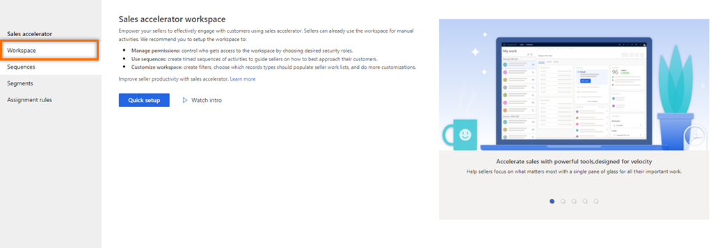
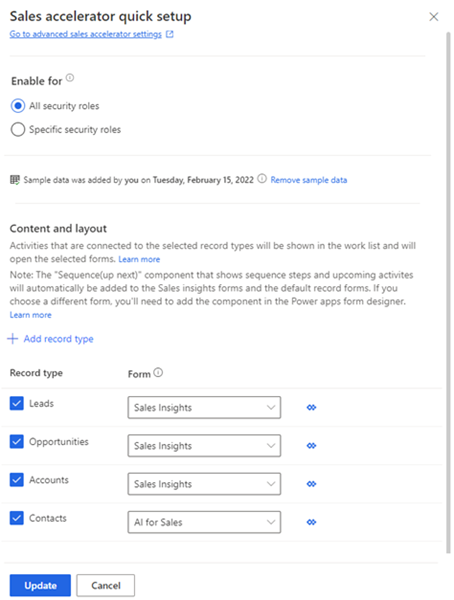

# Configure the sales accelerator

Enable and configure the sales accelerator to create sequences and connect records, and view daily work list items.

[!INCLUDE [trial-cta-note](../includes/trial-cta-note.md)]

## License and role requirements
| Requirement type | You must have |  
|-----------------------|---------|
| **License** | Dynamics 365 Sales Premium or Dynamics 365 Sales Enterprise  More information: [Dynamics 365 Sales pricing](https://dynamics.microsoft.com/sales/pricing/) |
| **Security roles** | System Administrator    More information: [Predefined security roles for Sales](security-roles-for-sales.md)|

## How does the sales accelerator help a sales team?

The sales accelerator is an engagement platform that helps a sales team understand customers' needs and respond in the following ways: 

- Engage with customers by using multiple channels within one workspace.
- Minimize the time spent on searching for the next best customer to reach out to.
- Gather information from multiple sources and let sellers focus on how to best approach their customers. 
- Sell smartly by building a strong and prioritized pipeline, offering context, and surfacing automated recommendations throughout a sales sequence that helps to expedite the sales process.

> [!NOTE]
> - To configure the sales accelerator for assignment rules with your Dynamics 365 Sales Enterprise license, go to [Configure sales accelerator for assignment rules](sales-accelerator-assignment-rules.md).
> - You can also set up the sales accelerator through quick setup (with the Dynamics 365 Sales Enterprise license). In this case, you'll get 1,500 sequence-connected records per month. To set up sales accelerator through quick setup, go to the **Get started with digital sales** page under **App Settings**. More information: [Set up sales accelerator](digital-selling-sales-accelerator.md#set-up-sales-accelerator)

> [!VIDEO https://go.microsoft.com/fwlink/?linkid=2190823]

## Recommendations

For the best experience of the sales accelerator, enable and configure [predictive lead scoring](configure-predictive-lead-scoring.md) and [predictive opportunity scoring](configure-predictive-opportunity-scoring.md) to display predictive scores for each record in the work list. Displaying the score helps your sellers to prioritize leads and opportunities based on how likely they're to be converted.

## First-run setup 

Enable the sales accelerator by quickly providing access to security roles and selecting the record types to be shown in the work list.

>[!NOTE]
>By default, sales accelerator is available in the Sales Hub app with limited functionalities. Your Sales teams can view the work list items created through timeline for contact, opportunity, lead, and account records. To experience the full capabilities of sales accelerator, purchase the Sales Premium license and configure the features such as sequences and segments. 

1. Sign in to your sales app, and in the lower-left corner of the page, go to **Change area** > **Sales Insights settings**.
2. Under **Sales accelerator**, select **Workspace**.     
    The sales accelerator workspace setup page opens. 

    >[!div class="mx-imgBorder"]
    >   

3.	Select **Quick setup**.

    The **Sales accelerator quick setup** pane opens.

    >[!div class="mx-imgBorder"]
    >   

4.	In the **Enable for** section, select roles to grant permissions to use sales accelerator features. Choose one of the following options to grant permissions.
       
    | Security roles | Description |
    |----------------|-------------|
    | All security roles | Select this option to give access to view sales accelerator features to all the security roles in your organization. |
    | Specific security roles | Select this option to specify security roles to give access to view the sales accelerator to just a few users. Use the lookup box to add the security roles. |

    >[!NOTE]
    >To provide permissions for other user roles to create, edit, delete, connect, and disconnect sequences, see [Permission requirements to manage sequences](create-manage-sequences.md#permission-requirements-to-manage-sequences)

5.	(Optional) Select **Add sample data** to explore the sales accelerator feature with the provided sample data.

    Installing the sample data is relevant only for your sandbox or trial environments. Adding the sample data might take a few minutes. More information: [Manage sample data](manage-sample-data.md)

    >[!IMPORTANT]
    >To prevent unwanted results, sample data is available only for non-production environments.

    >[!div class="mx-imgBorder"]
    >

6.	In the **Record type and form** section, select the record types and their corresponding related forms to view in the work list, as required by your organization. By default, leads, opportunities, accounts, and contacts are selected.

    >[!div class="mx-imgBorder"]
    >   

    1. To add a record type, select **Add record type**, and then select the dropdown list to choose the records that you want to add. 

    2. From the dropdown list, choose a form to which you want to add the Sequence (up next) widget. Sales managers use the record types to configure the sequence that will be assigned to records to be displayed in the app.  

       >[!NOTE]
       >- To view the custom records types in the list, go to  **Settings** > **Customizations** > **Customize the System** > **Components** > **Entities**. Under **Communication & Collaboration**, enable the options **Activities**, **Connections**, and **Sending email (If an email field does not exist, one will be created)**.
       >- To add the **Up next** widget to your custom entity form, see [Add the Up next widget to an entity form](add-upnext-widget-form.md).  

    3. Repeat steps a and b to add more record types.
        
       >[!NOTE]
       >- You can remove the record types that you no longer need to associate automated activities with. Select the **X** icon corresponding to the record type to remove it from the list. However, note that if the records in the deleted record type are associated with a sequence, these records will continue to be associated with the sequence.  
       >- To know how records are populated in the work list, go to [View my records by using the work list](prioritize-sales-pipeline-through-work-list.md#view-my-records-through-work-list).

7.	Select **Update**.

The sales accelerator workspace is enabled and ready to use in your organization. Now, you can customize the workspace by configuring filters, sort, and work item appearances. More information: [Customize the workspace](customize-workspace-sales-accelerator.md)

## Disable sales accelerator

You can disable the sales accelerator workspace, if it's no longer required in your organization.    

1. On the **Sales accelerator workspace** page, select **Disable**.

    >[!div class="mx-imgBorder"]
    >   

2. On the confirmation message, select **Disable Sales accelerator**.

    >[!div class="mx-imgBorder"]
    >   

The sales accelerator workspace is disabled in your organization. Also, sellers can't see the **Sales accelerator** sitemap entry under **My Work**.    
To configure the sales accelerator, go to [First-run setup](#first-run-set-up).

## Customizations

By default, the **Up next** widget is displayed on the **Default Main** and **Sales Insight** forms. To add the **Up next** widget to other forms, follow the process specified in [How do I add the Up next widget to an entity form?](faqs-sales-insights.md#sales-accelerator)

[Learn more about how to add sales accelerator to the site map in your custom app](faqs-sales-insights.md#how-to-add-sales-accelerator-to-the-site-map-in-your-custom-app).

[!INCLUDE [cant-find-option](../includes/cant-find-option.md)]

### See also

[What is the sales accelerator?](sales-accelerator-intro.md)     
[Create and manage sequences](create-manage-sequences.md)     
[Configure sales accelerator settings for sellers to personalize](customize-sales-accelerator-sellers.md)     
[Manage access and record type](manage-access-record-type-sales-accelerator.md)     
[Customize the workspace](customize-workspace-sales-accelerator.md)

[!INCLUDE[footer-include](../includes/footer-banner.md)]
