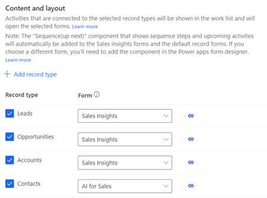
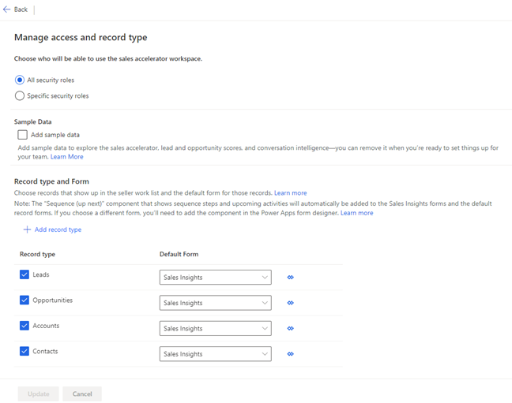
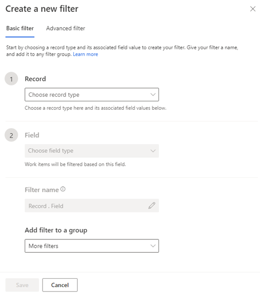
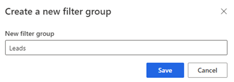
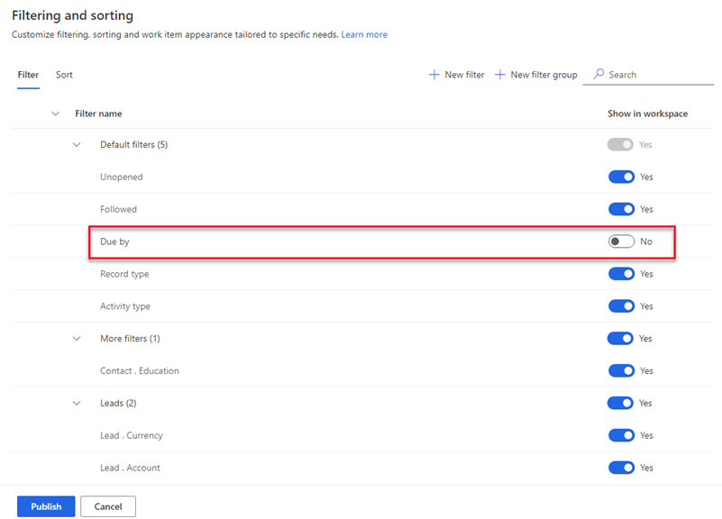
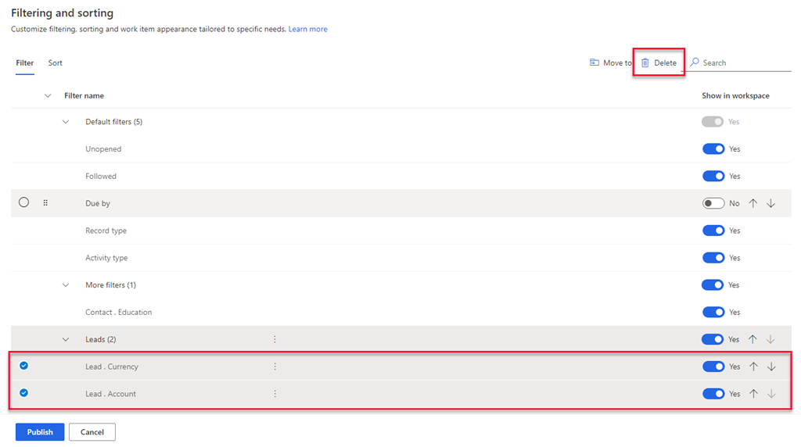
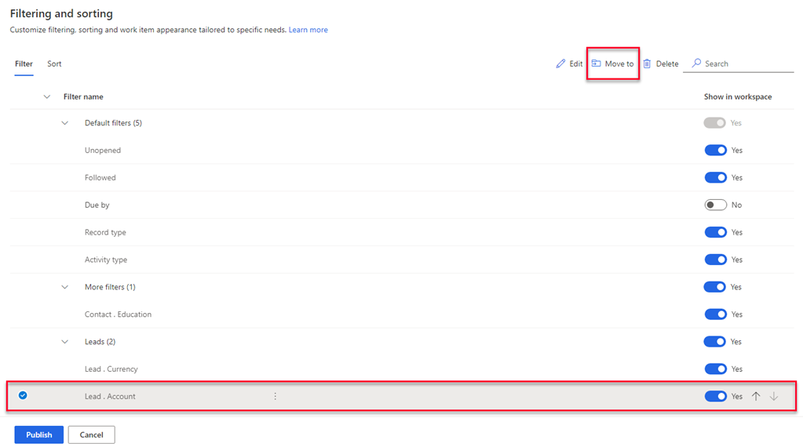
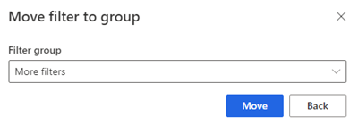

# Configure the sales accelerator

Enable and configure the sales accelerator to create sequences and connect records, and view daily work list items.

## License and role requirements

| &nbsp; | &nbsp; |  
|-----------------------|---------|
| **License** | Dynamics 365 Sales Premium or Dynamics 365 Sales Enterprise  More information: [Dynamics 365 Sales pricing](https://dynamics.microsoft.com/sales/pricing/) |
| **Security Role** | System Administrator    See [Predefined security roles for Sales](security-roles-for-sales.md)|
|||

## How sales accelerator helps sales team?

The sales accelerator is an engagement platform that helps the sales team understand customers' needs and respond in the following ways: 
-	Engage with customers by using multiple channels within one workspace.
-	Minimize the time spent on searching for the next best customer to reach out to.
-	Gather information from multiple sources and let sellers focus on how to best approach their customers. 
-	Sell smartly, by building a strong and prioritized pipeline, offering context, and surfacing automated recommendations throughout a sales sequence that helps to expedite the sales process.

> [!NOTE]
> - To configure sales accelerator for assignment rule with your enterprise license, see [Configure sales accelerator for assignment rules](sales-accelerator-assignment-rules.md).
> - You can also set up sales accelerator through quick setup (with the Dynamics 365 Sales Enterprise license). In this case, you'll get 1,500 sequence-connected records per month. To set up sales accelerator through quick setup, you must go to the **Get started with digital sales** page under **App Settings**. More information: [Set up sales accelerator](digital-selling.md#set-up-sales-accelerator)

## First-run set up 

Enable sales accelerator by quickly providing access to security roles and selecting the record types to be shown in the work list.

>[!NOTE]
>By default, sales accelerator is enabled and available in your organization through Dynamics 365 Sales Hub app. However, sales teams view only the work list items that are created through timeline. To experience the full capabilities of sales accelerator, purchase the required license and configure the features such as sequences and segments.   
To disable the sales accelerator, go to [Disable sales accelerator](disable-sales-accelerator.md). 

1. Sign in to your sales app, and in the lower-left corner of the page, go to **Change area** > **Sales Insights settings**.
2. Under **Sales accelerator**, select **Workspace**.     
    The sales accelerator workspace set up page opens. 

    >[!div class="mx-imgBorder"]
    >   
             
3.	Select **Get started**.    
    The **Sales accelerator quick setup** pane opens.

    >[!div class="mx-imgBorder"]
    >   

4.	In the **Enable for** section, select roles to grant permissions to use sales accelerator features. Choose one of the following options to grant permissions:
       
    | Security roles | Description |
    |----------------|-------------|
    | All security roles | Select this option to give access to view the sales accelerator features to all the security roles in your organization. |
    | Specific security roles | Select this option to specify security roles to give access to view the sales accelerator to just a few users. Use the lookup box to add the security roles. |    

5.	(Optional) Select **Add sample data** to explore the sales accelerator feature with the provided sample data.     
    Installing the sample data is relevant only for your sandbox or trial environments. Adding the sample data might take a few minutes. More information: [Manage sample data](manage-sample-data.md)    

    >[!IMPORTANT]
    >To prevent unwanted results, sample data is available only for non-production environments.
    
    >[!div class="mx-imgBorder"]
    >            

6.	In the **Record type and form** section, select the record types and their corresponding related forms to view in the work list, as required. By default, leads, opportunities, accounts, and contacts are selected.   
    
    >[!div class="mx-imgBorder"]
    >   
    
    1.	To add a record type, select Add record type, and then select the dropdown list to choose the records that you want to add. 
    2.	From the drop-down list, choose a form to which you want to add the Sequence (up next) widget. Sales managers use the record types to configure the sequence that will be assigned to records to be displayed in the app.  
        
        >[!NOTE]
        >- To view the custom records types in the list, enable the options **Activities**, **Connections**, and **Sending email (If an email field does not exist, one will be created)** under **Communication & Collaboration** in **Settings > Customizations** > **Customize the System** > **Components** > **Entities**.
        >- To add the **Up next** widget to your custom entity form, see [Add the Up next widget to an entity form](add-upnext-widget-form.md).  
    
    3.	Repeat step a and b to add more record types.
        
        >[!NOTE]
        >- You can remove the records types that are no longer required to have automated activities associated with them. Select the **X** icon corresponding to the record type to remove it from the list. However, if the records in the deleted record type are associated with a sequence, these records will continue to be associated with the sequence.   
        >- To know how records are populated in the work list, see [View my records by using the work list](prioritize-sales-pipeline-through-work-list.md#view-my-records-through-work-list).
     
7.	Select **Update**.   
The sales accelerator workspace is enabled and ready to use in your organization.
    
## Manage access and record type

After the first-run set up of the sales accelerator, you can manage the security roles, sample data, and record types. 

1. Sign in to your sales app, and in the lower-left corner of the page, go to **Change area** > **Sales Insights settings**.
2. Under **Sales accelerator**, select **Workspace**.     
    The sales accelerator workspace set up page opens. 

    >[!div class="mx-imgBorder"]
    >   
    
3.	Under the **Manage access and record type** section, select **Configure**. 
    The **Manage access and record type** page opens.

    >[!div class="mx-imgBorder"]
    >   

4.	Update the information as required and select **Publish**.  
    For more information, see steps 5 to 7 from [First-run set up](#first-run-set-up).

## Customize the workspace for sellers

As an administrator, you can filter work items in the workspace to shortlist the ones that serve your sellers’ specific needs.
For example, if sellers want to filter work items based on currency type for leads, you can add a filter by selecting the record type as lead and field as currency. Sellers can now use this filter to refine the work items and view the leads with a specific currency type such as US Dollar.    
To know how sellers can use the custom filters, see [Custom filters](prioritize-sales-pipeline-through-work-list.md#custom-filters).   
You can manage custom filters by creating, disabling, and deleting the filters. Follow these steps:

1. Sign in to your sales app, and in the lower-left corner of the page, go to **Change area** > **Sales Insights settings**.
2. Under **Sales accelerator**, select **Workspace**.     
    The sales accelerator workspace set up page opens. 

    >[!div class="mx-imgBorder"]
    >   

3.	Under the **Customize workspace** section, select **Filtering and sorting**.     
    The **Filters** page opens.

    >[!div class="mx-imgBorder"]
    >   

    You can perform the following tasks:    
    -	[Add filters](#add-filters)
    -	[Add groups](#add-groups)
    -	[Hide filters](#hide-filters)
    -	[Delete custom filters and groups](#delete-custom-filters-and-groups)
    -	[Edit name of custom filters and groups](#edit-name-of-custom-filters-and-groups)
    -	[Move filters to a group](#move-filters-to-a-group)

### Add filters

1.	On the **Filters** page, select **+ New filter**.    
2.	On the **New filter** dialog box, enter the following information:

    | Parameter | Description |
    |-----------|-------------|
    | Record | Select the type of record that you want to use to filter the work list. You can select only the record types that are added during the content and layout configuration when setting up the sales accelerator.  For more information, see step 7 in [First-run set up](#first-run-set-up). |
    | Field | Select a field based on which sellers can enter a value to filter the work list. The fields displayed in the list are the basic attributes of the selected record type. |
    | Filter name | Enter a name for the filter. By default, the name is selected as *record type.field*. For example, **Lead.Currency**. | 
    | Nest filter under | Select a group to which you want to add the filter to. Grouping filters helps sellers to easily identify filters and apply. If you don’t select group, the filter is added to the default **More filters** group. To know how to create groups, see [Add groups](#add-groups). |

    >[!div class="mx-imgBorder"]
    >   

3.	Save and publish the filters.
    The filter is created and added to the filters list.

### Add groups

Filter groups help you to organize the filters in a meaningful way for sellers to easily identify the filters.    

1.	Use one of the following ways to create groups:    
    -	On the **Filters** page, select **+ New group**.
    -	While creating a filter, under the **Nest filter under** drop-down list, select **Create new filter group**.
2.	On the **Create new filter group** dialog box, enter the name of the group.

    >[!div class="mx-imgBorder"]
    >   
 
3.	Save and publish.
    The group is created, and you can add filters to the group.

### Hide filters

You can hide any filter from the filter list. After hiding a filter, sellers can’t view the filter in their list. 

1.	On the **Filters** page, go to the filter that you want to hide and turn off the toggle. 
    
    >[!NOTE]
    >To hide a group, turn off the toggle for group.
 
    >[!div class="mx-imgBorder"]
    >   

2.	Select **Publish**.  
    The filter is hidden from the list for sellers to use.
    However, the filter will be available in the application, and you can turn on the toggle to activate.

### Delete custom filters and groups

You can delete filters that are no longer required in your organization.    

>[NOTE]
>You can’t delete the out of the box filters or groups.   

1.	On the **Filters** page, select the filter and then select the delete icon ().
 
    >[!NOTE]
    >To delete all filters under a group, select the group and then select the delete icon.  

    >[!div class="mx-imgBorder"]
    >   

2.	On the confirmation message, select **Delete permanently**.
3.	Select **Publish**.   
    The filter is permanently deleted from the list. 

### Edit name of custom filters and groups    

>[NOTE]
>You can’t edit the names of the out of the box filters or groups.  

1.	Select the filter or group and then select the pencil icon ().   

    The name opens in an inline editor.

    >[!div class="mx-imgBorder"]
    >   

2.	Update the name as required and publish the filter list.

### Move filters to a group

>[NOTE]
>You can’t move the out of the box filters to a group.  

1.	Select the filter and then select the move folder icon ().
 
    >[!div class="mx-imgBorder"]
    >   

2.	On the **Move filter** dialog box, from the **Filter group** list, choose the group name.

    >[!div class="mx-imgBorder"]
    >   
 
3.	Save and publish the filter list.
    The filter is moved into the selected group’s filter list.

## Recommendations

For the best experience of the sales accelerator, enable and configure [predictive lead scoring](configure-predictive-lead-scoring.md) and [predictive opportunity scoring](configure-predictive-opportunity-scoring.md) to display predictive scores for each record in the work list. Displaying the score helps your sellers to prioritize leads and opportunities based on their predicted likelihood to convert.

## Customizations

By default, the **Up next** widget is displayed on the **Default Main** and **Sales Insight** forms. To add the **Up next** widget to other forms, follow the process specified in [How do I add the Up next widget to an entity form?](faqs-sales-insights.md#sales-accelerator)

>[!NOTE]
>To know how to add work list site map to your custom app, see [How to add work list site map to your custom app](faqs-sales-insights.md#how-to-add-sales-accelerator-site-map-to-your-custom-app).

## Disable sales accelerator

You can disable the sales accelerator workspace, if it's no longer required in your organization.    

1. On the **Sales accelerator workspace** page, select **Disable**.

    >[!div class="mx-imgBorder"]
    >   

2. On the confirmation message, select **Disable Sales accelerator**.

    >[!div class="mx-imgBorder"]
    >   

The sales accelerator workspace is disabled in your organization.

[!INCLUDE [cant-find-option](../includes/cant-find-option.md)]

### See also

[Create and manage sequences](create-manage-sequences.md)     
[Configure sales accelerator settings for sellers to personalize](customize-sales-accelerator-sellers.md)     
[What is the sales accelerator?](sales-accelerator-intro.md)

[!INCLUDE[footer-include](../includes/footer-banner.md)]
