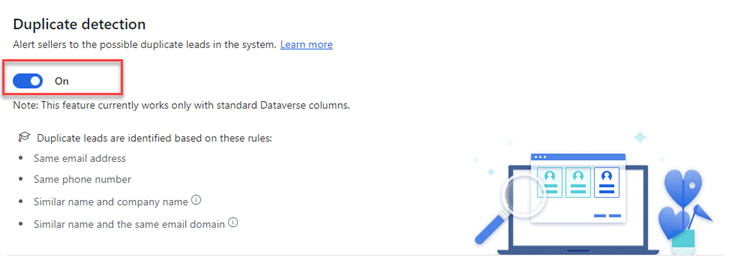

# Enable duplicate lead detection 

Enable duplicate lead detection to help your sellers identify and address potential duplicate leads.

## License and role requirements
| Requirement type | You must have |  
|-----------------------|---------|
| **License** | Dynamics 365 Sales Enterprise, Dynamics 365 Sales Premium, or [Microsoft Relationship Sales](https://dynamics.microsoft.com/en-in/sales/relationship-sales/)  More information: [Dynamics 365 Sales pricing](https://dynamics.microsoft.com/sales/pricing/) |
| **Security roles** | System Administrator   More information: [Predefined security roles for Sales](security-roles-for-sales.md)|

## What is duplicate detection?

>[!VIDEO https://www.microsoft.com/en-us/videoplayer/embed/RE4UpF6]

The duplicate detection capability helps sellers to check for potential duplicate leads in the app. When you enable this capability, the AI model uses the following rules to identify duplicates:

-	Same email address 
-	Same phone number  
-	Similar lead name and company name 
-	Similar lead name and the same email domain   

Further, sellers can compare and remove the duplicate leads in the organization. More information: [Manage duplicate leads](manage-duplicate-leads.md)

>[!NOTE]
>- If the Microsoft Power Platform duplicate detection feature is enabled in your organization, a message is displayed as shown in the following image: 
>:::image type="content" source="media/lead-power-platform-duplicate-detection-enabled-message.png" alt-text="Screenshot showing message when the Microsoft Power Platform duplicate detection feature is enabled." lightbox="media/lead-power-platform-duplicate-detection-enabled-message.png":::
>- To know the difference between the Microsoft Power Platform and Sales duplicate detection features, go to [What is the difference between the duplicate detection capability in Microsoft Power Platform and duplicate detection of leads in Dynamics 365 Sales?](faqs-sales.md#what-is-the-difference-between-duplicate-detection-capability-of-power-platform-and-duplicate-detection-of-leads-in-dynamics-365-sales)
>- For an optimal experience of the duplicate detection of leads in Dynamics 365 Sales, disable the duplicate detection of leads in Microsoft Power Platform. More information [Turn duplicate detection rules on or off for the whole organization](/power-platform/admin/turn-duplicate-detection-rules-off-whole-organization)  

## Enable the duplicate detection feature

1.	At the lower-left corner of the Sales Hub app, select **Change area**  > **App Settings**.
2.	On the site map, select **Data improvement** > **Duplicate detection**.

    >[!div class="mx-imgBorder"]
    >    

3.	Turn on the **Enable rules** toggle.

    >[!div class="mx-imgBorder"]
    >    

## Trouble in identifying duplicate leads?

If the duplicate detection feature isn't working, do the following steps:    

1. Turn off the feature.
2. Ensure that the following requirements are met:
    - [Enable Dataverse search](#enable-the-dataverse-search)
    - [Enable the required fields for leads](#enable-the-required-fields-for-leads)
    - [Activate the required processes](#activate-the-required-processes)
    - [Provide read permissions for process](#provide-read-permissions-for-process)
1. Turn on the feature.

### Enable the Dataverse search

Dataverse search is enabled in your organization. The AI model that detects duplicate leads uses Dataverse search for better results. More information: [Configure Dataverse search for your environment](/power-platform/admin/configure-relevance-search-organization)   
 
### Enable the required fields for leads  

The following fields are enabled in the **Quick Find All Leads** view for leads, under the **Find by** section: 
- `firstname`
- `lastname`
- `emailaddress1`
- `telephone1`
- `companyname`  

>[!NOTE]
>If these fields are already enabled, remove and add them back.

To go to the **Quick Find All Leads** view, follow these steps:

1. Sign in to [Power Apps](https://make.powerapps.com/?utm_source=padocs&utm_medium=linkinadoc&utm_campaign=referralsfromdoc).
1. Select an [environment](/power-apps/maker/model-driven-apps/model-driven-app-glossary#environment)
        
    > [!NOTE]
    > It is best practice to create tables inside a custom solution. More information: [Solution (glossary)](/power-apps/maker/model-driven-apps/model-driven-app-glossary#solution)

1. Expand **Dataverse**, select **Tables**, go to the **All** tab and select the **Lead** table.   
1. On the **Lead** table page, under the **Data experiences** section, select **Views**.  If using a custom solution, open the solution, open the table, and then select the **Views** area.  
1. On the **Views** page, select the **Quick Find All Leads** view.   

### Activate the required processes

Verify the following processes are in active state:
- CheckForDuplicatesAction
- DuplicateDetectionTriggerAction  
- GetDuplicatesAction

To go to the **Processes** page, follow these steps:     

1. In the web app, go to **Settings** > **Advanced Settings**.
2. On the **Advanced Settings** page, select **Settings** > **Process Center** > **Processes**.

### Provide read permissions for process

The security roles who use the feature have at least read permission for **Process** under **Customization**.  
More information: [Security roles and privileges](/power-platform/admin/security-roles-privileges) 

[!INCLUDE [cant-find-option](../includes/cant-find-option.md)]

### See also

[Manage duplicate leads](manage-duplicate-leads.md)
