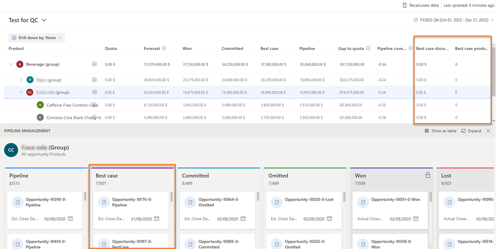
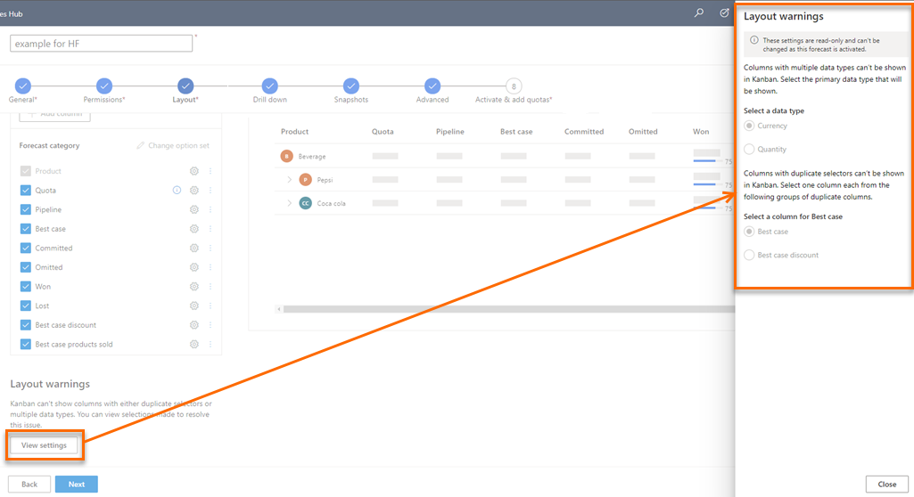

# Forecast with multiple data type columns 

In a forecast grid, you can have multiple columns with different data types&mdash;such as currency and quantity&mdash;displayed in a single view. For example, in a product-based forecast, you can display the **Best case** column values as a quantity (the integer value of the volume of products sold) and as currency simultaneously.

> [!div class="mx-imgBorder"]
> 

For more information about configuring columns and data types, go to [Choose layout and columns](choose-layout-and-columns-forecast.md).

The Kanban view, deal flow, and trend chart can only display a single data type at a time. Hence, for a multiple data type forecast, you must select the primary data type to be displayed before activating the forecast.

Similarly, the Kanban view, deal flow, and trend chart can't show two columns with the same selector. For example, the **Best case** selector is used for multiple revenue columns. Because the Kanban view and deal flow can only show a single revenue column for a category, you must choose the revenue column to display in these views before activating the forecast.  

>[!NOTE]
>To use deal flows and trend charts, you must enable premium forecasting.

## License and role requirements

| &nbsp; | &nbsp; |
|-----------------------|---------|
| **License** | Dynamics 365 Sales Premium or Dynamics 365 Sales Enterprise   More information: [Dynamics 365 Sales pricing](https://dynamics.microsoft.com/sales/pricing/) |
| **Security roles** | System Administrator or Forecast Manager   More information: [Predefined security roles for Sales](security-roles-for-sales.md)|
|||

## Examples of different data types

Let's look at a few examples of how you can configure and activate these forecasts:

- [Example 1: With a forecast category, create two different currency columns and a quantity column](#same-fc-different-data-type-currency-qty)
- [Example 2: With a forecast category, create a currency column and a quantity column](#same-fc-different-data-type)
- [Example 3: With two different forecast categories, create a currency column and a quantity column](#different-fc-different-data-type)

**Example 1: With a forecast category, create two different currency columns and a quantity column**

You're configuring a forecast in which you want to see the **Best case** forecast category's total amount, discount amount, and the number of products sold to get this amount. You configure three **Best case** columns as follows:

| Column name | Selector | Data type | Amount field |
|-------------|----------|-----------|--------------|
| **Best case** | Best case| Currency | Actual amount |
| **Best case discount** | Best case| Currency | Discount Amount |
| **Best case products sold** | Best case| Integer | Number of products sold |

After you've completed the other configuration steps as required and are activating the forecast, an error message is displayed at the top of the **Activate forecast** configuration page. More information: [Activate and upload simple columns data](activate-upload-simple-columns-data-forecast.md)

> [!div class="mx-imgBorder"]
> 

Select **Fix issue**. The following **Layout warnings** pane is displayed, where you can select a primary data type.

> [!div class="mx-imgBorder"]
>  

- If you select the primary data type as **Quantity**, the forecast chooses the **Best case products sold** column to display in the Kanban view, deal flows, and trend charts. This is because the **Best case products sold** column is the only column that has a quantity (in this case, integer) data type. You can proceed with activating the forecast after you select the primary data type. 

    > [!div class="mx-imgBorder"]
    >  

    In this forecast, the **Best case products sold** column is the only column that has a quantity (integer) data type and hence, the Kanban view in the following image displays only one lane with a single quantity-based column.

    > [!div class="mx-imgBorder"]
    > 
    
- If you select the primary data type as **Currency**, you must choose between **Best case** and **Best case discount** columns to display in the Kanban view, deal flows, and trend charts. This is because both these columns have **Currency** as the data type and share the same selector (**Best case**). Select the appropriate column, and then select **Save**. 

    > [!div class="mx-imgBorder"]
    >  

    In this forecast, the **Best case** column is selected to be displayed in the Kanban view, though the **Best case discount** column is of the same selector and data type. The quantity-type column **Best case products sold** is of the same selector and is displayed in the forecast grid, and not in the Kanban view. 

    > [!div class="mx-imgBorder"]
    > 

**Example 2: With a forecast category, create a currency column and a quantity column**

You're configuring a forecast in which you want to see the **Best case** forecast category's total amount and number of products sold to get this amount. You configure two **Best case** columns as follows:

| Column name | Selector | Data type | Amount field |
|-------------|----------|-----------|--------------|
| **Best case** | Best case| Currency | Actual amount |
| **Best case products sold** | Best case| Integer | Number of products sold |

After you've completed the other configuration steps as required and are activating the forecast, the same "Kanban can't show columns with multiple data types. Please resolve this issue to activate the forecast" error message is displayed at the top of the **Activate forecast** configuration page. 

Select **Fix issue**, and in the **Layout warnings** pane, select a primary data type.

Select the primary data type that meets your needs. The selector is the same for **Best case** (currency) and **Best case products sold** (quantity) columns; the difference is the data type. Select a data type to display the column in the Kanban view, deal flows, and trend charts.

**Example 3: With two different forecast categories, create a currency column and a quantity column**

You're configuring a forecast in which you want to see the total revenue of the **Won** forecast category and the products sold under the **Best case** forecast category. You configure the **Won** and **Best case** columns as follows:

| Column name | Selector | Data type | Amount field |
|-------------|----------|-----------|--------------|
| **Won** | Won | Currency | Actual amount |
| **Best case products sold** | Best case| Integer | Number of products sold |

After you've completed the other configuration steps as required and are activating the forecast, the "Kanban can't show columns with multiple data types. Please resolve this issue to activate the forecast" error message is displayed at the top of the **Activate forecast** configuration page.

Select **Fix issue**, and in the **Layout warnings** pane, select a primary data type.

Select the primary data type that meets your needs. Because the **Won** (currency) and **Best case** (quantity) columns have different selectors and data types, you must select a primary data type to display in the Kanban view, deal flows, and trend charts.

## View selected primary data type and columns

You can view the details of the primary data type and selected column (among duplicate columns with same selector) to display in the Kanban view, deal flows, and trend charts. The displayed details are view-only and can't be edited.

1. Sign in to the **Sales Hub** app.

2. In the site map, select the **Change area** , and then select **App Settings**. 

3. Under **Performance management**, select **Forecast configuration**.

    The forecast configuration page opens. 

4. Select **More options** corresponding to the forecast, and then select **Edit**.

5. Go to the **Layout** configuration step. At the bottom of the **Layout** section, a **Layout warnings** section is displayed. 

6. Select **View settings**. A **Layout warnings** pane is displayed on the right side of the page.

    > [!div class="mx-imgBorder"]
    >  

    You can view the selected primary data type and column to display in the Kanban view, deal flows, and trend charts.

[!INCLUDE[cant-find-option](../includes/cant-find-option.md)] 

### See also

[Activate and upload simple columns data](activate-upload-simple-columns-data-forecast.md)  
[Choose layout and columns](choose-layout-and-columns-forecast.md)

[!INCLUDE[footer-include](../includes/footer-banner.md)]
