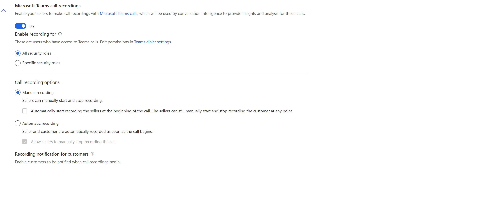
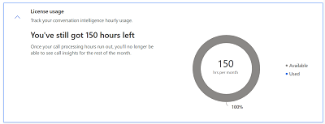
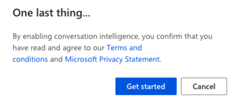

# First-run setup experience of Microsoft Teams for conversation intelligence

> [!IMPORTANT]
> - The enhanced experience for Microsoft Teams together with conversation intelligence is a preview feature. [!INCLUDE[cc-preview-features-definition](../includes/cc-preview-features-definition.md)]
> - [!INCLUDE[cc-preview-features-expect-changes](../includes/cc-preview-features-expect-changes.md)]
> - [!INCLUDE[cc-preview-features-no-ms-support](../includes/cc-preview-features-no-ms-support.md)] 

You can configure conversation intelligence with Microsoft Teams. After you sign in to your sales app as an administrator, you can configure the complete application&mdash;enable Microsoft Teams call recording for conversation intelligence preview, select storage, grant app permissions, and define organization-level tracked keywords and competitors to be used by conversation intelligence.

After configuring conversation intelligence, a sales manager or a seller can view the data and settings that are relevant to them. More information: [Configure sales team level settings](configure-sales-team-level-settings.md)

> [!NOTE]
> You can also enable call recording through quick setup (with the Dynamics 365 Sales Enterprise license). In this case, you'll get 3 hours of conversation intelligence per month. More information: [Microsoft Teams calls with conversation intelligence](digital-selling.md#microsoft-teams-calls-with-conversation-intelligence)

## License and role requirements

| &nbsp; | &nbsp; |  
|-----------------------|---------|
| **License** | Dynamics 365 Sales Premium or Dynamics 365 Sales Enterprise  More information: [Dynamics 365 Sales pricing](https://dynamics.microsoft.com/sales/pricing/) |
| **Security Role** | System Administrator    See [Predefined security roles for Sales](security-roles-for-sales.md)|
|||

## Microsoft Teams for conversation intelligence

Using Teams together with conversation intelligence in Dynamics 365 Sales helps organizations transform customer interactions into revenue. Calling with Teams allows business-critical insights to be surfaced both in real time (during the call) and post-call, insights that are seamlessly tied to the relevant Dynamics 365 records.

### Review the prerequisites

Review the following requirements before you configure Teams call recording for conversation intelligence:

- Your organization has a Teams phone system installed with a valid license to use it. More information: [Set up Phone System in your organization](/microsoftteams/setting-up-your-phone-system)
- You have a license to use Teams. More information: [Microsoft Teams add-on licenses](/microsoftteams/teams-add-on-licensing/microsoft-teams-add-on-licensing?tabs=small-business)
 
### Enable calling with Teams 

Before you can proceed to configuring Teams with conversation intelligence, you must enable the Teams dialer for your organization. More information: [Configure Microsoft Teams dialer](/dynamics365/sales-enterprise/configure-microsoft-teams-dialer)

> [!NOTE]
> To set up the phone system and Teams for your organization, contact your Teams administrator. 

### Configure Microsoft Teams call recording

1.	Sign in to Dynamics 365 Sales Hub.

2.	Select the **change area**  in the lower-left corner of the page, and then select **Sales Insights settings**.  
    > [!div class="mx-imgBorder"]
    > 

3.	On the site map, under **Productivity**, select **Conversation intelligence**.     
    The conversation intelligence home page opens.    

4.	In the **Microsoft Teams call recordings (preview)** section, enable the preview and then configure the other settings as described in the following table.

    | Option | Description |
    |--------|-------------|
    | Enable recording for | Specifies the security roles in your organization who have permission to record calls by using the teams dialer. By default, permission is granted to all security roles in your organization. To only allow specific roles to access the feature, select **Specific security roles** and then use the lookup to select the roles.   **Tips:** <ul><li>To implement the feature in your entire organization, select all security roles.</li><li>For a phased implementation in your organization, create different security roles for each group of users and then assign the security role accordingly.</li></ul>|
    | Call recording options | Select an option for initiating call recordings: <ul><li>**Manual recording**: Select this option to allow sellers to manually start or stop the recording when a call is initiated. Also, you can select the checkbox to record only the seller automatically when the call is initiated. However, sellers can start or stop the recording of the customer anytime during the call. </li><li>**Automatic recording**: Select this option if you want the calls to be automatically recorded when a call is initiated. Also, you can select the checkbox to allow sellers to manually stop the recording anytime during the call.</li></ul>|
    | Recording notification for customers | Turn on this toggle to notify customers when the call recording is initiated. This lets customers know that the call is being recorded.|   
    
    > [!div class="mx-imgBorder"]
    >      

    >[!NOTE]
    >You only need to configure Teams call recording settings, storage selection, and conversation tracking for first-time onboarding to conversation intelligence. All remaining steps are optional. You can choose to configure them now or later, as needed.

5.	(Optional) Under **Call recording storage**, configure the storage-related options as described in the following table.

    | Option | Description |
    |--------|-------------|
    | Storage for call recordings | Select an option to store your call recordings for analysis: <ul><li>**Microsoft provided storage**: Select this option if you want to use the storage provided by Microsoft. By default, this option is selected, and we recommend that you use this storage.</li><li>**Your own Azure storage**: Select this option if you want to use your custom Azure storage. After you select this option, enter the **Storage connection string** and **Container name**.</li></ul>More information: [Configure conversation intelligence to connect call data](configure-conversation-intelligence-call-data.md) |
    | Retention policy | Choose a retention time limit. The application retains call recording data for the specified time limit, and deletes it when the time limit is reached. More information: [Data retention and access through Privacy settings](data-retention-deletion-policy.md). |   

    > [!div class="mx-imgBorder"]
    > 

    >[!NOTE]
    >For Microsoft-provided storage, the available retention periods are 30 days and 90 days. If your organization requires longer retention periods, please consider using your own storage.

6.	Under **Conversation tracking**, add the keywords and competitors that your organization wishes to track during calls, and add the languages used by sellers during calls with customers.

    This is a required global setting that will be applied to all sales calls in the organization. To enable conversation intelligence, you must set at least one global keyword and at least one global competitor. You can update these keywords and competitors later if necessary. More information: [Configure keywords and competitors in conversation content](configure-keywords-competitors.md)
        
    > [!div class="mx-imgBorder"]
    > 

7.	(Optional) In the **Privacy** section, you can select the checkbox to allow Microsoft to improve the quality of insights by giving read-only access to your organization's data in conversation intelligence.  

    > [!div class="mx-imgBorder"]
    > 

8.	In the **License usage** section, you can view information about the total call recording processing hours that have been used, and how many available hours remain.

    > [!div class="mx-imgBorder"]
    > 

9.	(Optional) In the **Coming soon** section, select the **Access new features before they're released to all our customers** checkbox to turn on the "coming soon" feature.

    If you don't want to enable preview features for your organization, skip this step. You can always enable them later. More information: [Enable coming soon features](../sales/enable-preview-features-sales-insights-app.md)  

    > [!div class="mx-imgBorder"]
    >   

10.	Select **Publish**. In the message that appears, read the terms and conditions and the privacy statement. Select **Agree and continue**.      

    > [!div class="mx-imgBorder"]
    >     

Teams call recording with conversation intelligence is now configured and ready for use in your organization.

[!INCLUDE[cant-find-option](../includes/cant-find-option.md)] 

### See also

[Introduction to administering conversation intelligence](intro-admin-guide-sales-insights.md#administer-conversation-intelligence)  
[Prerequisites to configure conversation intelligence](prereq-sales-insights-app.md)

[!INCLUDE[footer-include](../includes/footer-banner.md)]
