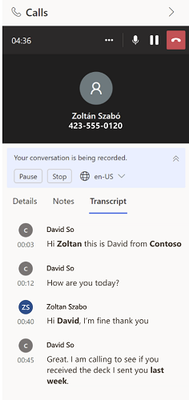

# Get real-time call data through Teams calls (preview)  

> [!IMPORTANT]
> - While in preview, Teams calls does not support emergency calling.
> - Preview features are not complete, but are made available to you before general availability so you can evaluate them and provide feedback to Microsoft. Preview features are not intended for production use and may have limited or restricted functionality, as further explained in our [Product Terms](https://go.microsoft.com/fwlink/?linkid=2173816). 

Conversation intelligence with Teams calls gets you real-time analysis of call data, including  overview, summary, transcription, insights, and action items. To use this feature, an administrator must configure Microsoft Teams in your organization. More information: [First-run setup experience for conversation intelligence in sales app](fre-setup-ci-sales-app.md) 

## License and role requirements

| &nbsp; | &nbsp; |
|-----------------------|---------|
| **License** | Dynamics 365 Sales Premium or Dynamics 365 Sales Enterprise   More information: [Dynamics 365 Sales pricing](https://dynamics.microsoft.com/sales/pricing/) |
| **Security roles** | Salesperson and above   Go to [Predefined security roles for Sales](security-roles-for-sales.md)|
|||

## View real-time analysis of call data
  
Before you start a call, choose the language of the call on the dialer. Currently, English (US) and English (UK) are supported.

When a call is connected, the **Record and analyze** option appears. Turn on this option to get real-time analysis of the call.

> [!div class="mx-imgBorder"]
>     

>[!NOTE]
>A recording confirmation message is displayed. Select **Dismiss**.

You can perform the following actions during the call:   

-	**Take notes**: On the **Notes** tab, you can take meeting notes to summarize key points or any other important information about the meeting. By taking notes in the **Calls** widget, you can save the context of the call and view these notes in the call summary. The action items are highlighted in the notes, and you can create activities such as phone call, meetings, email, and tasks. Also, the notes are added as activities on the phone call activity timeline. More information: [Track and manage activities](manage-activities.md)
-	**Transcript**: On the **Transcript** tab, a real-time transcript is displayed during the call, with a timeline showing who said what, when. The transcript helps you analyze the call. The defined keywords and competitors that were mentioned in the call are highlighted in bold text. More information: [Configure keywords and competitors](configure-keywords-competitors-sales-app.md)

After the call is ended, select **Full summary** to view the summary of the call. More information: [View and understand call summary](view-and-understand-call-summary-sales-app.md)

[!INCLUDE [cant-find-option](../includes/cant-find-option.md)]

### See also

[Configure Microsoft Teams dialer](configure-microsoft-teams-dialer.md)   
[Call using Microsoft Teams](call-using-microsoft-teams.md)   

[!INCLUDE[footer-include](../includes/footer-banner.md)]
