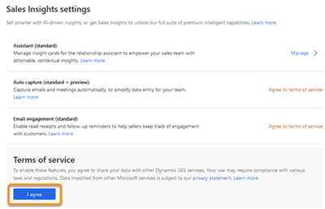
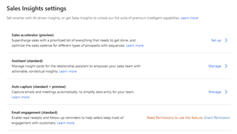
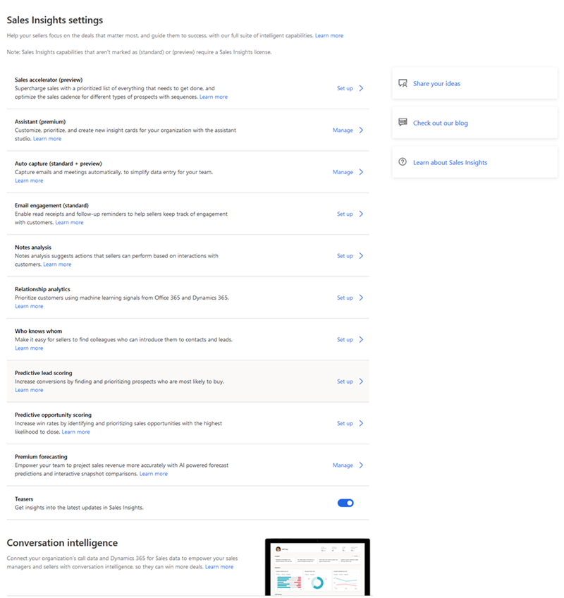

# Introduction to administering Sales Insights features 

Enabling and configuring the [!INCLUDE[pn-dynamics-sales-insights](../includes/pn-dynamics-sales-insights.md)] features helps sellers to build stronger relationships with their customers, save time, and stay on top of their deals with real-time AI-based insights. In Sales Insights, some features are available for free along with Dynamics 365 Sales and some require an additional Sales Insights license to use in your organization. More information: [Overview](overview.md) 

## License and role requirements

| &nbsp; | &nbsp; |
|-----------------------|---------|
| **License** | Dynamics 365 Sales Enterprise for standard features and Dynamics 365 Sales Premium for premium features  More information: [Dynamics 365 Sales pricing](https://dynamics.microsoft.com/sales/pricing/) |
| **Security Role** | System Administrator    See [Predefined security roles for Sales](security-roles-for-sales.md)|
|||

## What you can configure

As an administrator, you can enable and configure the Sales Insights features as required in your organization:

-	[Enable and configure standard Sales Insights features](#enable-and-configure-standard-sales-insights-features)
-   [Get started with premium Sales Insights features](#get-started-with-premium-sales-insights-features)
-	[Install and configure premium Sales Insights features](#install-and-configure-premium-sales-insights-features)   
-	[Administer conversation intelligence](#administer-conversation-intelligence)

## Enable and configure standard Sales Insights features

The standard Sales Insights features&mdash;assistant (standard), Auto capture (standard + preview), and email engagement (standard)&mdash;are available for you along with Dynamics 365 Sales. You can configure these standard features as required in your organization.

>[!NOTE]
>The standard Sales Insights features aren't available with the Sales Professional app. 

> [!div class="mx-imgBorder"]
> 

1.	[Review requirements and prerequisites](#requirements-and-prerequisites).  
2.	[Enable standard Sales Insights features](#enable-standard-sales-insights-features).    
3.	[Configure standard features as required](#configure-standard-sales-insights-features).

### Requirements and prerequisites

Review the following requirements and prerequisites to enable standard Sales Insights features:

- Some feature restrictions apply depending on which versions of Dynamics 365 Sales and Microsoft 365 you're running, as detailed in the following table.

    | Product version | Available standard Sales Insights features |
    |-----------------|--------------------------------------------|    
    | Dynamics 365 with Microsoft Exchange Online | <ul><li>Assistant (standard cards)</li> <li>Email engagement</li> <li>Auto capture</li></ul>|
    | Dynamics 365 with Microsoft Exchange (on-premises) | <ul><li>Assistant (all cards except cards based on Exchange information)</li> <li>Email engagement</li></ul>|
    | Dynamics 365 (on-premises) | <ul><li>Assistant (standard cards) |

- The assistant, email engagement, and auto capture features are available for Dynamics 365 Sales with an Enterprise or Sales Premium license.

- You must have an administrator or equivalent security role.

### Enable standard Sales Insights features

Before you can configure these features, you must accept the privacy notice. To accept the privacy notice, follow the steps listed here.

>[!NOTE]
>By default, the standard assistant is enabled.

> [!IMPORTANT]
> [!INCLUDE[pn-dynamics-sales-insights](../includes/pn-dynamics-sales-insights.md)] provides features that track behavior and collect information about contacts. Make sure you understand the related privacy issues that these features raise and enable the features only if you're certain that they don't violate any privacy policies already in place in your organization. Always take steps to protect the privacy of your contacts. More information: [Privacy notice](privacy-notice.md)

1.	Sign in to Dynamics 365 Sales, and go to the Sales Hub app.

2.	Go to **Change area** in the lower-left corner of the page, and select **Sales Insights settings**.

    > [!div class="mx-imgBorder"]
    > 
 
3.	In the **Terms of service** section, select **I agree**.

    > [!div class="mx-imgBorder"]
    > 

    The standard Sales Insights features are enabled for your organization and you can configure features such as the standard assistant, auto capture (standard), and email engagement (standard).
 
    > [!div class="mx-imgBorder"]
    > 

### Configure standard Sales Insights features

After you enable the standard Sales Insights features, you can configure the features for your organization.

-	To configure the standard assistant, see [Configure and manage insight cards for the standard assistant](configure-assistant.md#configure-and-manage-insight-cards-for-the-standard-assistant).   
-	To configure standard auto capture, see [Configure and enable auto capture](configure-auto-capture.md).    
-	To configure standard email engagement, see [Configure and enable email engagement](configure-email-engagement.md).   
-	To Configure sales accelerator for assignment rules, see [Configure assignment rules in Sales Enterprise](sales-accelerator-assignment-rules.md)

## Get started with premium Sales Insights features

With your Dynamics 365 Sales Enterprise license, you can set up and experience Sales Premium features such as Sales accelerator, conversation intelligence, and predictive scoring with a limited monthly capacity. More information: [Digital selling capabilities in Sales Enterprise](digital-selling.md)

## Install and configure premium Sales Insights features

The premium Sales Insights features provide intelligent insights about sales data that help sellers take timely actions to close deals and generate revenue. The premium Sales Insights features include the premium assistant with assistant studio, auto capture premium (preview), notes analysis, relationship analytics, who knows whom, predictive lead scoring, predictive opportunity scoring, premium forecasting, and sales accelerator and sequence (preview). You can configure these features as required in your organization.

The following diagram illustrates the steps to configure these features:

> [!div class="mx-imgBorder"]
> 

1.	[Review GDPR](#review-gdpr).   
2.	[Review the prerequisites](#review-the-prerequisites).   
3.	[Install premium Sales Insights](#install-premium-sales-insights).   
4.	[Configure premium Sales Insights features](#configure-premium-sales-insights-features).

### Review GDPR

To learn about [!INCLUDE[pn_dynamics_sales_insights](../includes/pn-dynamics-sales-insights.md)]&ndash;related General Data Protection Regulation (GDPR), see [Dynamics 365 Sales Insights and GDPR](embedded-intelligence-gdpr.md).

### Review the prerequisites

Review the following requirements before you install and configure the premium Sales Insights features:

- You must be a Dynamics 365 Sales administrator.  
- You must have a Sales Premium or a Sales Insights license.    
    >[!NOTE]
    >You can also start a free trial to use the sales premium features. More information: [Sign up for a free Dynamics 365 Sales trial](/dynamics365/sales-enterprise/sign-up-for-sales-trial)

- Assign licenses to each individual user to utilize the features. This is executed within the [Microsoft 365 admin center](https://admin.microsoft.com/Adminportal/Home?#/homepage). More information: [Assign licenses to users](/microsoft-365/admin/manage/assign-licenses-to-users?view=o365-worldwide&preserve-view=true).     
- Exchange email server is configured, and a mailbox is enabled using **Email Configurations** in **Settings**. [!INCLUDE[proc_more_information](../includes/proc-more-information.md)] [System Settings dialog box - Email tab](/dynamics365/customer-engagement/admin/system-settings-dialog-box-email-tab).

### Install premium Sales Insights

The premium Sales Insights features aren't available by default. You must install these features by accepting the terms and conditions for your organization. To accept the terms and conditions, follow these steps:

1.	Sign in to Dynamics 365 Sales, and go to the Sales Hub app.

2.	Go to **Change area** in the lower-left corner of the page, and select **Sales Insights settings**.

    > [!div class="mx-imgBorder"]
    > 
 
3.	In the **Supercharge your sales with Premium** section, select the terms and conditions and then select **Get started**.

    > [!div class="mx-imgBorder"]
    > 
 
    The installation may takes a few minutes to complete, and the progress is displayed in a dialog. After the installation is complete, you're ready to configure the premium Sales Insights features.

    > [!div class="mx-imgBorder"]
    > 
 
### Configure premium Sales Insights features

After installing the premium Sales Insights features, you can configure the premium features as required:

-	To configure the premium assistant, see [Configure and manage insight cards for the premium assistant](configure-assistant.md#configure-and-manage-insight-cards-for-the-premium-assistant).   
-	To configure premium auto capture, see [Configure auto capture](configure-auto-capture.md).   
-	To configure notes analysis, see [Configure notes analysis](configure-notes-analysis.md).   
-	To configure relationship analytics, see [Configure Relationship analytics](configure-relationship-analytics.md).   
-	To configure talking points, see [Configure talking points](configure-talking-points.md).   
-	To configure who knows whom, see [Configure who knows whom](configure-who-knows-whom.md).   
-	To configure predictive lead scoring, see [Configure predictive lead scoring](configure-predictive-lead-scoring.md).   
-	To configure predictive opportunity scoring, see [Configure predictive opportunity scoring](configure-predictive-opportunity-scoring.md).    
-   To configure premium forecasting, see [About premium forecasting](configure-premium-forecasting.md).    
-   To configure sales accelerator and sequence (preview), see [Enable and configure sales accelerator](enable-configure-sales-accelerator.md).

## Administer conversation intelligence

Conversation intelligence assists the sales managers and sellers in your organization to get an overview of the conversation with customers. Conversation Intelligence helps:

-	Sales managers drill down to get call statistics for individual sellers, such as customer sentiment, keywords used, and competitors mentioned in the conversation. Sales managers can use this data to give smarter coaching to sellers and improve the business.  
-	Sellers analyze their conversation data and identify improvements in the conversation style to enhance sales and generate revenue. 

As an administrator, when you sign in to the application for the first time, you can set up the application. After you complete the setup, sales managers and sellers in your organization can sign in and use the application seamlessly. More information: [First-run setup experience of Sales Insight application](fre-setup-sales-insight-app.md)

You can also update each setting later as required. The following configurations are available:

-	Connect your Sales environment to gather data and display on KPIs. More information: [Connect to Dynamics 365 Sales environment](connect-dynamics365-sales-environment.md)    
-	Connect to call data repository. More information: [Configure conversation intelligence to connect call data](configure-conversation-intelligence-call-data.md)   
-	Define keywords and competitors that will be tracked in conversations. More information: [Configure keywords and competitors to track](configure-keywords-competitors.md)   
-	Define how long you want to retain the data in the application, and remove seller-specific data. More information: [Data retention and deletion through Privacy](data-retention-deletion-policy.md)   
-	Enable preview features. More information: [Enable preview features](enable-preview-features-sales-insights-app.md)

## For effective use of Sales Insights

- Use the out-of-the-box entities (Contact, Opportunity, Lead, Account, and Case) while creating records in the application. If changes to the entity are required in your organization, customize only these out-of-the-box entities to meet your requirements. This helps the application to analyze the records, and generate models and predictions effectively.

- Ensure that the **Change Tracking** option for the following entities are enabled: Account, Contact, Lead, Opportunity, System User, Team, Queue, Organization, Email, Phone Call, Task, Appointment, Activity Party, Connection, Business Unit, Metric, Opportunity Product, Product, Opportunity Sales Process, Process Stage, Connection Role, Workflow, Goal, Role, System User Roles, Note, Auto Capture Settings, Auto Capture Rule, and Lead To Opportunity Sales Process.

    1. Go to **Settings** > **Customizations** > **Customize the System**.    
    2. On the **Default Solution** page, expand **Entity**, and then select an entity.   
    3. On the **General** tab, under **Data Services**, verify that the **Change Tracking** option is enabled.

- Ensure that you do not delete the **Sales Insights MDL Config** solution from the solutions. If this solution is deleted, the Sales Insights features give inaccurate results and might be disabled. 

    However, if you want to delete the **Sales Insights MDL Config** solution due to storage issues, uninstall the **SalesInsightsAddOn** solution too. This ensures that the **Sales Insights MDL Config** solution won't be automatically reinstalled when future updates are pushed to your organization.

## Privacy notice

For specific privacy information about Dynamics 365 Sales Insights capabilities, see [Privacy notice](privacy-notice.md).

[!INCLUDE [cant-find-option](../includes/cant-find-option.md)]

### See also

[Overview of Dynamics 365 Sales Insights](overview.md)  
[Improve seller coaching and sales potential with Dynamics 365 Conversation Intelligence](../sales/dynamics365-sales-insights-app.md)  
[Dynamics 365 Sales Insights and GDPR](embedded-intelligence-gdpr.md)  
[Sales Insights privacy notice](privacy-notice.md) 

[!INCLUDE[footer-include](../includes/footer-banner.md)]
