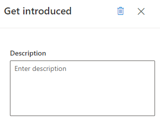
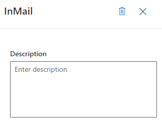

# Add LinkedIn activities to sequence 

Use LinkedIn features to define activities for sequences in sales accelerator to display steps in work list and Up next widget.

## License and role requirements

| &nbsp; | &nbsp; |
|-----------------------|---------|
| **License** | Dynamics 365 Sales Premium  More information: [Dynamics 365 Sales pricing](https://dynamics.microsoft.com/sales/pricing/) |
| **Security Role** | System Administrator or Sequence Manager    See [Predefined security roles for Sales](security-roles-for-sales.md)|
|||

## How LinkedIn activities help?

In sequences, activities that are based on LinkedIn Sales Navigator allow sellers to diversify their day-to-day activities by including the social selling functions that are available in LinkedIn. You can use LinkedIn's vast network with recommended actions that your sellers can take to build deeper connections.

As an administrator or sequence manager, you can add the following activities to sequences:   
-	[Research](#research-activity)
-	[Get introduced](#get-introduced-activity) 
-	[Connect](#connect-activity)
-	[Send InMail](#send-inmail)

## Prerequisites  

Ensure that you meet the following requirements before configuring the LinkedIn activities:   
-	Verify that LinkedIn Sales Navigator is configured in your organization. More information: [Install and enable LinkedIn Sales Navigator](/dynamics365/linkedin/install-sales-navigator).
-	Verify that the latest solution with version **3.0.1.1060** for **msdyn_LinkedInSalesNavigatorAnchor** is installed. 
    - Go to **Advanced settings** > **Solutions** and search for **msdyn_LinkedInSalesNavigatorAnchor**. The version number should be 3.0.1.1060 or later. 
-	You have proper license to use LinkedIn Sales Navigator. More information: [Microsoft Relationship Sales](https://dynamics.microsoft.com/en-in/sales/relationship-sales/).

## Research activity

The **Research** activity allows sellers to view the LinkedIn profile, including the customer’s contact and account information. This helps sellers to better understand the customers before starting to work with them. More information: [Leads Module References](/linkedin/sales/display-services/leads-screenshots) and [Accounts Module References](/linkedin/sales/display-services/accounts-screenshots).    

When the activity is displayed to the seller, the LinkedIn research step is displayed in the **Up next** widget and work list. 

**To add the Research activity**

1.	In the activity selection box, select the **LinkedIn** tab, and then select **Research**.  

    >[!div class="mx-imgBorder"]
    >    
 
2.	In the **Research** box, enter a description for the activity, and select **Save**.   

    >[!div class="mx-imgBorder"]
    >        
 
    The **Research** step is created and added to the sequence.

    >[!div class="mx-imgBorder"]
    >        
 
## Get introduced activity   

The **Get introduced** activity allows sellers to ask for an introduction to the customer from anyone within their network in LinkedIn who is already connected to the customer. More information: [Get Introduced](/linkedin/sales/display-services/leads-screenshots#get-introduced).

When this activity is displayed to the seller, the Find intro person step is displayed in the Up next widget and work list. 

**To add the Get introduced activity**  

1.	In the activity selection box, select the **LinkedIn** tab and then select **Get introduced**.

    >[!div class="mx-imgBorder"]
    >    
 
2.	In the **Get introduced** box, enter a description for the activity, and select **Save**.  

    >[!div class="mx-imgBorder"]
    >        
 
    The **Get introduced** step is created and added to the sequence.
 
    >[!div class="mx-imgBorder"]
    >        

## Connect activity

The **Connect** activity allows sellers to send connection invites along with personal messages, to solidify customer relationships and add them to their network. More information: [Connect](/linkedin/sales/display-services/leads-screenshots#connect).

When this activity is displayed to the seller, the Connect via LinkedIn step is displayed in the Up next widget and work list. 

**To add the Connect activity**

1.	In the activity selection box, select the **LinkedIn** tab, and then select **Connect**.

    >[!div class="mx-imgBorder"]
    >    
 
2.	In the **Connect** box, enter a description for the activity, and select **Save**.

    >[!div class="mx-imgBorder"]
    >        
 
    The **Connect** step is created and added to the sequence.
 
    >[!div class="mx-imgBorder"]
    >        

## Send InMail

The **Send InMail** activity allows sellers to directly message customers they’re not already connected to through LinkedIn. More information: [Send an InMail Message](https://www.linkedin.com/help/linkedin/answer/437).

When this activity is displayed to the seller, the Send InMail step is displayed in the Up next widget and work list. 

**To add the Send InMail activity**

1.	In the activity selection box, select the **LinkedIn** tab and then select **Send InMail**.
    
    >[!div class="mx-imgBorder"]
    >    
 
2.	In the **Send InMail** box, enter a description for the activity, and select **Save**.

    >[!div class="mx-imgBorder"]
    >        
 
    The **Send InMail** step is created and added to the sequence.
 
    >[!div class="mx-imgBorder"]
    >        

[!INCLUDE [cant-find-option](../includes/cant-find-option.md)]

### See also

[Work with LinkedIn activities](work-with-linkedin-activities.md)

[!INCLUDE[footer-include](../includes/footer-banner.md)]

