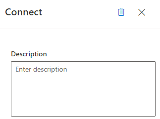

# Add LinkedIn activities to a sequence 

Use LinkedIn features to define activities for sequences in the sales accelerator to display steps in the work list and **Up next** widget.

## License and role requirements
| &nbsp; | &nbsp; |
|-----------------------|---------|
| **License** | Dynamics 365 Sales Premium and [Microsoft Relationship Sales](https://dynamics.microsoft.com/en-in/sales/relationship-sales/)  More information: [Dynamics 365 Sales pricing](https://dynamics.microsoft.com/sales/pricing/) |
| **Security roles** | System Administrator or Sequence Manager    More information: [Predefined security roles for Sales](security-roles-for-sales.md)|

## How do LinkedIn activities help?

In sequences, activities that are based on LinkedIn Sales Navigator allow sellers to diversify their day-to-day activities by including the social selling functions that are available in LinkedIn. You can use LinkedIn's vast network with recommended actions that your sellers can take to build deeper connections.

As an administrator or sequence manager, you can add the following activities to sequences:   
-	[Research](#research-activity)
-	[Get introduced](#get-introduced-activity) 
-	[Connect](#connect-activity)
-	[Send InMail](#send-inmail)

>[!div class="mx-imgBorder"]
>

## Prerequisites  

Ensure that you meet the following requirements before configuring LinkedIn activities:

- LinkedIn Sales Navigator is configured in your organization. More information: [Install and enable LinkedIn Sales Navigator](/dynamics365/linkedin/install-sales-navigator)
- The latest version of the solution is installed. Go to **Advanced settings** > **Solutions**, and search for **msdyn_LinkedInSalesNavigatorAnchor**. The version number should be **3.0.1.1060** or later. 
- You have the proper license to use LinkedIn Sales Navigator.

## Research activity

Sellers can use<!--note from editor: Here and throughout (and in the companion article), I suggest using "can" instead of "allows", to better follow the style guide.--> the **Research** activity to view a customer's LinkedIn profile, including contact and account information. This helps sellers to better understand customers before starting to work with them. More information: [Leads Module References](/linkedin/sales/display-services/leads-screenshots) and [Accounts Module References](/linkedin/sales/display-services/accounts-screenshots)

When the activity is displayed to the seller, the LinkedIn **Research** step is displayed in the **Up next** widget and work list. 

**To add the Research activity**

1. In the activity selection box, select the **LinkedIn** tab, and then select **Research**.  

2. In the **Research** box, enter a description for the activity, and then select **Save**.   

    >[!div class="mx-imgBorder"]
    >        

 The **Research** step is created and added to the sequence.

 >[!div class="mx-imgBorder"]
 >        
 
## Get introduced activity   

Sellers can use the **Get introduced** activity to ask for an introduction to the customer from anyone within their network in LinkedIn who's already connected to the customer. More information: [Get Introduced](/linkedin/sales/display-services/leads-screenshots#get-introduced)

When this activity is displayed to the seller, the **Find intro person** step is displayed in the **Up next** widget and work list. 

**To add the Get introduced activity**  

1. In the activity selection box, select the **LinkedIn** tab, and then select **Get introduced**.

2.	In the **Get introduced** box, enter a description for the activity, and then select **Save**.  

    >[!div class="mx-imgBorder"]
    >
 
The **Get introduced** step is created and added to the sequence.

>[!div class="mx-imgBorder"]
>

## Connect activity

Sellers can use the **Connect** activity to send connection invites to customers along with personal messages, to help solidify customer relationships and add them to their network. More information: [Connect](/linkedin/sales/display-services/leads-screenshots#connect)

When this activity is displayed to the seller, the **Connect**<!--note from editor: Should "via LinkedIn" be included in the screenshot and elsewhere in this procedure, or is ""Connect" literally the name of the step?--> step is displayed in the **Up next** widget and work list. 

**To add the Connect activity**

1.	In the activity selection box, select the **LinkedIn** tab, and then select **Connect**.

2.	In the **Connect** box, enter a description for the activity, and then select **Save**.

    >[!div class="mx-imgBorder"]
    >
 
The **Connect** step is created and added to the sequence.
 
>[!div class="mx-imgBorder"]
>

## Send InMail

The **Send InMail** activity allows sellers to directly message customers who they're not already connected to through LinkedIn. More information: [Send an InMail Message](https://www.linkedin.com/help/linkedin/answer/437)

When this activity is displayed to the seller, the Send InMail step is displayed in the Up next widget and work list. 

**To add the Send InMail activity**

1.	In the activity selection box, select the **LinkedIn** tab, and then select **Send InMail**.

2.	In the **Send InMail** box, enter a description for the activity, and then select **Save**.

    >[!div class="mx-imgBorder"]
    >
 
The **Send InMail** step is created and added to the sequence.

>[!div class="mx-imgBorder"]
>

[!INCLUDE [cant-find-option](../includes/cant-find-option.md)]

### See also

[Work with LinkedIn activities](work-with-linkedin-activities.md)

[!INCLUDE[footer-include](../includes/footer-banner.md)]

