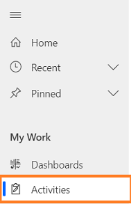
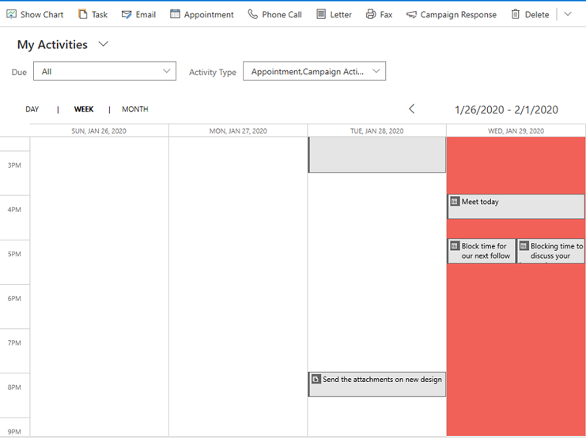
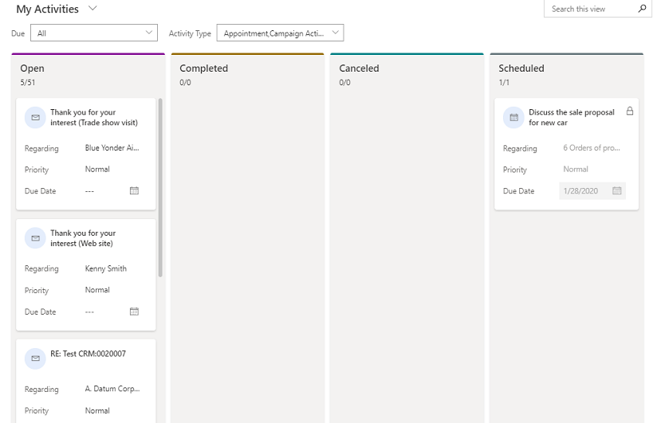
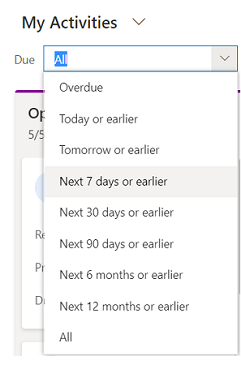
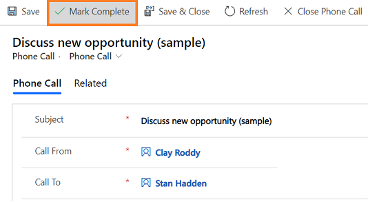

# Track and manage activities 

In Dynamics 365 Sales, you use activities to plan, track, and organize all your customer communications. For example, you can take notes, send email, make phone calls, set up appointments, and assign yourself tasks as you work a sale or resolve a service case. These actions are all considered types of activities.

The system automatically timestamps every activity and shows who created it. You and other people on your team can scroll through the activities to see the history as you work with a customer.

To get the most out of Dynamics 365 Sales, it's important for everyone in the organization to track all their customer interactions by adding an activity for every email, phone call, task, or appointment. That way, a customer's history is complete. 

## License and role requirements

| &nbsp; | &nbsp; |
|-----------------------|---------|
| **License** | Dynamics 365 Sales Premium, Dynamics 365 Sales Enterprise, or Dynamics 365 Sales Professional  More information: [Dynamics 365 Sales pricing](https://dynamics.microsoft.com/sales/pricing/) |
| **Security roles** | Salesperson and above    See [Predefined security roles for Sales](security-roles-for-sales.md)|
|||

## Find your activities

You can find your activities under **My Work** in the site map. 

> [!div class="mx-imgBorder"] 
> 

## See activities in List, Calendar, or Kanban view

1. In the site map, select **Activities**.

2. On the command bar, select the **More commands** icon , and then select **Show As**, and then the view type such as, **Kanban**, **Calendar Control**, or **Read Only Grid**.

    > [!div class="mx-imgBorder"]  
    >  

You can see the activities in three different views:
-  **List.** Shows a list of all activities. 

    > [!div class="mx-imgBorder"] 
    > 

-  **Calendar.** Shows a calendar with a list of the day's scheduled activities and the associated deals. 

    > [!div class="mx-imgBorder"] 
    > 

-  **Kanban.** Shows a visual representation of your sales activities in their different states. This lets you see the status of every activity in your pipeline and drag them to move from one status to another (for example, Open, Completed, Canceled, Scheduled). More information: [Work with activities in the Kanban view](activity-kanban-view.md)

    > [!div class="mx-imgBorder"]  
    >  

## Change your activities view

You can use views to see the activities you want. For example, you can use the **My Activities** view to see activities assigned to you and **My Team Members' Activities** view to see your team's activities. 

> [!div class="mx-imgBorder"] 
> 

## Filter the list of activities

You can filter the list of activities to see only the ones you're interested in. For example, you can further limit the activities you are seeing in a view by using the activity type filter. The activity type filter allows you to filter activities based on the type, such as email, task, phone call, and so on.

> [!div class="mx-imgBorder"] 
> 

You can also use the **Due** filter to see the activities that are due in a specified time, such as activities that are due today or earlier or activities that are due in the next seven days or earlier.

> [!div class="mx-imgBorder"] 
> 

## Create or edit a new activity

You can create independent activities that aren't associated with any customer or sales record. To do so, in the site map, select **Activities** and then on the command bar, select **Email** or **Phone Call** or **Task**, depending on which activity you want to create.

Or, to edit an existing activity record, open the activity by selecting its title.

> [!NOTE]
> With the April 2020 release of Dynamics 365 Sales, when you create or edit a new activity, the record opens in a Main form dialog. A Main form dialog is a Main form opening in a dialog (a pop-up window). Main form dialogs allow you to stay in context while working on one record with the ability to open a second or third record in dialog experience. This makes it easier to edit the records.

## Add a new activity for a customer

Most often, you'll want to add an activity associated with a contact, opportunity, account, or other type of record to help you keep track of all the communication history you have with a customer. (You can also add an activity for yourself.)

As your organization's relationship with a customer builds over time, you and other people on your team can look through the activity feed as you work with the customer, and see the history of your interactions. Activities can also be included in reports to track your ongoing progress.

**To add an activity for a customer:**

1. Open the record. You can use Quick Search on the navigation bar to find a record quickly.

2. Select **Activities** to add a task or phone call to the record. Select **More** (…) to add an email or appointment. Or, select **Notes** and then start typing.
 
## Add an activity for yourself  

Add a task or note for yourself when you want a reminder to do something personal, like schedule a doctor's appointment or attend a sporting event.  

Otherwise, to keep a history of your interactions with a customer, you should add new activities that are associated with a customer's record, so  those activities become part of the history that other people on your team can view.  
  
**To add an activity for yourself:**

1.  On the navigation bar, select **Create** and then select the icon or tile for the activity.  
  
2.  Fill in the fields and then select **Save**.  
  
## Attach a document  

Documents, spreadsheets, pictures, and just about any type of file can be attached to emails and notes.  

**To attach a document to an email:**
  
1. Open the email form.  
  
2. On the command bar, select **Attach File**.
  
3. Browse to and then select the file that you want to attach.
    The selected file appears in the **Attachment** pane.

**To attach a document to a note:**
  
1. In the **Timeline** pane, select **+** and then select **Note**. 
  
2. Add the note and select the attachment icon before the **Add note** button. 
  
3. Browse to and then select the file that you want to attach.
    The selected file appears above the **Add note** button.
  
## Mark an activity complete  

After you call someone, complete a task, send an email, or go to an appointment, you can mark the activity for that action as completed.  
  
1. Open the activity.  
  
2. On the command bar, select **Mark Complete**.  
  
   > [!div class="mx-imgBorder"] 
   >   
  
## Mark several activities complete at the same time  

1.  On the list of activities, select all the activities that you want to mark complete.  
  
2.  On the command bar, select **Mark Complete**.  
  
## Best practices for activities  

Here are some suggestions about how to use activities to your organization's best advantage:  
  
- **Add an activity for every customer interaction**. Make sure a customer's history includes a record of every communication you have with them.  
  
- **Use the right activity type for the action**. It might be tempting to enter a new note that says, "Sent an email to confirm pricing," or "Called the customer to discuss their service case." However, you should add an email or phone call activity to track those types of actions, and use notes for more general text.  
  
- **Add activities for yourself, too**. You can keep track of your own assignments, events, and notes without associating these activities with a customer.  
  
     Use the **Create** command on the navigation bar. Find these activities in the list by sorting on the **Regarding** column, which is blank to let you know that the activity isn't associated with a customer record.  

- **Keep in mind that activities "roll up" under their associated records.** Let's say you want to remind yourself to follow up with Cecil Langer, a contact who's associated with the account, ​Wingtip Toys. You'll need to add the task activity to the contact record for Cecil (not for the account, ​Wingtip Toys).  
  
     That way, your task will "roll up" under the account automatically, and you and other people on your team will see the task when they're looking at the contact and when they're looking at the account for ​Wingtip Toys. (And they'll know you've got it handled.) 

[!INCLUDE [cant-find-option](../includes/cant-find-option.md)]

### See also

[Work with activities in the Kanban view](activity-kanban-view.md)  

[!INCLUDE[footer-include](../includes/footer-banner.md)]
