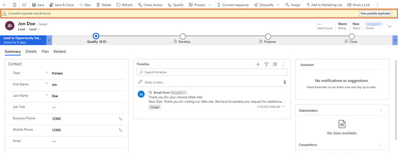
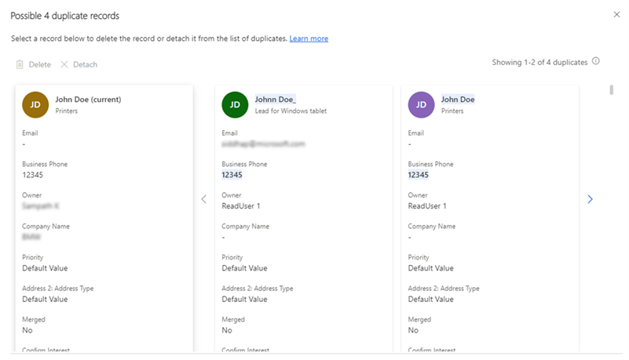
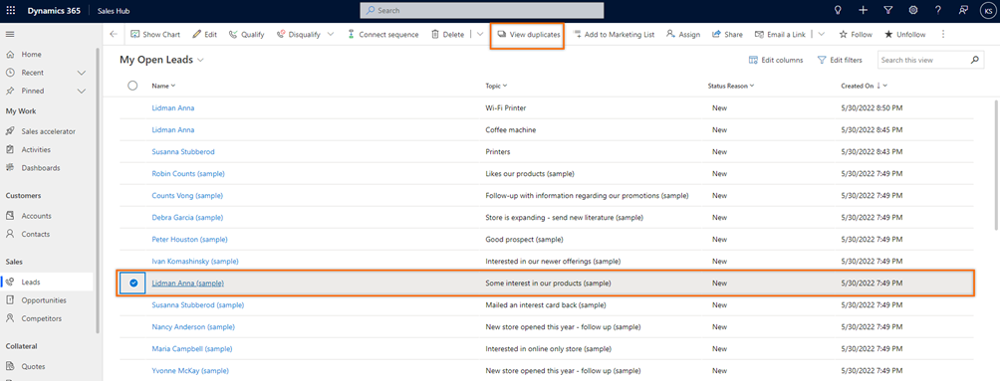
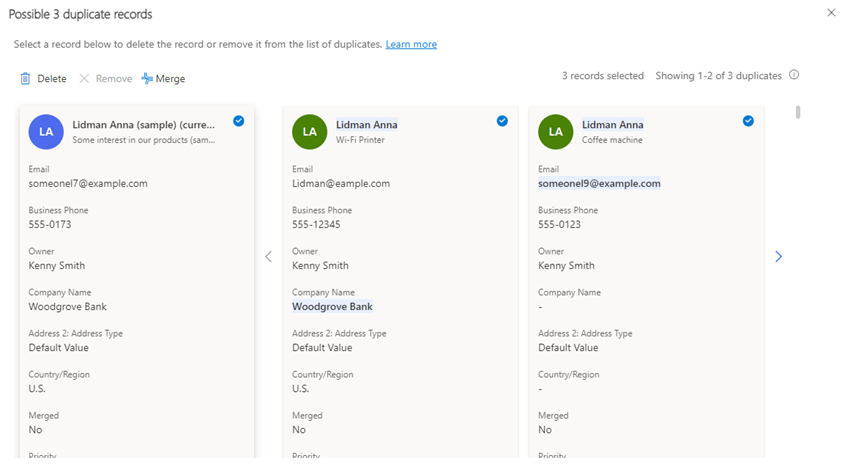
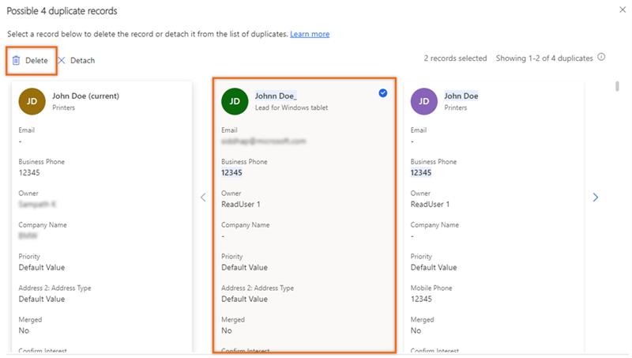

# Preview: Manage duplicate leads

[!INCLUDE [preview-disclaimer](../includes/preview-disclaimer.md)] 

>[!VIDEO https://www.microsoft.com/en-us/videoplayer/embed/RE4UpF6]

Identifying duplicate leads helps you to maintain a clean and accurate database of leads by removing the duplicates.

## License and role requirements
| Requirement type | You must have |  
|-----------------------|---------|
| **License** | Dynamics 365 Sales Premium or Dynamics 365 Sales Enterprise   More information: [Dynamics 365 Sales pricing](https://dynamics.microsoft.com/sales/pricing/) |
| **Security roles** | Any primary sales role, such as salesperson or sales manager   More information: [Primary sales roles](security-roles-for-sales.md#primary-sales-roles)|

## Prerequisites

Contact your administrator to enable duplicate lead detection for your organization. More information: [Enable duplicate lead detection](enable-duplicate-lead-detection.md)

## Rules to identify duplicates

Duplicate leads are identified based on the following rules.

| Rule | Description | Example |
|------|-------------|---------|
| Same email address | The leads are displayed as duplicates when they contain the same email address, even though other values such as name and mobile number are different. | The leads Kenny Smith and John Doe have the email address employee@contoso.com. The duplicate detection feature displays the leads Kenny Smith and John Doe as duplicates, based on this rule. |
| Same phone number | The leads are displayed as duplicates when they contain the same phone number, even though other values such as name and email address are different. | The leads Kenny Smith and John Doe have the same phone member, +1234567890. The duplicate detection feature displays the leads Kenny Smith and John Doe as duplicates, based on this rule. |
| Similar name and company name | If the leads have a similar name and company, they're displayed as duplicates. The AI model can identify the duplicate leads even when the name and company sound similar. | For example, Regina Murphy from Contoso and Regina Merphy from Contoso.inc. In this example, the spelling of the names is different but the names sound similar. |
| Similar name and the same email domain | If the leads have a similar name and the same email domain, they're displayed as duplicates. The AI model can identify the duplicate leads even when the names sound similar. | For example, Regina Murphy, Regina@contoso.com, and Regina Merphy, Manager@contoso.com. In this example, the spelling of the names is different, but the names sound similar and the email domain is the same (contoso.com). |
 
## View and identify duplicate leads

1.	Sign in to Sales Hub app, and in the site map, select **Sales** > **Leads**.    
     
2.	Select a lead from the list. If the lead has duplicates, the **View duplicates** option is displayed on the toolbar.

    >[!NOTE]
    >Select only one lead to view the duplicates. 

    >[!div class="mx-imgBorder"]
    >    
 
    or
    
    Open a lead. If the lead has duplicates, a message is displayed below the toolbar with the number of duplicate leads that match the open lead. Select **View possible duplicates**.

    >[!div class="mx-imgBorder"]
    >    

    The duplicate page opens with a list of duplicate leads.

    >[!div class="mx-imgBorder"]
    >    

After detecting the duplicates, you can merge and maintain a single record. More information: [Merge duplicate leads](#merge-duplicate-leads)

## Understand the duplicate list page

- The lead displayed on the left side of the page is the lead that you've selected to view duplicates. The name is suffixed with **(current)**.

- The attributes that contain similar data are highlighted across the identified duplicate leads. For example, in the preceding image, you can see that the name and the **Business Phone** are highlighted, indicating that the data is similar when compared with the selected lead.

- Only two duplicate leads are visible on the page. To view the other leads, select the right arrow. The message in the upper-right corner shows the count of the leads you're viewing. For example, in the preceding image, the message **Showing 1-2 of 4 duplicates** indicates that you're viewing the first two leads of a total of four duplicate leads.
 
## Merge duplicate leads

To work on a prospect, merge the duplicate records into a single relevant record. With the duplicate detection feature of Microsoft Power Platform, you can only merge one with the primary record. The sales duplicate detection feature is enhanced to merge a record with at least four duplicates. This helps the sellers to maintain a single record with the latest information.

Let’s look at the merger process with an example–**Lidman Anna**.

1.	Open the lead. More information: [View and identify duplicate leads](#view-and-identify-duplicate-leads).    
    In this example, we are opening the **Lidman Anna (sample)** record.
 
    >[!div class="mx-imgBorder"]
    > 

2.	On the duplicate records dialog box, select the records that you want to merge. You can select up to four duplicate records.    
    The **Lidman Anna (sample)** lead contains three possible duplicates and select the records that you want to merge. 

    >[!div class="mx-imgBorder"]
    > 

    >[!NOTE]
    >The **Merge** option will be active only when you select the current record and at least one duplicate record.    

3.	Select **Merge**.    
    The Merge dialog opens and let’s look at it in detail. 

    >[!div class="mx-imgBorder"]
    > 
 
    -	**Primary record**: A primary record is always the lead that has most activities related to it or the most recently updated. For example, though we have selected **Lidman Anna (sample)** to view the duplicates, the primary record is **Lidman Anna** with topic **Wi-Fi Printer**. Because **Lidman Anna** with topic **Wi-Fi Printer** is the most recently updated record.    
        
        To make other records as primary, select the **Make primary** option from the top of the record. A confirmation message is displayed stating that the changes made to the current primary record will be lost, select **Continue**.    

    -	**Fill the empty fields of the primary record**: If the primary record contains empty fields and the other records have values, select the **Fill the empty fields of the primary record** option. By default, the option is selected.      
        
        The empty fields in the primary records are automatically updated with the information from the next available record (in the order of display). Also, you can see that the updated fields in the primary record are proceeded with the undo icon.    
        
        Similarly, field values that are added to the primary record are preceded with a check icon on the record from where it is added. For example, you can see that field values such as, **No. of Employees**, **Source Campaign**, and **Lead Source** are added from **Lidman Anna (sample)** to the primary record **Lidman Anna**.    
        
        To add the required value from the duplicate records to the primary record, hover over the field and select the check icon. For example, if you want the lead’s job title to be **Sales Manager**, select the **Job Title** field from the first duplicate record.    
            
        To remove the value of a field:   
        -	Select the undo icon  on the primary record or    
        -	Uncheck the filed on the duplicate record.   

    - **Hide fields with same data**: To hide fields with similar values across all the records, select **Hide fields with same data**. By default, the option is selected.

4.	Select **Merge**.

5.	On the confirmation message, select **Continue**.
 
The primary record is updated, and other records are deactivated. 

## Delete duplicate leads

After you identify the duplicate leads, delete them to help ensure a clutter-free and actionable leads list.

1.	Select the duplicate lead, and then select **Delete**. 

    >[!NOTE] 
    >You can delete a lead only if you're the owner of the lead or have the delete permission for the lead.

    >[!div class="mx-imgBorder"]
    > 
 
2.	In the confirmation message, select **Delete permanently**.

The duplicate lead is removed from your organization.

## Remove leads from the duplicates list

After you identify the leads that aren't duplicates, you can remove them from the duplicates list.

Select the lead, and then select **Detach**. 
 
>[!div class="mx-imgBorder"]
>   

The lead is detached from the actual lead's duplicate list. However, if the detached lead occurs in the duplicates list of other leads, you must remove it from each list individually.

[!INCLUDE [cant-find-option](../includes/cant-find-option.md)]

### See also

[Enable duplicate lead detection](enable-duplicate-lead-detection.md)

