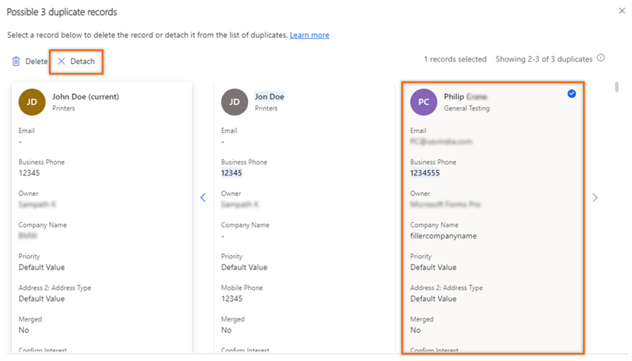

# Preview: Manage duplicate leads

[!INCLUDE [preview-disclaimer](../includes/preview-disclaimer.md)] 

Identifying duplicate leads helps you to maintain a clean and accurate database of leads by removing the duplicates.

## License and role requirements

| &nbsp; | &nbsp; |  
|-----------------------|---------|
| **License** | Dynamics 365 Sales Premium or Dynamics 365 Sales Enterprise   More information: [Dynamics 365 Sales pricing](https://dynamics.microsoft.com/sales/pricing/) |
| **Security roles** | Salesperson and above   See [Predefined security roles for Sales](security-roles-for-sales.md)|
|||

## Prerequisites

Contact your administrator to enable duplicate lead detection for your organization. More information: [Enable duplicate lead detection](enable-duplicate-lead-detection.md)

## Rules to identify duplicates

Duplicate leads are identified based on the following rules.

| Rule | Description | Example |
|------|-------------|---------|
| Same email address | The leads are displayed as duplicates when they contain the same email address, even though other values such as name and mobile number are different. | The leads Kenny Smith and John Doe have the email address employee@contoso.com. The duplicate detection feature displays the leads Kenny Smith and John Doe as duplicates, based on this rule. |
| Same phone number | The leads are displayed as duplicates when they contain the same phone number, even though other values such as name and email address are different. | The leads Kenny Smith and John Doe have the same phone member, +1234567890. The duplicate detection feature displays the leads Kenny Smith and John Doe as duplicates, based on this rule. |
| Similar name and company name | If the leads have a similar name and company, they're displayed as duplicates. The AI model can identify the duplicate leads even when the name and company sound similar. | For example, Regina Murphy from Contoso and Regina Merphy from Contoso.inc. In this example, the spelling of the names is different but the names sound similar. |
| Similar name and the same email domain | If the leads have a similar name and the same email domain, they're displayed as duplicates. The AI model can identify the duplicate leads even when the names sound similar. | For example, Regina Murphy, Regina@contoso.com, and Regina Merphy, Manager@contoso.com. In this example, the spelling of the names is different, but the names sound similar and the email domain is the same (contoso.com). |
 
## View and identify duplicate leads

1.	Sign in to Sales Hub app, and in the site map, select **Sales** > **Leads**.    
     
2.	Select a lead from the list. If the lead has duplicates, the **View duplicates** option is displayed on the toolbar.

    >[!NOTE]
    >Select only one lead to view the duplicates. 

    >[!div class="mx-imgBorder"]
    >    
 
    or
    
    Open a lead. If the lead has duplicates, a message is displayed below the toolbar with the number of duplicate leads that match the open lead. Select **View possible duplicates**.

    >[!div class="mx-imgBorder"]
    >    

    The duplicate page opens with a list of duplicate leads.

    >[!div class="mx-imgBorder"]
    >    

## Understand the duplicate list page

- The lead displayed on the left side of the page is the lead that you've selected to view duplicates. The name is suffixed with **(current)**.

- The attributes that contain similar data are highlighted across the identified duplicate leads. For example, in the preceding image, you can see that the name and the **Business Phone** are highlighted, indicating that the data is similar when compared with the selected lead.

- Only two duplicate leads are visible on the page. To view the other leads, select the right arrow. The message in the upper-right corner shows the count of the leads you're viewing. For example, in the preceding image, the message **Showing 1-2 of 4 duplicates** indicates that you're viewing the first two leads of a total of four duplicate leads.

## Delete duplicate leads

After you identify the duplicate leads, delete them to help ensure a clutter-free and actionable leads list.

1.	Select the duplicate lead, and then select **Delete**. 

    >[!NOTE] 
    >You can delete a lead only if you're the owner of the lead or have the delete permission for the lead.

    >[!div class="mx-imgBorder"]
    > 
 
2.	In the confirmation message, select **Delete permanently**.

The duplicate lead is removed from your organization.

## Remove leads from the duplicates list

After you identify the leads that aren't duplicates, you can remove them from the duplicates list.

Select the lead, and then select **Detach**. 
 
>[!div class="mx-imgBorder"]
>   

The lead is detached from the actual lead's duplicate list. However, if the detached lead occurs in the duplicates list of other leads, you must remove it from each list individually.

[!INCLUDE [cant-find-option](../includes/cant-find-option.md)]

### See also

[Enable duplicate lead detection](enable-duplicate-lead-detection.md)

