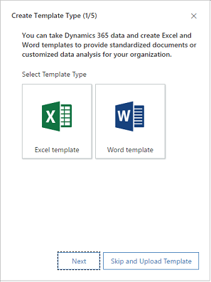
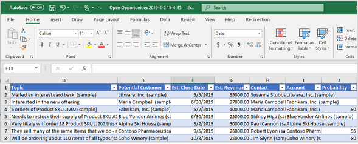
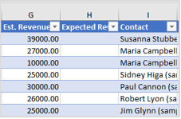

# Create and manage Excel templates in Dynamics 365 Sales

Microsoft Excel provides powerful ways to analyze and present your Dynamics 365 Sales data. With Excel templates, you can easily create and share your customized analysis with others in your organization.

You can use Excel templates for:

-   Sales forecasting

-   Pipeline management

-   Leads scoring

-   Territory planning

-   And much more…

## License and role requirements

| &nbsp; | &nbsp; |
|-----------------------|---------|
| **License** | Dynamics 365 Sales Premium, Dynamics 365 Sales Enterprise, or Dynamics 365 Sales Professional  More information: [Dynamics 365 Sales pricing](https://dynamics.microsoft.com/sales/pricing/) |
| **Security roles** | System Administrator, Sales Manager, or Sales Professional Manager    See [Predefined security roles for Sales](security-roles-for-sales.md)|
|||

## Create an Excel template

Templates display information from the view defined for a record type (entity). Depending on the Dynamics 365 Sales license that you have, select one of the tabs for specific information.

# [Sales Premium and Sales Enterprise](#tab/SE)

1. From the Sales Hub app, select the **Settings** icon , and then **Advanced settings**. 

2. Follow the instructions in [Analyze and share your data with Excel templates](/power-platform/admin/analyze-your-data-with-excel-templates?context=/dynamics365/context/sales-context) to create an excel template.  

# [Sales Professional](#tab/SP)

There are four steps for creating an Excel template.

### Step 1: Create a new template from existing data

1.  Make sure you have the System Administrator role in Dynamics 365 Sales Professional.

2.  In the site map, select **Sales Settings**.

3.  Under **Advanced Settings**, select **Excel and Word Templates**.

4.  Select **New template**.

5.  In the **Create Template Type** pane, select **Excel Template**, and then select **Next**.

    

6.  Select an entity to which the template applies. The template will use data from this entity. The views you can select in the next field depend on the
    entity you select.

7.  The view defines the query used to display records and the columns or fields that are shown. Select a view, and then select **Next**.

    

8.  On the **Download Template** page, select **Download**.

9.  To upload the template later, select the **Upload the template later** check box, and then select **Next**.

10.  To upload the template after you customize the data, go to the list of templates, and then select **Upload Template**. More information: [Upload the template and share it with others](#step-3-upload-the-template-and-share-with-others).

### Step 2: Customize the data in Excel

Open the newly created template in Excel to customize the data.

Let’s walk through a simple example of customizing an Excel template using Dynamics 365 Sales Professional sample data.

#### Example customization of Opportunities data

1.  Select **Enable Editing** to allow customization of the Excel spreadsheet.

2.  Add a new column, and name it “Expected Revenue”.

    

3.  Create a formula for the expected revenue. Don’t refer to cells using their addresses; define and use names instead.

    

4.  Create a pivot table and chart.

    Place user-added content above or to the right of the existing data table. This prevents the content from being overwritten if you add new data in Dynamics 365 Sales Professional later and you create a new Excel template.
    
    More information: [Best practices and considerations for using Excel templates](#best-practices-and-considerations-for-using-excel-templates).

    

5.  Save the spreadsheet.

You’re now ready to upload the Excel template into Dynamics 365 Sales
Professional.

### Step 3: Upload the template and share with others

When you have your Excel template customized the way you want, you can upload it into Dynamics 365 Sales Professional.

Administrators can use the **Advanced Settings** page to upload the Excel
template into Dynamics 365 Sales Professional.

>  [!NOTE] 

>  Users in your organization can see the templates available to them by selecting the **Excel Templates** button on the command bar in the list of records.

1.  Under **Advanced Settings**, select **Excel and Word Templates**, and then select **Upload template**.

2.  Find and upload the file.

    

3.  Select **Upload**.

    You’ll see the summary of the file you’re uploading.

4.  Select **Finish**.

---

## Best practices and considerations for using Excel templates

Here are some things you need to be aware of to create and make the best use of Excel templates in Dynamics 365 Sales.

-   **Test your Excel templates.**

    Excel has lots of features. It’s a good idea to test your customizations to see that all Excel features work as expected in your templates.

-   **Data in templates and privacy concerns.**

    By default, pivot chart data is not updated when a spreadsheet is opened. This can create a security issue if certain pivot chart data should not be seen by users with insufficient permissions.

    Consider the following scenario:

    -   A Dynamics 365 Sales administrator creates a template where the view contains sensitive data in a pivot chart which is uploaded into Dynamics 365 Sales.

    -   A salesperson who should not have access to the sensitive data in the pivot charts uses the template to create an Excel file to do data analysis.

    The outcome of this scenario is that the salesperson might be able to see the pivot chart data as it is uploaded by the Dynamics 365 Sales administrator, including access to views for which the salesperson does not have permissions.

    In addition, iOS does not support updating pivot data and pivot charts when using the Microsoft Excel app on iOS devices.

    >[!IMPORTANT]
    >Sensitive data should not be included in pivot tables and pivot charts.

-   **Set pivot chart data to automatically refresh**

    By default, pivot chart data does not automatically refresh when you open the spreadsheet. Other types of charts do update automatically.

    In Excel, right-click the pivot chart, and then select **PivotChart Options** > **Refresh data** when opening the file.

    

-   **Placing new data**

    If you want to add content to the Excel template, place your data above or to the right of the existing data. A second option is to place your new content on a second sheet.

-   **Excel templates with images can cause an error**

    If you attempt to view Dynamics 365 Sales data with an Excel template that has an image saved in it, you might see the following error: “An error occurred while attempting to save your workbook. As a result, the workbook was not saved.” Try removing the image from the template and reloading it into Dynamics 365 Sales.

-   **Excel templates and Office Mobile app in Windows 8.1**

    Excel templates will not open in Windows 8.1 devices with the Office Mobile app. You’ll get the following error message: “We’ve recovered as much of your document as we could, but you can’t edit it. Try to open and repair the document on your PC to fix the problem.”

    This is a known issue. Use table column names and range names in formulas. When you create Excel formulas, don’t use column titles or cell numbers. Instead, use the table column names, and define names for cells or cell ranges.

### See also

[Create and manage Word templates in Dynamics 365 Sales](manage-word-templates.md)

[!INCLUDE[footer-include](../includes/footer-banner.md)]
