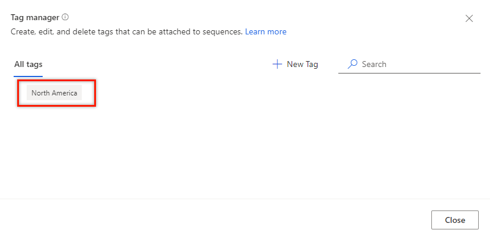
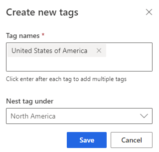
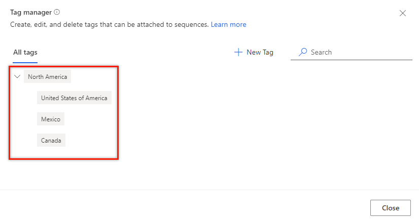
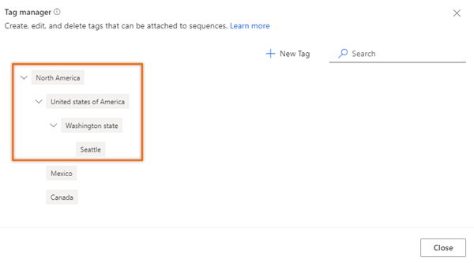
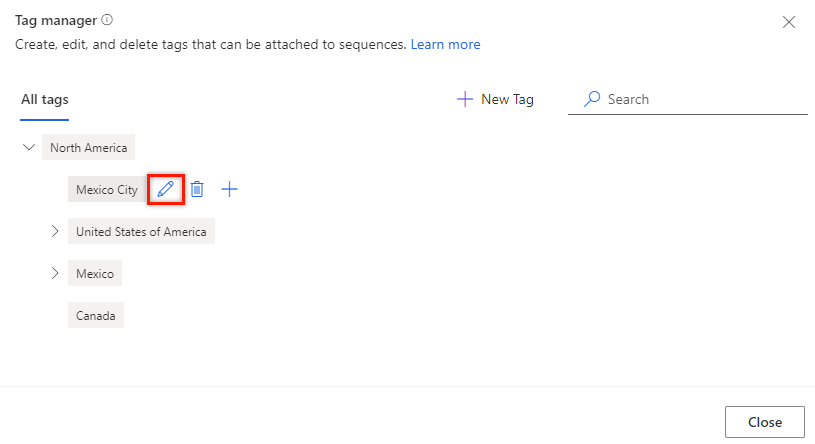
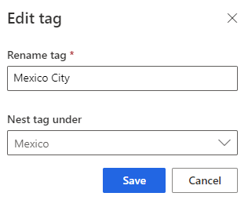
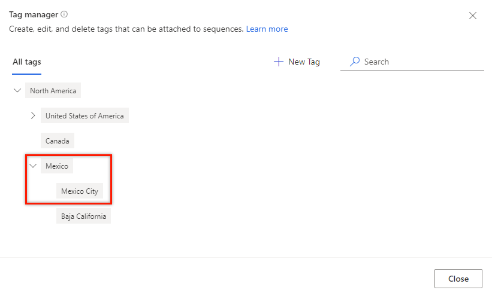

# Manage tags for sequence 

Tags help you quickly filter and identify sequences from a list by categories that you define.

## Role and license requirements

| &nbsp; | &nbsp; |
|-----------------------|---------|
| **License** | Dynamics 365 Sales Premium or Dynamics 365 Sales Enterprise More information: [Dynamics 365 Sales pricing](https://dynamics.microsoft.com/sales/pricing/) |
| **Security Role** | System Administrator, Sequence manager, or Sales Manager    See [Predefined security roles for Sales](security-roles-for-sales.md)|
|||

## What are tags?

A tag is a label that is used to identify a sequence. The tag works as a metadata to help you filter and find sequences. By tagging sequences, you can distinguish one sequence from another and easily identify a sequence from a huge list. 

You can do the following activities on tags:
-	[Create tags](#create-tags)
-	[Edit a tag](#edit-a-tag)
-	[Delete a tag](#delete-a-tag)
-	[Apply tag to a sequence](#apply-tag-to-a-sequence)
-	[Filter sequences based on tags](#filter-sequences-based-on-tags)
-	[Remove tags from a sequence](#remove-tags-from-a-sequence)

## Create tags

Create tags to categorize sequences into a logical order. For example, you want to categorize leads based on the city of origin. You create tags with city names such as, Seattle and Hyderabad, and apply them to leads according to their city of origin.   

**To create tags, follow these steps:**

1.	In the **Sales Hub** app, go to **Change area** in the lower-left corner of the page, and select **Sales Insights settings**.
2.	Under **Sales accelerator**, select **Sequence**.
3.	On the **Sequences** page, select **Tag manager**.

   >[!div class="mx-imgBorder"]
   >
 
5.	On the **Tag manager** page, select **New tag**.
6.	On the **Create new tags** dialog box, enter the following details:   

    | Field | Description |
    |-------|-------------|
    | Tag name | Enter the name of the tag. **Note**: You can't have forward slash (/) in name. |
    | Nest tag under | Select a tag name under which you want to create the tag. When **None** is selected, the tag is created at level 1 and you can add tags under it. To add multiple tags, press **Enter** after adding each tag. You can also create nested tags. More information: [Create nested tag](#create-nested-tag). |

7.	Select **Save**.    
    Repeat the procedure to add more tags.

### Create nested tag

The nested tags allow you to group the tags together so that it’s easy to identify tags while applying to a sequence. For example, you want to create tags based on regions and go down levels to cities including countries and states. You create North America (at level 1), create United states of America (level 2), create Washington state (level 3), then create Seattle (level 4).

>[!IMPORTANT]
>- You can create nested tags for up to 4 levels.
>- There is no limit in adding tags at level 1. For other levels, you can only add up to 100 tags.

1.	Create a tag at root node. In this example, we're creating the **North America** tag.   

    >[!div class="mx-imgBorder"]
    >
  
2.	Create a node at a level below the root node (North America).   
    1.	Hover the mouse over the root node tag (For example, **North America**) and then select the **Add (+)** icon.     
        >[!NOTE]
        >You can also use **+ New Tag** to add a node below the root node.   
        
        >[!div class="mx-imgBorder"]
        >     

    2.	On the **Create new tags** dialog box, enter the **Tag names**. Add multiple tags by pressing enter after each tag.      
        In the **Nest tag under** field, select the parent tag. Currently, only four levels of hierarchy are supported, and each level can have up to 100 tags. For example, level 1 > level 2 > level 3 > level 4. If you try to add another node below the level 4 node, an error message is displayed.    
        In this example, we're adding **United states of America**, **Canada**, and **Mexico** under parent node **North America**.    
        
        >[!div class="mx-imgBorder"]
        >     
        
    3.	Select **Save**.     
        Under **North America** node, you can see that **United states of America**, **Canada**, and **Mexico** are added to the next level as child nodes.     
                    
        >[!div class="mx-imgBorder"]
        >             
    
3.	Similarly, repeat step 2 to add: 
    -	A node below **United states of America** as **Washington state**.
    -	A node below **Washington state** as **Seattle**.
 
    >[!div class="mx-imgBorder"]
    >    

## Edit a tag

You can edit a tag if you want to change the name or the hierarchy level.     
In this example, we're editing the tag **Mexico city** (which is under **North America**) to move it under **Mexico** without changing the name. Follow these steps:   

1.	Open the tag manager.
2.	Hover the mouse over a tag and select the **Edit** icon.  

    >[!div class="mx-imgBorder"]
    >    
 
    The **Edit tag** dialog box opens.
 
    >[!div class="mx-imgBorder"]
    >    

3.	Update the information as necessary and then select **Save**. In this example, we're changing the **Nest tag under** value to **Mexico**.  
    
    >[!div class="mx-imgBorder"]
    >    

## Delete a tag

You can remove the tags that are no longer required in your organization to associate with a sequence. If a sequence is associated with the deleted tag, the tag is automatically removed from the sequence. More information: [Filter sequence based on tags](#filter-sequence-based-on-tags).

1.	Open the tag manager.
2.	Hover the mouse over a tag and select the **Delete** icon.     
    A conformation message is displayed.

    >[!div class="mx-imgBorder"]
    >    
 
3.	Select **Delete permanently**.     
    The tag is deleted. 

If a tag is deleted that has child tags, then the child tags will move up a level in hierarchy and are nested under the parent of the deleted tag.

For example, there are three levels of tags in the hierarchy, and you deleted a tag at parent (level 2). The child tags (level 3) move up a level (level 2) and nested under the parent (level 1). When you delete **Mexico** (parent) which is at level 2, the cities under it move a level up to **North America** and become level 2 in the hierarchy.

>[!div class="mx-imgBorder"]
>    

## Apply tag to a sequence

To apply tags to a sequence, follow these steps:

1.	In the **Sales Hub** app, go to **Change area** in the lower-left corner of the page, and select **Sales Insights settings**.
2.	Under **Sales accelerator**, select **Sequence**.   
3.	Select a sequence for which you want to apply tags and then select **Edit tags**.    
    
    >[!NOTE]
    >You can also select the **Edit tags** option by opening the sequence.   
    
    >[!div class="mx-imgBorder"]
    >    
    
5.	On the **Edit sequence tags** pane, select **+ Add tags to sequence**.

    >[!div class="mx-imgBorder"]
    >    
 
6.	Select the tags that you want to apply to the sequence.    
    The selected tags are highlighted in Blue and are listed in the **Selected tags** section with the hierarchy path.   

    >[!div class="mx-imgBorder"]
    >    
 
7.	Select **Add**.    
    The tags are listed in the sequence, including the hierarchy. Hover the mouse over the added tag to view the full path for the tag.

    >[!div class="mx-imgBorder"]
    >     

8.	Select **Apply**.     
    The tags are applied to the sequence.

## Filter sequences based on tags

To filter the sequences based on tags, follow these steps:

1.	In the **Sales Hub** app, go to **Change area** in the lower-left corner of the page, and select **Sales Insights settings**.
2.	Under **Sales accelerator**, select **Sequence**.   
3.	Select the **Tags** column.   
    The **Filter by option** opens.   

    >[!div class="mx-imgBorder"]
    >     

4.	Search for the tags to filter the sequence.

    >[!div class="mx-imgBorder"]
    >      
    
    The sequences are filtered and are listed in the sequence page. The list displays all the sequences that match the filter criteria regardless of state.     

    >[!div class="mx-imgBorder"]
    >      

## Remove tags from a sequence 

To remove a tag from a sequence, follow these steps:
 
1.	In the **Sales Hub** app, go to **Change area** in the lower-left corner of the page, and select **Sales Insights settings**.
2.	Under **Sales accelerator**, select **Sequence**.   
3.	Select a sequence for which you want to remove tags and then select **Edit tags**.
4.	In the **Sequence tags** section, select the **Cross** icon (**X**) corresponding to the tag and select **Apply**.    
    The tag is removed from the sequence.

[!INCLUDE[cant-find-option](../includes/cant-find-option.md)] 

### See also

[Create and manage sequences](create-manage-sequences.md)      
[Create and activate a sequence](create-and-activate-a-sequence.md)

[!INCLUDE[footer-include](../includes/footer-banner.md)]

