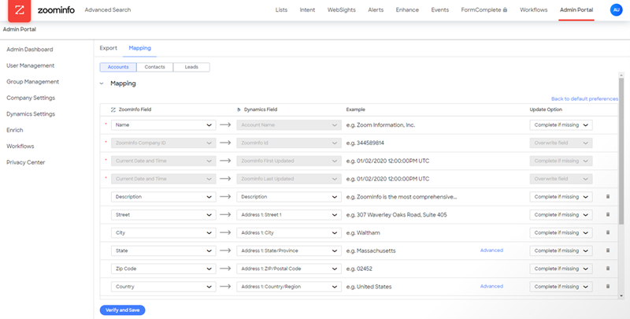

# Match fields between Dynamics 365 and ZoomInfo 

When you try to export data from the ZoomInfo app to your Dynamics 365 Sales organization, certain corresponding fields may not match and won't display updated values. To avoid these mismatches, you can map the corresponding fields between Dynamics 365 and ZoomInfo for accounts, contacts, and leads.

## License and role requirements
| &nbsp; | &nbsp; |
|-----------------------|---------|
| **License** | Dynamics 365 Sales Premium or Dynamics 365 Sales Enterprise   More information: [Dynamics 365 Sales pricing](https://dynamics.microsoft.com/sales/pricing/) |
| **Security roles** | System Administrator   More information: [Predefined security roles for Sales](security-roles-for-sales.md)|

## Prerequisites
Before you start, be sure you've met the following prerequisites:
-	The ZoomInfo app is installed on your Dynamics 365 Sales organization. More information: [Install ZoomInfo app](install-zoominfo-app.md).   
-	You have a license to use the ZoomInfo app.

## Map the fields     
1.	Sign in to your Dynamics 365 environment and open the ZoomInfo app.    
2.	On the left navigation pane, select **ZoomInfo** > **ZoomInfo**.   
    >[!NOTE]
    >The app might prompt you to enter credentials. Select either Google, Office, or enter your ZoomInfo credentials if you have an account with ZoomInfo.  

    > [!div class="mx-imgBorder"]
    > 
     
3.	On the top-right corner of the page, select **More** > **Admin Portal**.
4.	On the **Admin Portal** page, select **Dynamics Settings**.

    > [!div class="mx-imgBorder"]
    >  

5.	Select the **Mapping** tab and then choose the **Accounts**, **Contacts**, or **Leads** tab to map the fields.   

    >[!NOTE]
    >In this example, we're using **Accounts**.    

    You can view the default or configured corresponding field between the ZoomInfo app and Dynamics 365.

    > [!div class="mx-imgBorder"]
    >  
    
6.	Map the fields as required. Each column is described with its functionality in the following table:   

    | Column name | Description |
    |-------------|-------------|
    | ZoomInfo Field | Displays a list of ZoomInfo fields that are available for you to map with Dynamics 365 fields. |
    | Dynamics Field | Displays a list of Dynamics 365 fields that are available for you to map. The list also includes your custom fields. |
    | Example | Displays an example of value for the selected ZoomInfo field. |
    | Update Option | Select one of the following options for the field:<ul><li>**Complete if missing**: Choose this option to only complete with ZoomInfo data if nothing exists in Dynamics 365. By default, this option is selected.</li><li>**Overwrite field**: Choose this option to overwrite existing data in Dynamics 365 with ZoomInfo data.</li></ul> |
    
    >[!NOTE]
    >-	Select **Add Rows** to add more fields to the mapping table.
    >-	To set the mapped values to default, select **Back to default preferences**.  

7.	Select **Verify and Save**.    

    The ZoomInfo app validates the corresponding mapped values and saves the mappings. If there are any mismatches in the mapping, an error is displayed to resolve the issue.

[!INCLUDE[cant-find-option](../includes/cant-find-option.md)] 

### See also

[Install ZoomInfo app](install-zoominfo-app.md)   

[!INCLUDE[footer-include](../includes/footer-banner.md)]
