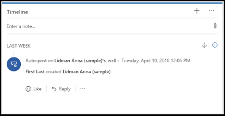
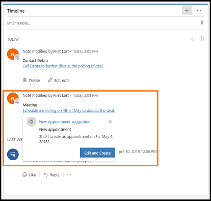
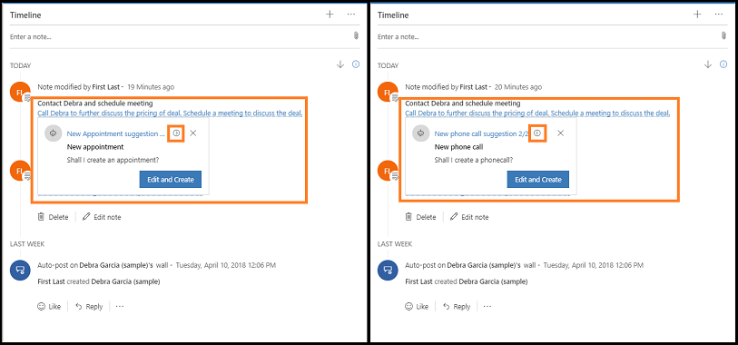

# How notes analysis assists you with suggestion 

Get intelligent suggestions on action that you take on notes you enter during a recent meeting or discussion with your customer.

## License and role requirements
| &nbsp; | &nbsp; |  
|-----------------------|---------|
| **License** | Dynamics 365 Sales Premium  More information: [Dynamics 365 Sales pricing](https://dynamics.microsoft.com/sales/pricing/) |
| **Security roles** | All primary sales roles such as salesperson, sales manager, and so on.   More information: [Primary sales roles](security-roles-for-sales.md#primary-sales-roles)|
|||

## Create actions based on suggestions

Notes analysis provides you with suggestions for actions based on customer-related activities. When you create an activity, such as appointment, email, phone call, task, note, post, or custom activities, the notes analysis feature analyzes the descriptions provided in these activities and gives you intelligent suggestions. With these suggestions, you can take actions, such as creating a meeting request and adding a contact.

**Timeline** control is available on contacts, opportunities, leads, accounts, and case forms.  
 > [!div class="mx-imgBorder"]
 >  
With notes analysis, the text in the activity is highlighted and when selected, suggestions are displayed. These suggestions include: Creating activities, tasks, contacts, meeting, content requests, and issue detection. 
For example, you created a note “*Meet the customer on May 4 at 4:00 PM*”. When you select this text, Dynamics 365 Sales Insights provides an automatic suggestion to create an appointment. 
 > [!div class="mx-imgBorder"]
 >  
When you have multiple suggestions associated with an activity, Dynamics 365 Sales Insights displays those multiple suggestions—you can take timely actions depending on your requirements. For example, you have created a note to contact your customer regarding pricing and schedule a meeting to further discuss the deal. The note shows suggestions to create an appointment and schedule a phone call. Let's look this example to see how suggestion-based activities work with multiple suggestions: 
1.	Open a record with the note and select the note text.   
    In this example, the note specifies to call Debra to discuss the pricing of the deal and schedule a meeting to discuss the deal. 
    > [!div class="mx-imgBorder"]
    >  
    Suggestions to create an appointment and a phone call are displayed. 
    > [!div class="mx-imgBorder"]
    >  
    Use the arrow icon to switch between the suggestions.
2.	On the **New Appointment suggestion** card, select **Edit and Create**. 
    The **Quick Create: Appointment** form opens with prefilled information from the note. 
    > [!div class="mx-imgBorder"]
    >  
3.	Edit the necessary information and select **Save**.
4.	Similarly, repeat step 2 and 3 for New phone call suggestion. 
    A new appointment and a call are scheduled for the record. 

[!INCLUDE[proc_more_information](../includes/proc-more-information.md)] [Work with activities](/dynamics365/customer-engagement/basics/work-with-activities)

## Examples

The following three scenarios are the examples of how to use notes analysis in your organization.

- [Scenario 1: Suggest New Contact](#scenario-1-suggest-new-contact)
- [Scenario 2: Suggest Task Creation](#scenario-2-suggest-task-creation)
- [Scenario 3: New Meeting](#scenario-3-new-meeting)

### Scenario 1: Suggest New Contact

   - Let me introduce you to John
    
### Scenario 2: Suggest Task Creation

   - I will prepare the contract by Friday.
   - John to confirm the date with Contoso.
   - John, can you please send the code to them?
 
### Scenario 3: New Meeting

   - Could we talk over coffee while I am in town?
   - We had a meeting with Contoso last Friday.

## Privacy notice  

For specific privacy information about [!INCLUDE[pn_dynamics_sales_insights](../includes/pn-dynamics-sales-insights.md)] capabilities for sellers, see [Privacy notice](./privacy-notice.md).

### See also

[Configure Notes analysis](configure-notes-analysis.md)  
[Notes analysis FAQs](faqs-sales-insights.md#notes-analysis)

[!INCLUDE[footer-include](../includes/footer-banner.md)]
