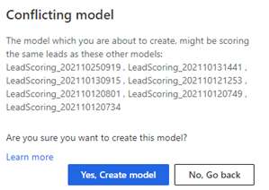

# Manage duplicate lead scoring models

When you create multiple models, it’s important to configure them so that they are not scoring the same leads. In the case of duplicate models, it’s difficult to identify which model scored the lead. Duplicate models are automatically identified when you create or edit models. A conflict message is displayed when the configuration is a duplicate of existing models.  

To remove the duplicate models, use one of the following methods depending on the action you’re performing:

- [Create model](#create-model)
- [Published model](#published-model)

## Create model

When you select **Get started**, a conflict message is displayed stating that the model you’re creating has conflicts with other models in the list. The following image shows an example of the message:

> [!div class="mx-imgBorder"]
> 

- Select **No, Go back** and change the filter column and values to ensure that the model is scoring unique leads. 
   -Or-
- Proceed to create a duplicate model, which might cause conflicts in identifying the leads that are being scored by this model.

## Published model

When you open a published model, a note displays above the version details section with the list of models that the current model is a duplicate of. The following image shows an example of the message:

> [!div class="mx-imgBorder"]
> 

Delete the duplicate model as described in the next section.

### Delete a model

You can delete a model when it's no longer required in your organization or it's a duplicate of an existing model. You can only have 10 models&mdash;both published and unpublished&mdash;simultaneously.

1. Go to the predictive lead scoring configuration page.
1. Select a model from the **Select model** list, and then select **Delete model**. In this example, we've selected the model **LeadScoring_202009181011**.

   > [!NOTE]
   > You can't delete a model if the **Retrain automatically** option is enabled. Disable the option first.

1. In the confirmation message that appears, select **Delete**.

The model is deleted from your organization.

