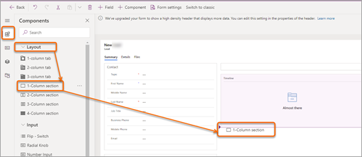
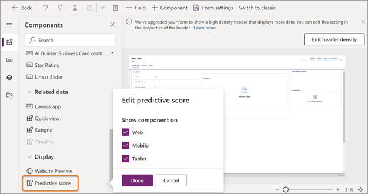

# Add the opportunity scoring widget to a form

By default, the predictive opportunity scoring widget is available only in the out-of-the-box **Sales Insights** form. If you're using customized forms for opportunities, you can display the predictive opportunity scoring widget on your custom forms by following these steps.

> [!IMPORTANT]
> - Adding opportunity scoring widgets is only supported in Unified Interface apps.
> - You can't use the legacy form designer to add an opportunity scoring widget to a form.

## License and role requirements

| Requirement type | You must have |
|-----------------------|---------|
| **License** | Dynamics 365 Sales Premium or Dynamics 365 Sales Enterprise  More information: [Dynamics 365 Sales pricing](https://dynamics.microsoft.com/sales/pricing/) |
| **Security roles** | System Administrator    More information: [Predefined security roles for Sales](security-roles-for-sales.md)|

## Add the opportunity scoring widget to a custom form

1. Sign in to the [Power Apps](https://make.powerapps.com/) portal.

    > [!div class="mx-imgBorder"]  
    > 

2. Search for and select your organization's environment.

    > [!div class="mx-imgBorder"]  
    > 

3. Select **Data** > **Tables**.

    The **Tables** page opens with the list of tables.

    > [!div class="mx-imgBorder"]  
    > 

4. Open the table, select the **Forms** tab, and then select a main form to add the widget to. In this example, the table **Opportunity** is selected and the main form **Opportunity** is selected.

    >[!NOTE]
    >If you're unable to view the table to which you want to add the widget, in the upper-right corner of the page, change the filters settings to **All**. 

    > [!div class="mx-imgBorder"]  
    > 

5. In the form designer, select **Component**, and then from **Layout**, add a column to the form as a placeholder to add the widget.

    > [!div class="mx-imgBorder"]  
    > 

    The column is added to the form.

7. From the site map, select **Display** > **Predictive score**.

    >[!NOTE]
    >Ensure that the added placeholder column is selected. If it isn't, the widget will be added at a random place in the form. 

    > [!div class="mx-imgBorder"]  
    > 

8. In the **Edit predictive score** pop-up window, select **Done**.

    > [!div class="mx-imgBorder"]  
    > 

    The predictive score widget is added to the form, as shown in the following image.

    > [!div class="mx-imgBorder"]  
    > 

    >[!NOTE]
    >To hide the **New section** label, go to the **Properties** tab of the **New Section** settings pane, and then select **Hide label**.

9. Save and publish the form.
