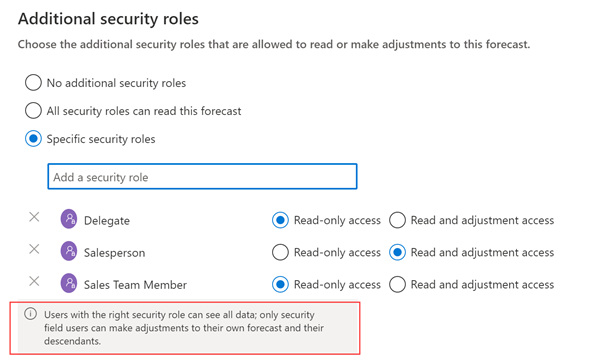

# Provide viewing and adjustment privileges to a forecast 

## Requirements
|  | |
|-----------------------|---------|
| **License** | Dynamics 365 Sales Enterprise or Dynamics 365 Sales Premium  More information: [Dynamics 365 Sales pricing](https://dynamics.microsoft.com/sales/pricing/) |
| **Security roles** | System Administrator or Forecast Manager   See [Predefined security roles for Sales](security-roles-for-sales.md)|
|||

In the **Permissions** step of the forecast configuration, you define which team members can view and adjust the forecast data at each level of the hierarchy. Also, you can provide access to users who have specific security roles to view the forecast. 

**To set viewing permissions**

1.	In the **User security field** section, choose **User lookup field**. Choosing this field determines the owner of the forecast row. The following default system user value is selected based on the template:        
    -	For **Org chart forecast**, the value is selected as **User**.      
    -	For **Territory forecast**, the value is selected as **Manager**.    
    If you select a value other than the default, a column is created in the forecast grid.     
    For example, when you select **User lookup field** as **Manager** for a territory forecast, the forecast is visible only to the managers of the territories in the selected hierarchy. The managers can edit forecast data that directly belongs to them and to their reporting territories.

2.	In the **Additional security roles** section, select one of the following options to provide permissions to view the forecast to users who aren't part of the hierarchy.

    | Additional security roles option | Description |
    |----------------------------------|-------------|
    | No additional security roles | This option provides access only to the selected hierarchy users. When you select this option, users who have other security roles in the organization can't view the forecast. By default, this option is selected. |
    | All security roles (everyone can access the forecast) | This option provides read-only access to this forecast to all the security roles of users in your organization. |
	| Specific security roles | This option allows you to specify which security roles will receive either read-only access, or read-only and adjustment access within this forecast.|

    > [!div class="mx-imgBorder"]
    > 

    A message displays at the bottom of the page that helps you understand how the forecast security is applied based on your selections.

    > [!div class="mx-imgBorder"]
    > 
    
3.	Select **Next**.

<table>
<tr><td>

> [!div class="nextstepaction"] 
> [Previous step: Define general properties and scheduling](define-general-properties-scheduling-forecast.md)
</td><td>

> [!div class="nextstepaction"] 
> [Next step: Choose layout and columns](choose-layout-and-columns-forecast.md)
</td></tr>
</table>

### See also

[Configure forecasts in your organization](configure-forecast.md)

[!INCLUDE[footer-include](../includes/footer-banner.md)]
