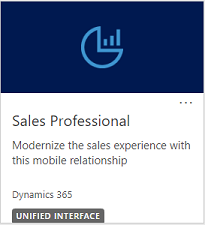

# Provision an environment for Dynamics 365 Sales Professional

Congratulations on the purchase of the Sales Professional application. 

## License and role requirements
| Requirement type | You must have |
|-----------------------|---------|
| **License** | Dynamics 365 Sales Professional  More information: [Dynamics 365 Sales pricing](https://dynamics.microsoft.com/sales/pricing/) |
| **Security roles** | System Administrator    More information: [Predefined security roles for Sales](security-roles-for-sales.md)|

Before you can start using the Sales Professional application, you need to do one of the following actions:

- If you don't have an existing Power Platform environment with Dynamics 365 apps enabled, [provision a new environment and install the Sales Professional app](#provision-a-new-power-platform-environment-for-sales-professional) 
- If you have an existing Power Platform environment with Dynamics 365 apps enabled, just [install the Sales Professional app on that environment](#install-the-sales-professional-app-on-an-existing-environment)

> [!NOTE]
> You must be a global administrator of your Microsoft 365 org (tenant) to perform both the above actions.

## Provision a new Power Platform environment for Sales Professional

1. Follow the instructions in [Create an environment with a database](/power-platform/admin/create-environment#create-an-environment-with-a-database) in the Power Platform admin guide.

1. Select **Sales Pro** as app name to deploy in the environment.  
    
1. After the environment moves to **Ready** state, open the environment URL. 

8.	In the list of application, select **Sales Professional**. 

    > [!IMPORTANT]
    > If you see the **Sales Hub** app in your list, [hide the app](/power-apps/maker/model-driven-apps/deactivate-app) as it's only applicable for Sales Enterprise and Sales Premium licenses. Sales Professional users are entitled to use only the Sales Professional app.

## Install the Sales Professional app on an existing environment

You can install the Sales Professional app on an existing Power Platform environment, which is enabled for Dynamics 365 apps. For example, if you already have an environment for Dynamics 365 Customer Service, you can install the Sales Professional app on the same environment. 

To install the app, follow the instructions in the [Power Platform documentation](/power-platform/admin/manage-apps#install-an-app-in-the-environment-view).

After the app is installed, open the environment URL and select the Sales Professional app.

### See also
[Overview of Dynamics 365 Sales](overview.md)  
[Overview of admin settings](admin-settings-overview.md)  
[Learn the basics of [!INCLUDE[pn-dyn-365-sales](../includes/pn-dyn-365-sales.md)]](user-guide-learn-basics.md) 

[!INCLUDE[footer-include](../includes/footer-banner.md)]
