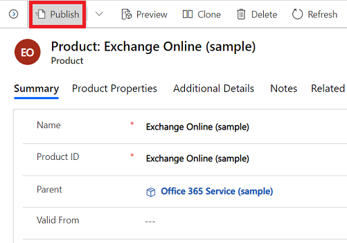

# Publish a product, family, or bundle to make it available for selling 

Publishing a product or bundle makes the product available for selling in Dynamics 365 Sales. Sellers can choose only published products and bundles when creating opportunities, quotes, and so on.

## License and role requirements

| &nbsp; | &nbsp; |  
|-----------------------|---------|
| **License** | Dynamics 365 Sales Enterprise or Dynamics 365 Sales Premium  More information: [Dynamics 365 Sales pricing](https://dynamics.microsoft.com/sales/pricing/) |
| **Security roles** | System Administrator   See [Predefined security roles for Sales](security-roles-for-sales.md)|
|||

## Publish a product, family, or bundle

By default, product records are created in a draft state, and are available to your sales agents only after you publish it. For products that don't have a parent product family, you can create them directly in an active state using a system setting, so that you don't have to publish them after creation. [!INCLUDE[proc_more_information](../includes/proc-more-information.md)] [System Settings dialog box - Sales tab](/power-platform/admin/system-settings-dialog-box-sales-tab)  

> [!NOTE]
>  You can only publish a product or bundle with a parent family if the parent product family is active.  

1. [!INCLUDE[proc_permissions_admin_cust_mgr_vp_sales_ceo](../includes/proc-permissions-admin-cust-mgr-vp-sales-ceo.md)]  
  
2. Select the site map , then select **App Settings**, and then select **Families and Products**.  

3. Open the product, bundle, or family you want to publish, and on the command bar, select **Publish**. 

    > [!div class="mx-imgBorder"]
    > 

   This will change the product status to **Active** and make it available for selling.

> [!TIP]
> 
> You can't publish multiple product records at the same time. To publish all child products and families of a parent family at once, open the family, and choose **Publish** > **Publish Hierarchy**. For product records that don't belong to a product family, publish them individually after creating or editing them to make them available to your sales agents.
  
 
## Typical next steps  
  [Revise a product](revise-product.md)  
  
  [Retire a product](retire-product.md)  
  
  [Set up a product catalog: Walkthrough](set-up-product-catalog-walkthrough.md) 
  
[!INCLUDE [cant-find-option](../includes/cant-find-option.md)]

### See also  
 [Set up a product catalog: Walkthrough](set-up-product-catalog-walkthrough.md)

[!INCLUDE[footer-include](../includes/footer-banner.md)]
