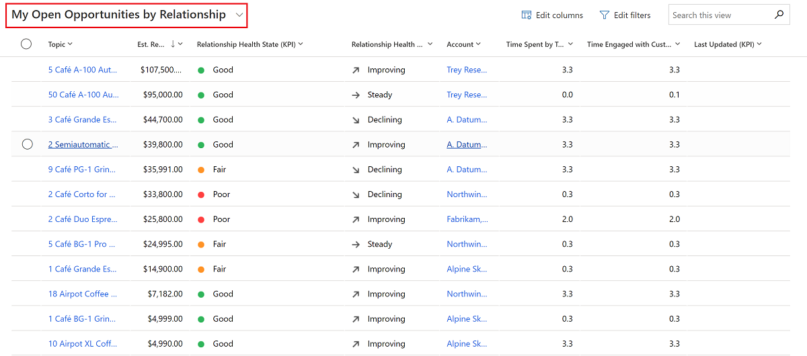
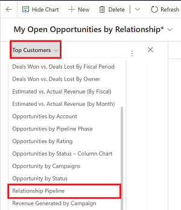
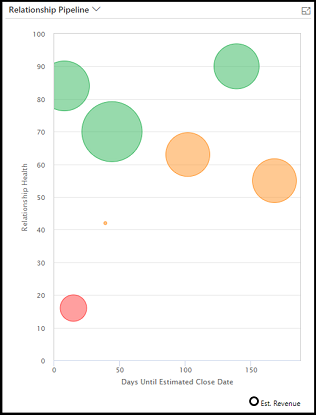
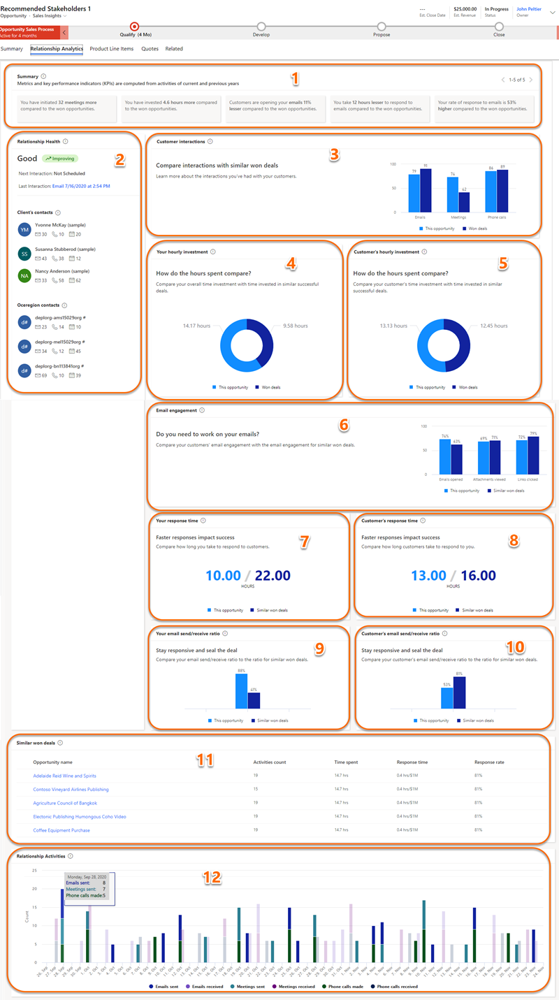

# View relationship analytics and KPIs

Relationship analytics uses the activity history of a seller with a contact or account and calculates KPIs based on their interactions. The KPIs are available at various levels such as, contact, account, opportunity, and lead. The graphical display of the KPIs help you quickly identify relationships that need to be nurtured and the KPIs to be improved for the same.  

Depending on your license and configuration, you'll either see [basic insights](relationship-analytics-overview.md#basic-relationship-insights) or [enhanced insights](relationship-analytics-overview.md#enhanced-relationship-insights). Basic insights are available for early access.

## License and role requirements

| Requirement type | You must have |
|-----------------------|---------|
| **License** | Dynamics 365 Sales Enterprise or Dynamics 365 Sales Premium  More information: [Dynamics 365 Sales pricing](https://dynamics.microsoft.com/sales/pricing/) |
| **Security roles** | Any primary sales role, such as salesperson or sales manager   More information: [Primary sales roles](security-roles-for-sales.md#primary-sales-roles)|

## View analytics and KPIs for a record

The record-level analytics includes graphs for each KPI and provides a drill-down of the activities. The following steps describe how to access the analytics page for a lead. Use similar steps to view relationship analytics for account, contact, and opportunity records.

1. In the Sales Hub app, select **Leads** and open a lead.  
1. Select the **Sales Insights** form from the drop-down.  
    :::image type="content" source="media/sales-insights-form.png" alt-text="Screenshot of the drop-down to select the Sales Insights form":::
1. Select the **Relationship Analytics** tab.
    The tab includes widgets that display useful relationship insights.
    :::image type="content" source="media/relationship-analytics-tab-large.png" alt-text="Screenshot of the relationship analytics tab and with KPIs":::

## Get the big picture with the relationship analytics view

The relationship analytics view lists the relationship KPIs and health for all your open records such as open opportunities, leads, accounts, and contacts. The following steps describe how to view the relationship analytics for all your open leads. Use similar steps to view relationship analytics for all your open accounts, contacts, and opportunities.

1. In the Sales Hub app, select **Leads**.  

1. From the views drop-down, select **My Open Leads by Relationship**.  
    :::image type="content" source="media/my-open-lead-by-relationshipp-view.png" alt-text="Screenshot of the My Open Leads by Relationship view for leads":::
    
    The list view provides the following information for contacts, opportunities, leads, and accounts:

    - Activity history and KPIs for contact, opportunity, lead, and account records.  
    - Health score and health trend for contact, opportunity, and lead records.  
      The most important KPIs (including your team's previous and next activity) are shown in the list view for each of these record types, so you can get an overview and sort the list by them.  

## Identify critical opportunities with the relationship pipeline view

The relationship pipeline view provides a bubble chart that gives you a quick overview of the health, close date, and estimated revenue for your upcoming opportunities. To view it:  

1. Go to **Sales** > **Opportunities**.  

1. From the drop-down menu, select **My Open Opportunities by Relationship**.  

    

1. From the command bar, select **Show Chart**.  

1. At the top of the charts pane, open the drop-down list, and then select **Relationship Pipeline**.  

        

   The relationship pipeline chart appears.  

      

  Each upcoming opportunity is plotted as a bubble on the relationship pipeline chart. The size of each bubble indicates the estimated revenue of the opportunity. Health is plotted on the y-axis, so the higher up the bubble appears on the chart, the higher its health.  Estimated close date is plotted on the x-axis, so opportunities on the left side of the chart may expire soon. So, the most critical opportunities are those with the largest bubbles located near the lower-left corner, while the most promising opportunities are near the top of the chart.  

  Hover over a bubble to see the name of the opportunity and other details. Select a bubble to open its opportunity record. The color of each bubble indicates relationship health:  

  - green for good

  - amber for fair

  - red for poor

  - blue for pending computation

  - gray for no computation (indicates that the results have not been calculated, or that there is not enough data)

The relationship pipeline chart relies on several values being available for each opportunity record, but in some cases, these values may be missing for some or all opportunities. This could be due to an oversight, or it could be because you don't use these fields at your organization. The chart represents missing values as follows:  

- Opportunities that don't have a relationship health value are gray, with a value of zero. They are plotted at the bottom of the chart.  
- Opportunities with an estimated close date in the past are not shown.  
- Opportunities without an estimated close date are not shown.  
- Opportunities without an estimated revenue value show a value of zero. They are plotted as very small bubbles.  

## Compare the KPIs of an opportunity with similar opportunities

As a seller, it's important for you to understand what's working better for a deal and learn about the best engagement practices from similar deals that were won in the past. The enhanced relationship analytics displays comparable information on the KPIs, graphs, activity history, and relationship health with similar deals that were won. Also, a list of similar deals that were won is displayed at the bottom. By opening the deals, you can learn what has worked and what didn't work, and implement these learnings in the deal you're currently trying to close.  

Your administrator must have enabled the feature before you can start using it. More information: [Configure relationship analytics](configure-relationship-analytics.md).

> [!NOTE]
> If relationship analytics can't detect the similar opportunities for the current opportunity, relationship analytics takes top 100 won opportunities and displays KPIs to compare with the current opportunity.

For more information about KPIs and how they're generated, see [Enhanced relationship insights](relationship-analytics-overview.md#enhanced-relationship-insights).
 
The following screenshot shows an example of enhanced relationship analytics available for an opportunity:  
> [!div class="mx-imgBorder"]
> 

### See also

[Configure relationship analytics](configure-relationship-analytics.md)  
[GDPR for Dynamics 365 Sales Insights](embedded-intelligence-gdpr.md)  
[View and export KPI data (GDPR)](view-export-KPI-data-gdpr.md)  
[Retrieve insights data using msdyn_RetrieveKPIValuesForGDPR action](../sales/retrieve-insights-data-msdyn-RetrieveTypeValuesFromDCI.md)
[Relationship analytics and health FAQ](faqs-sales-insights.md#relationship-analytics-and-health)

[!INCLUDE[footer-include](../includes/footer-banner.md)]
