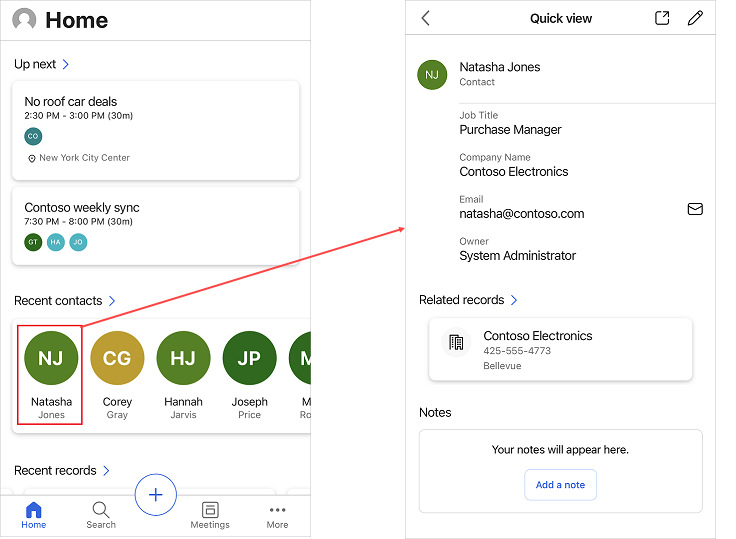
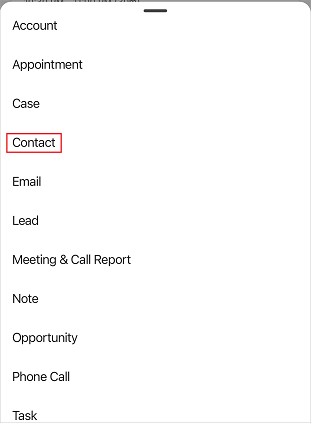
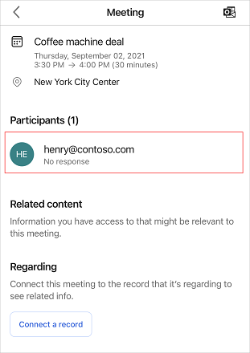
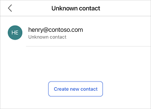

# Manage contacts 

In the Dynamics 365 Sales mobile app, you can view, edit, and create contacts.

- [View details](#view-details)

- [Edit contact details](#edit-contact-details)

- [Create contact](#create-contact)

## License and role requirements

| &nbsp; | &nbsp; |
|-----------------------|---------|
| **License** | Dynamics 365 Sales Premium, Dynamics 365 Sales Enterprise, Dynamics 365 Sales Professional, or Microsoft Relationship Sales  More information: [Dynamics 365 Sales pricing](https://dynamics.microsoft.com/sales/pricing/) |
| **Security roles** | Salesperson and above    More information: [Predefined security roles for Sales](security-roles-for-sales.md)|
|||

## View details

> [!NOTE]
> - The fields that you see on the compact form are defined in the quick view form of the table.
> - The lightweight view doesn't include all attributes of the table.
> - This is a lightweight form that contains any attributes defined in the first form on quick view form set order. More information: [Set the form order](/powerapps/maker/model-driven-apps/control-access-forms#set-the-form-order)

You can view the details of a contact in the following ways: 

**On the home page**    

The home page displays a list of contacts that you have recently accessed. When you tap a contact, the details are displayed partially at the bottom half of the screen. Scroll up or tap  to display the complete contact details in a lightweight form.

**On the Meetings page**     

The Meeting details page displays contacts are invited for the meeting. Also, the notes and insights that are displayed in the meeting are related to the displayed regarding record. Tap a contact to view the details of the contact in a quick view form. 

In the following example, the details of a recent contact shown on the home page are displayed in a quick view form:   

> [!div class="mx-imgBorder"]
>  

## Edit contact details

If the contact already exists in your Dynamics 365 Sales organization, you can update the contact details, such as mobile number and business email, by using the edit option in the quick view form.  

In the upper-right corner of the quick view form, tap . Edit the details in the **Edit** form and tap **Save**.

To open the record in the Sales Hub app, tap .

 
## Create contact

If you need to create a contact that doesn't already exist in your Dynamics 365 Sales organization, you can use the mobile app to create the contact from the following pages:

- [Home page](#home-page)

- [Meetings page](#meetings-page)

### Home page

1.  Tap the plus sign  on the navigation bar at the bottom of the screen.

2.  Tap **Add a contact**.

    
    
3.  In the **Create new Contact** form, fill in the details, and then tap **Save**.

### Meetings page 

1.  In the participant list for a meeting, tap the name of a participant. Note that you can create a contact from a participant only if the participant isn't already a contact in your Dynamics 365 organization.

    
    
1. Tap **Create new contact**.

    > [!div class="mx-imgBorder"]
    > 
    
3.  In the **Create new contact** form, fill in the details, and then tap **Save**.

### See also

[Learn the basics](learn-basics-mobile-app.md)   
[View meetings](view-agenda.md)

[!INCLUDE[footer-include](../../includes/footer-banner.md)]
