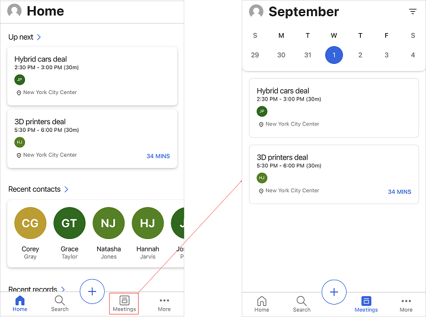
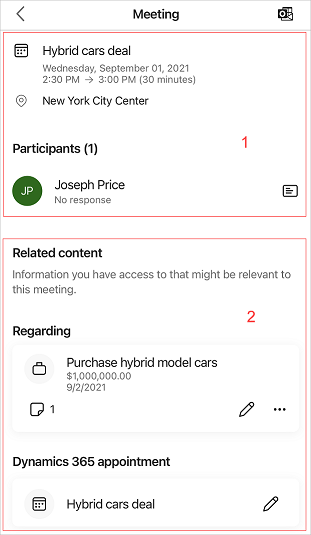
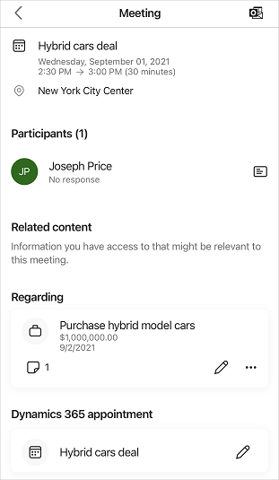
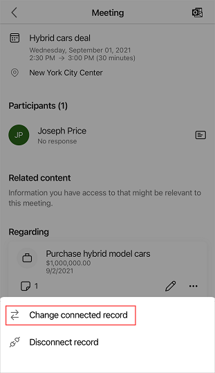
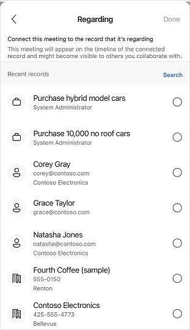
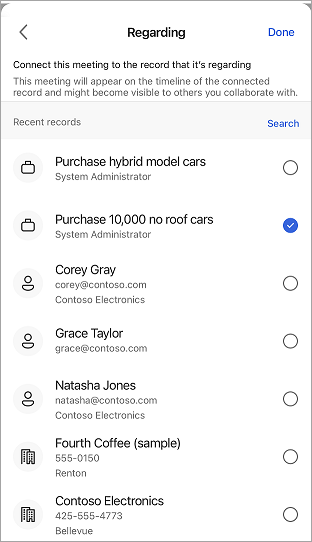
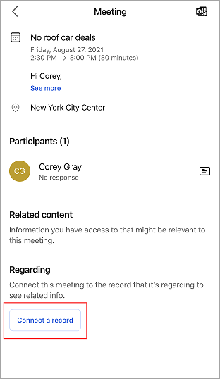
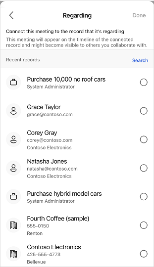
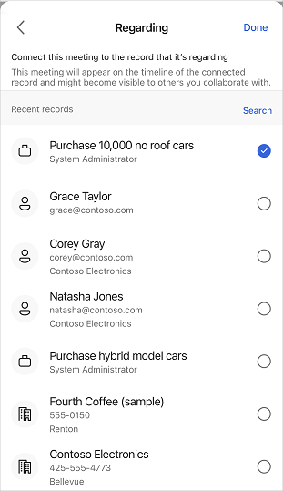
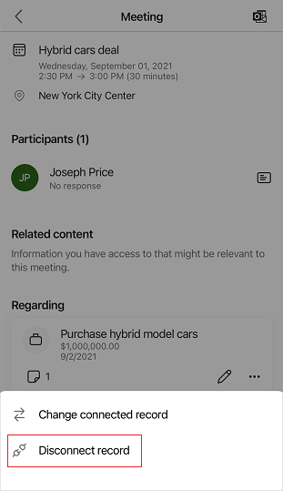

# View meetings in the mobile app

The information on the home page of the Dynamics 365 Sales mobile app can help you better plan your day. For example, the Meetings section displays your most recent meeting and the next upcoming meeting. To see more meetings for the day, tap **Meetings** either on the home page or on the navigation bar. Meetings that have been scheduled in Microsoft Outlook are displayed.  
  
> [!NOTE]
> - You can't create a meeting from the Dynamics 365 Sales mobile app.
> - The Meetings section only include meetings that have at least one participant who's outside of your organization's domain.   

## License and role requirements

| &nbsp; | &nbsp; |
|-----------------------|---------|
| **License** | Dynamics 365 Sales Premium, Dynamics 365 Sales Enterprise, Dynamics 365 Sales Professional, or Microsoft Relationship Sales  More information: [Dynamics 365 Sales pricing](https://dynamics.microsoft.com/sales/pricing/) |
| **Security Role** | Salesperson and above    More information: [Predefined security roles for Sales](security-roles-for-sales.md)|
|||
 
## View meetings

1.  On the navigation bar, tap **Meetings**. The calendar view opens.
    
    
       
2.  Do one of the following:

    - To see the details of a meeting, tap the meeting record.
    - To see meetings for a specific date, tap a date in the calendar. If there are no meetings scheduled for the day, nothing is displayed.   

## View meeting details

To see details of a specific meeting, tap the meeting record on either the home page or in the calendar view. The meeting details are displayed, as shown in the following image.    

  

Meeting details include the following:

1. [Meeting information and participants](#meeting-information-and-participants)   
2. [Related content](#related-content)

### Meeting information and participants

> [!NOTE]
> The data that is displayed in this section is retrieved from your Microsoft Exchange server.

**Meeting information**

The meeting information section provides information about the meeting subject, location, time, and description. Tap the description section to show more details. Note that the meeting information can be viewed but cannot be edited in the app.

**Participants**

Up to five meeting participants are shown in the **Participants** section, such as customers and the meeting organizer. You can see participant's acceptance status, such as accepted, tentative, declined, or no response. When you tap the name of a participant, the quick view of their contact record opens. You can perform the following actions on the contact: view, edit, and create. More information: [Manage contacts](create-contact.md)            

### Related content

This section displays information relevant to the meeting such as regarding record and appointment.

> [!NOTE]
> The data that is displayed is related to the selected regarding record and retrieved from your Dynamics 365 Sales organization.

#### Regarding record

The **Regarding** section specifies what the meeting is about, such as an opportunity, lead, contact, or account. When a meeting is attached to a record, the meeting displays the timeline, insight, participant information, and corresponding related entities. Also, the regarding record helps you to understand what the meeting is about, so you can come prepared with relevant information.

In the following screenshot, you can see that the meeting is about an opportunity to purchase hybrid model cars.

You can perform the following action on regarding entities: [view and edit](open-record.md) the records along with [change regarding record in meetings](#change-regarding-record) and [add regarding record in meetings](#add-regarding-record). You can also [disconnect the regarding record](#disconnect-regarding-record) when it is no longer relevant to the current meeting.

> [!NOTE]
> - You'll be able to set the regarding record only if server-side synchronization has been enabled in your environment and email address is approved. Contact your administrator to do the settings.
> - If you are not able to add a regarding record to meetings even after the appropriate settings are in place, uninstall and reinstall the app.

**Change regarding record in meetings**

You can update the regarding record when it is no longer relevant or there are changes to the meeting. To change the regarding record, follow these steps:

1. In the record card, tap tap , and then tap **Change connected record**.

    
    
2. On the **Regarding** page, either select a recent record or tap **Search** to look for the record you want.

    
    
3. After selecting a record, tap **Save**.

    
    
The connected record details are displayed in the Regarding section.

**Add regarding record in meetings**

You can add a regarding record to a meeting when no regarding record is attached to it. When you add the regarding record, its corresponding related entities are also added to the meeting.  

> [!NOTE]  
> Once you add a regarding record, you cannot delete it. However, you can update the record if you find that the added record is inappropriate.   

1. On the meeting details page, tap **Connect a record**.

    
    
2. On the **Regarding** page, either select a recent record or tap **Search** to look for the record you want.

    
    
3. After selecting a record, tap **Save**.

    
    
The connected record is displayed in the **Regarding** section.

**Disconnect regarding record**

You can disconnect the regarding record when it is no longer relevant to the current meeting.

- In the record card, tap tap , and then tap **Disconnect record**.

    

The record is disconnected from the meeting, and the **Connect a record** button is displayed.

**Notes and reminders** 

Notes and reminders are displayed within the corresponding connected record. [View details](open-record.md#view-details) of the record to see notes and reminders.

To view only the notes attached to the connected record, tap  on the connected record card.

### See also   

[Use the Dynamics 365 Sales mobile app](use-sales-mobile-app.md)    
[Manage contacts](create-contact.md)   
[Manage records](open-record.md)

[!INCLUDE[footer-include](../../includes/footer-banner.md)]
