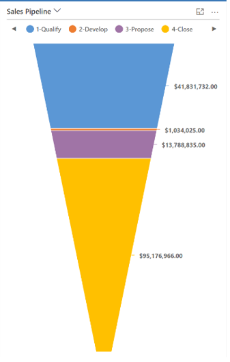

# Understand the sales pipeline chart and its phases 

Sales reps or managers use the out-of-the-box Sales Pipeline chart to visualize the revenue for an opportunity based on each pipeline phase. The following image shows a sample Sales Pipeline chart with pipeline phases such as 1-Qualify, 2-Develop, and so on. 

The pipeline phase of an opportunity is based on the stage of the business process flow that it's currently in. When an opportunity moves through the stages of its business process flow, the pipeline phase is set to a value in the form of _{StageCategoryIndex} - {CategoryName}_.

To understand how each of the pipeline phases are named, go to the **Settings** area for the opportunity and open the business process flow definition associated with the opportunity record. 
 
There are four stages in the out-of-the-box Opportunity Sales Process flow. Each stage is mapped to a unique category, as highlighted in the **Properties** section of the image below. You can customize the business process flow definition by adding or removing stages, and you can also change the name that's displayed for each stage. The value of the pipeline phase attribute is based on the category of the stage and isn't affected by any change you make to the display name. 

 
The category values used for each business process stage are defined in a global option set named **Stage Category**. When an opportunity moves from the **Qualify** to **Develop** stage of the Opportunity Sales Process flow, the metadata for the category of the new stage (**Develop**, in this example) is read. Because the order of the **Develop** stage in our example is **2**, the pipeline phase of the opportunity will be set to **2-Develop**.

The label for the pipeline phase of an opportunity consists of the category order (index) of the associated stage followed by the name of the category. In this way, pipeline phases are arranged in a sequence that matches the order of the associated category options in the **Stage Category** option set metadata. If you have a business need to introduce a new stage in the flow&mdash;for example, you want the stage **Negotiation** to appear between the **Propose** and **Close** stages&mdash;you must add a new category option named **Negotiation** in the **Stage Category** option set, and ensure that it's positioned between **Propose** and **Close**, and select this new category option for the Negotiation  stage of the business process flow. 

### See also

[Gain insights with dashboards in Dynamics 365 Sales](dashboards.md)  
[Troubleshooting sales pipeline chart and its phases](/troubleshoot/dynamics-365/sales/troubleshoot-sales-pipeline-issues)

[!INCLUDE[footer-include](../includes/footer-banner.md)]
