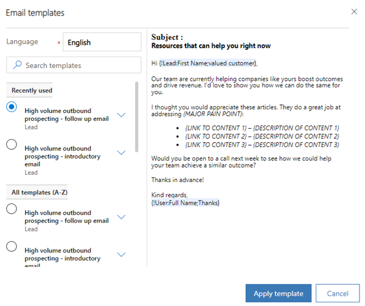
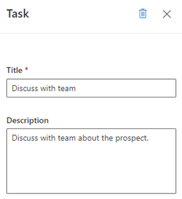

# Add steps to sequence

Add steps to define activities for sequences in the sales accelerator to display in the work list and Up next widget.

## License and role requirements
| Requirement type | You must have |
|-----------------------|---------|
| **License** | Dynamics 365 Sales Enterprise, Dynamics 365 Sales Premium, and [Microsoft Relationship Sales](https://dynamics.microsoft.com/en-in/sales/relationship-sales/)  More information: [Dynamics 365 Sales pricing](https://dynamics.microsoft.com/sales/pricing/) |
| **Security roles** | System Administrator or Sequence Manager    More information: [Predefined security roles for Sales](security-roles-for-sales.md)|

## Types of steps

When creating a sequence, you can add the following types of activities as steps:
- [Email activity](#email-activity)
- [Automated email activity](#automated-email-activity)
- [Phone call activity](#phone-call-activity)
- [Task activity](#task-activity)
- [Set wait time](#set-wait-time)

## Email activity  
Creates an email activity for sellers to communicate with customers. When this activity is shown to the seller, an envelope icon is displayed on the record. When a seller selects the icon, an email composer opens with a template, if one was selected. If no template was selected, an empty email composer opens.  

To add the email activity:

1. On the sequence designer page, select the **Add** (**+**) icon under a step.

2. On the **Add an action or other element** dialog box, under the **Steps** tab, select **Send an email**. 
    
    > [!div class="mx-imgBorder"]
    >     

3. On the **Email** activity pane, enter the following information to configure the email activity

   1. A name and description for the activity. The information you enter here will be displayed to sellers.   
   2. (Optional) If templates are available for your organization, select **Add email template**.
       On the **Email templates** dialog box, select the template you want to assign for this step and then select **Apply template**. To know more about email templates, see the step to [add email template](#automated-email) in the **Automated email** section.  
    
    > [!div class="mx-imgBorder"]
    >     
    
4. Close the email pane.   
    The email activity is added to the sequence.

Now, you can define conditions for an email activity to determine the branch that the sequence moves to as the next step. More information: [Define conditions for email activity](adaptive-sequence.md#define-conditions-for-email-activity)      

## Automated email activity   

Creates an automated email activity for sellers to communicate with customers. When this activity is shown to the seller, a send icon  is displayed on the record. The email is automatically sent to the customer based on the selected template.     
>[!TIP]
>Add a **Set wait time** activity before the **Automated email** activity. Adding wait time provides a time gap between the previous step and sending the automated email. If the time gap isn't configured, the automated email will be sent immediately after the previous activity is completed, which won't give sellers the time they might need to take action on the automated email activity.    

>[!NOTE]
>- Verify that required email templates are created in your organization. More information: [Create templates for email](/power-platform/admin/create-templates-email?context=/dynamics365/context/sales-context)   
>- Configure [the email engagement feature](configure-email-engagement.md) in your organization before you start using the automated email step.

To add the automated email activity:

1. On the sequence designer page, select the **Add** (**+**) icon under a step.

2. On the **Add an action or other element** dialog box, under the **Steps** tab, select **Send an automated email**. 
    
    > [!div class="mx-imgBorder"]
    >     

3. On the **Automated email** activity pane, enter the following information to configure the automated email activity:
    
    -	A name and description for the activity. The information you enter here will be displayed to sellers.
    -	An email template that you want to assign for this step. 
        1. Select **Add email template**. 
        2. In the **Email templates** dialog, select the language and then choose a template. When a template is chosen, you can see the preview.     
            > [!div class="mx-imgBorder"]
            >      
            
            >[!NOTE]
            >You can also view the preview of selected email template on the created step. Select the preview icon .
            
        3. Select **Apply template**.   
            The template is selected for the step.   
                
    > [!div class="mx-imgBorder"]
    >    

4. Close the automated email pane.   
    The automated email activity is added to the sequence.

Now, you can define conditions for automated email activity to determine the branch that sequence moves to next step. More information: [Define conditions for email activity](adaptive-sequence.md#define-conditions-for-email-activity).   

## Phone call activity   

Creates a phone call activity for sellers to communicate with customers. When this activity is shown to the seller, a phone icon is displayed on the record. When sellers select the icon, a softphone appears on the app to dial the customer.   
 
To add the phone call activity:

1. On the sequence designer page, select the **Add** (**+**) icon under a step.

2. On the **Add an action or other element** dialog box, under the **Steps** tab, select **Make a phone call**. 
    
    > [!div class="mx-imgBorder"]
    >     

3. On the **Phone call** activity pane, enter a name and description for the phone call activity. The information you enter here will be displayed to sellers.
    
    > [!div class="mx-imgBorder"]
    >   
    
4. Close the phone call pane.   
    The phone call activity is added to the sequence.

Now, you can define conditions for phone call activity to determine the branch that sequence moves to next step. More information: [Define conditions for phone call activity](adaptive-sequence.md#define-conditions-for-phone-call-activity).      

## Task activity  

Creates a custom activity that you define&mdash;such as scheduling a meeting with the customer&mdash;that isn't specified in the activity selector.   

To add the custom activity:

1. On the sequence designer page, select the **Add** (**+**) icon under a step.

2. On the **Add an action or other element** dialog box, under the **Steps** tab, select **Complete a task**. 
    
    > [!div class="mx-imgBorder"]
    >     

3. On the **Task** activity pane, enter a name and description for the custom activity. The information you enter here will be displayed to sellers.
    
    > [!div class="mx-imgBorder"]
    >   
    
4. Close the task pane.   
    The custom activity is added to the sequence.

## Set wait time  

Specifies the interval between activities&mdash;that is, after an activity is completed and before the next activity occurs&mdash;during which sellers need to wait. A sequence can't end with this activity.     
When this activity is shown to sellers on a record, they don't need to perform any action; they simply need to wait until the wait time expires before they perform the next activity.   

To add the wait time:

1. On the sequence designer page, select the **Add** (**+**) icon under a step.

2. On the **Add an action or other element** dialog box, under the **Steps** tab, select **Set wait time**. 
    
    > [!div class="mx-imgBorder"]
    >     

3. On the **Wait** activity pane, choose the duration in days and hours that you want sellers to wait before they perform the next activity. The maximum wait time is 30 days.
    
    > [!div class="mx-imgBorder"]
    >      
    
4. Close the task pane.   
    The wait time is added to the sequence.

[!INCLUDE[cant-find-option](../includes/cant-find-option.md)]

### See also

[Create and manage sequences](create-manage-sequences.md)     
[Create and activate a sequence](create-and-activate-a-sequence.md)      
[Adaptive sequences](adaptive-sequence.md)    

