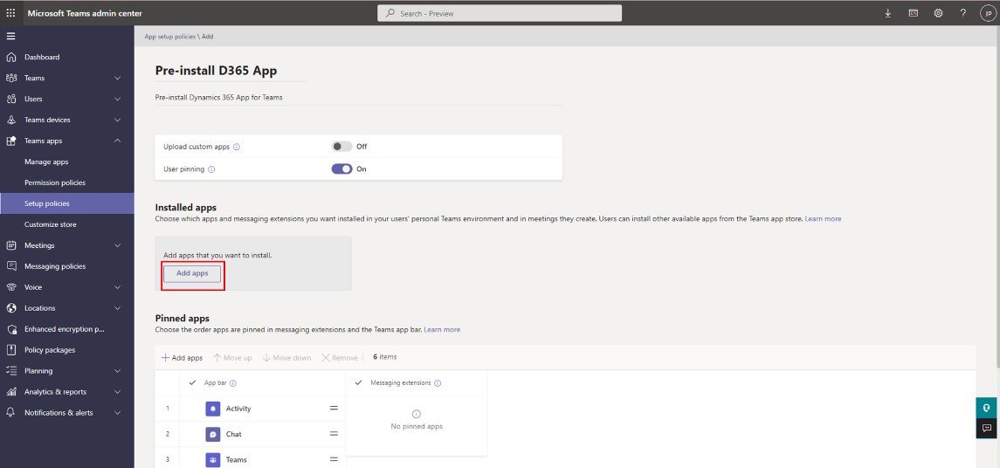
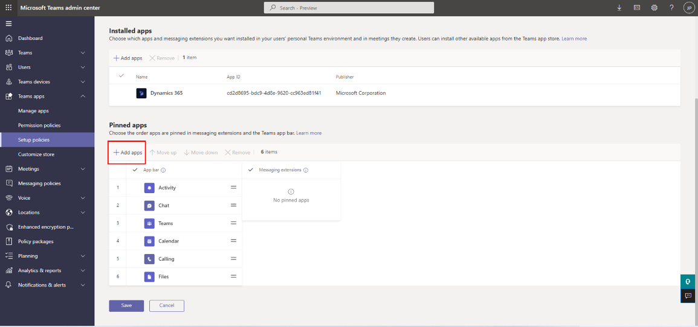
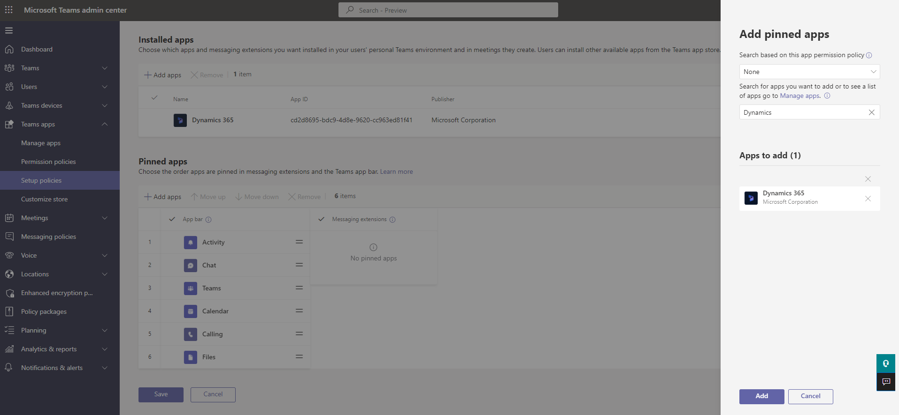
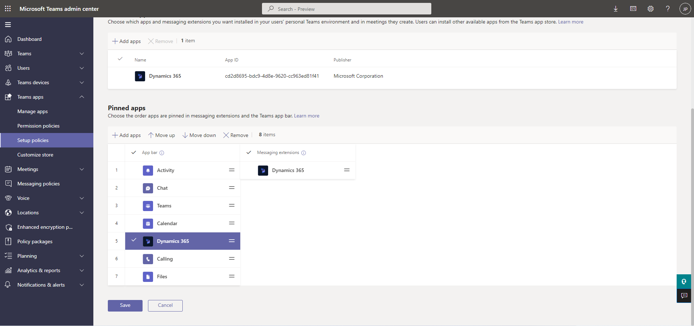
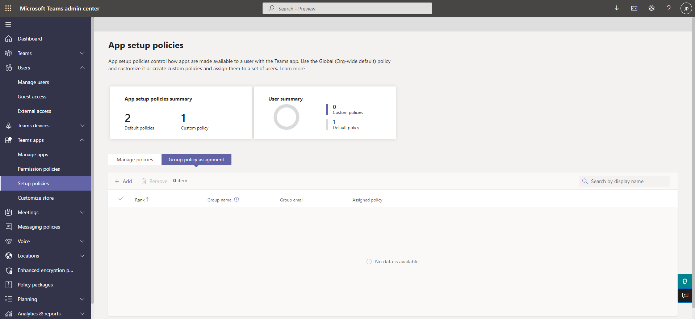

---
title: Pre-install and pin the Dynamics 365 app in Microsoft teams
description: Learn how to pre-install and pin the Dynamics 365 app in Microsoft teams.
ms.date: 05/24/2022
ms.topic: article
ms.service: dynamics-365-sales
author: sbmjais
ms.author: shjais
manager: shujoshi
---

# Pre-install and pin the Dynamics 365 app in Microsoft Teams

Pre-installing and pinning the Dynamics 365 app in Teams increases the discoverability of the app by business users and encourages them to share records in a secure way. It requires creating a custom Teams app policy and assigning the policy to users.

> [!NOTE]
> - The ability [to pre-install and pin apps for users by managing app policies](https://docs.microsoft.com/en-us/microsoftteams/teams-app-setup-policies) is available as part of Microsoft Teams and is not a feature of Microsoft Dynamics 365. This document details how to use the Microsoft Teams feature to pre-install the Dynamics 365 app for Teams.
> - You need to be a Teams administrator to pre-install and pin the Dynamics 365 app for Teams for business users. For more information on Teams administrator roles, refer to [Use Microsoft Teams administrator roles to manage Teams](https://docs.microsoft.com/en-us/microsoftteams/using-admin-roles).

## Create a custom Teams app setup policy

1.  Log in to [Microsoft Teams admin center](https://admin.teams.microsoft.com/).

2.  In the left pane, go to **Teams apps** &gt; **Setup policies**.

3.  Under the **Manage policies** tab, select **Add**.

    

4.  Enter a name and description for the policy.

5.  Turn on **User pinning**.

6.  Under **Installed apps**, select **Add apps**.

    

7.  In the **Add installed apps** panel, search for the **Dynamics 365** app, and then select **Add**. You can also filter apps by app permission policy.

    

8. Select **Add**.

9.  Under **Pinned apps**, select **Add apps**.

    

10.  In the **Add pinned apps** panel, search for the **Dynamics 365** app, and then select **Add**. You can also filter apps by app permission policy.

    

11. Select **Add**.

12. Under the **App bar** or **Messaging extensions**, arrange the apps in the order that you want them to appear in Teams.

    

13. Select **Save**.

## Assign the custom Teams app setup policy to a user groups

Policy assignment to groups lets you assign a policy to a group of users, such as a security group, an organizational unit, or a distribution list.

1.  Log in to [Microsoft Teams admin center](https://admin.teams.microsoft.com/).

2.  In the left pane, go to **Teams apps** &gt; **Setup policies**.

3.  Under the **Group policy assignment** tab, select **Add**.

    

4.  In the **Assign policy to group** panel, do the following:

    1.  Search for and add the group you want to assign the policy to. Ideally this would be the group to which sellers, service agents, and other Dynamics 365 users belong to. If you have Dynamics 365 users spread across multiple groups, you will have to create multiple group policy assignments.

    2.  Set the ranking for the group assignment.

    3.  Select the policy created earlier – to pre-install and pin the Dynamics 365 app for Teams.

    4.  Select **Apply**.

    

> [!NOTE]
> - To learn more about assignment policies on Teams, go to [Assign policies to users and groups](https://docs.microsoft.com/en-us/microsoftteams/assign-policies-users-and-groups#assign-a-policy-to-individual-users).
> - You can also [assign the policy to individual users](https://docs.microsoft.com/en-us/microsoftteams/assign-policies-users-and-groups#assign-a-policy-to-individual-users)

### See also

[Share and update Dynamics 365 records within Microsoft Teams conversations](share-d365-record-overview.md)   
