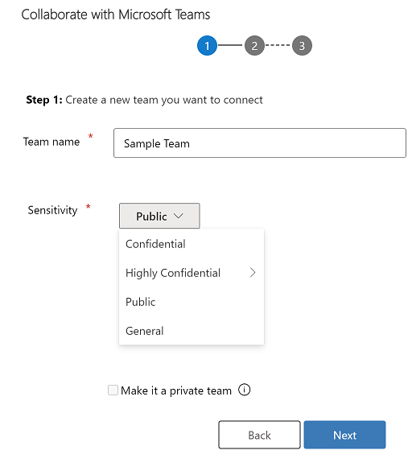
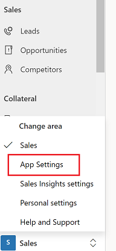

# Enable sensitivity labels to protect content in Microsoft Teams

Use sensitivity labels to protect your content in Microsoft Teams so that your users can collaborate securely with others both inside and outside your organization.

## License and role requirements

| Requirement type | You must have |
|-----------------------|---------|
| **License** | <ul><li>Dynamics 365 Sales Premium, Dynamics 365 Sales Enterprise, Dynamics 365 Sales Professional, or any Dynamics 365 customer engagement app license</li> <li>Microsoft Teams license</li></ul>  <br>More information: <ul><li>[Dynamics 365 Sales pricing](https://dynamics.microsoft.com/sales/pricing/)</li><li>[Microsoft Teams pricing](https://www.microsoft.com/microsoft-teams/compare-microsoft-teams-options?activetab=pivot:primaryr2&rtc=1)</li><li>[Dynamics 365 Licensing Guide](https://go.microsoft.com/fwlink/?LinkId=866544&clcid=0x409)</li></ul> |
| **Security roles** | System Administrator<br>  More information: [Predefined security roles for Sales](../security-roles-for-sales.md)|

## About sensitivity labels

Users in your organization collaborate with others both inside and outside the organization. This means that content no longer stays behind a firewall. It can roam everywhere—across devices, apps, and services. And when it roams, you want it to do so in a secure, protected way that meets your organization's business and compliance policies. For more information, see [Get started with sensitivity labels](/microsoft-365/compliance/get-started-with-sensitivity-labels).

Microsoft Teams integration with Dynamics 365 customer engagement apps (such as Dynamics 365 Sales, Dynamics 365 Customer Service, Dynamics 365 Field Service, Dynamics 365 Marketing, and Dynamics 365 Project Service Automation) allows you to create teams with sensitivity labels and make the teams private so that only the owner of each team can add other members.

> [!div class="mx-imgBorder"]
> 

## Prerequisites

The following prerequisites are required before you can turn on sensitivity labels in your app:

 - You must have the Azure Information Protection (AIP) P2 Premium license. For more information, see [Azure Information Protection](https://azure.microsoft.com/services/information-protection)
 - You must create and configure sensitivity labels in your tenant. For more information, see [Create and configure sensitivity labels and their policies](/microsoft-365/compliance/create-sensitivity-labels?view=o365-worldwide&preserve-view=true).

## Turn on sensitivity labels

Sensitivity labels are only available when the Enhanced Collaboration Experience is turned on. For more information, see [Enable linking of Dynamics 365 records to Teams channels](enable-record-linking.md).

> [!NOTE]
  > If you are still using the group classification labels instead of sensitivity labels, turning on this option will let you use the classification labels in Teams.

**To turn on sensitivity labels:**

1. In the Sales Hub app, select the **Change area** icon
    
    in the lower-left corner and then select **App Settings**.
   > [!div class="mx-imgBorder"]
   > 

    > [!Note]
    > 
    > App Settings is available only in the Sales Hub app. If you don't have the Sales Hub app and want to access the settings from your custom app, add a subarea with the following URL:
    > ```
    > /main.aspx?pagetype=control&controlName=MscrmControls.FieldControls.CCFadminsettings&data={"id":"overview","ismanage":"cnc"}
    > ```
    > Alternatively, you can suffix your Dynamics 365 domain URL to instantly access the settings page mentioned in Step 3:
    > For example:
    > ``` 
    > https://adatum.crm.dynamics.com/main.aspx?pagetype=control&controlName=MscrmControls.FieldControls.CCFadminsettings&data={"id":"overview","ismanage":"cnc"}
    > ```

2. From the site map, under **General Settings**, select **Chat and collaborate**.

3. Turn on the **Turn on Confidential Labels** toggle.

      

4. Select **Save**. 
    
To learn how to use sensitivity labels, see [Enhanced Collaboration Experience with Microsoft Teams](teams-collaboration-enhanced-experience.md).
