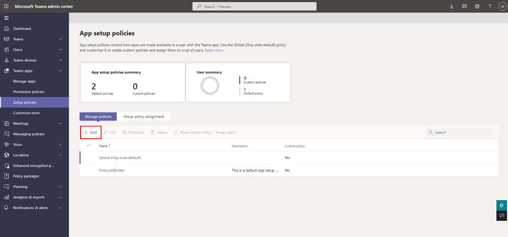
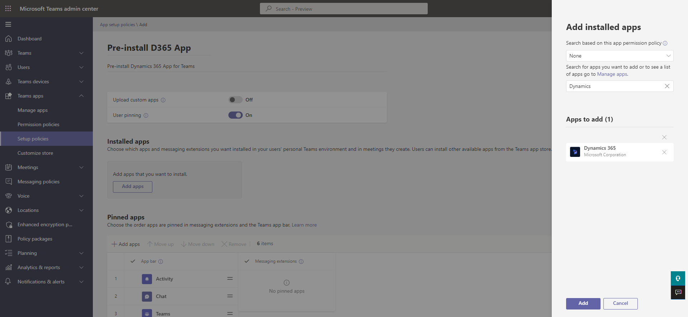
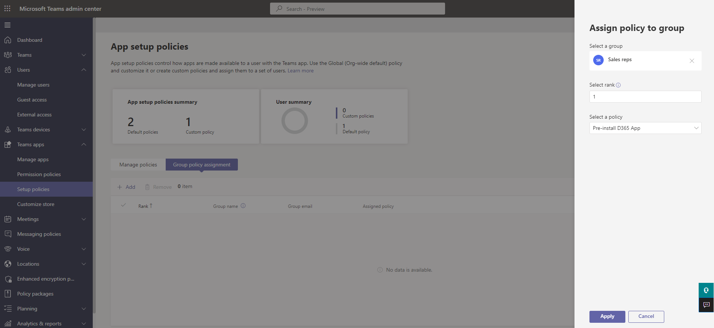

# Enable sales teams to work with Dynamics 365 records within Teams conversations (production-ready preview)

> [!IMPORTANT]
> - This topic is prerelease documentation and is subject to change.
> - Preview features designated as production-ready employ privacy and security measures typically present in generally available features, as further explained in our [preview terms](https://go.microsoft.com/fwlink/?linkid=2105274).

## License and role requirements

| Requirement type | You must have |
|-----------------------|---------|
| **License** | <ul><li>Dynamics 365 Sales Premium, Dynamics 365 Sales Enterprise, Dynamics 365 Sales Professional, or any Dynamics 365 customer engagement app license</li> <li>Microsoft Teams license</li></ul>   More information: <ul><li>[Dynamics 365 Sales pricing](https://dynamics.microsoft.com/sales/pricing/)</li><li>[Microsoft Teams pricing](https://www.microsoft.com/microsoft-teams/compare-microsoft-teams-options?activetab=pivot:primaryr2&rtc=1)</li><li>[Dynamics 365 Licensing Guide](https://go.microsoft.com/fwlink/?LinkId=866544&clcid=0x409)</li></ul> |
| **Security roles** | System Administrator   More information: [Predefined security roles for Sales](security-roles-for-sales.md)|

## Overview

The Dynamics 365 app for Microsoft Teams allows sellers to share and update Dynamics 365 records, as an interactive card, within Teams conversations. 

While business users can access the feature themselves by adding, signing in, and setting up the Dynamics 365 app for Teams, you can drive faster and more seamless adoption by:

- Familiarizing yourself with the feature.
- Understanding how the information is displayed in the interactive card.
- Preinstalling and pinning the app for business users who can benefit from the feature.
- Encouraging business users to sign in and set up the app.

## Familiarize yourself with the feature

It's important to become familiar with the feature to understand the nuances of how it works and identify the business users for whom preinstalling and pinning the app will add value. 

**To familiarize yourself with the feature**:

1. [Add the Dynamics 365 app for Teams](access-d365-app.md#add-the-dynamics-365-app)

2. [Access and sign in to the Dynamics 365 app for Teams](access-d365-app.md#access-the-dynamics-365-app)

3. [Set up the Dynamics 365 app for Teams](access-d365-app.md#set-up-the-dynamics-365-app) 

4. [Share a record in a Teams chat and channel by pasting its URL](share-dynamics-records-in-teams.md#share-a-record-through-url)

5. [Share a Dynamics 365 record through search](share-dynamics-records-in-teams.md#share-a-dynamics-365-record-through-search)

6. [View and update record details](view-update-dynamics-records.md)

7. [Add chat messages to Dynamics 365 as notes or tasks](add-chat-d365.md)

## How is the information displayed in the interactive card?

The information in the interactive card is displayed using the view of type **Quick Find View** of a table. You must validate and edit the columns in the **Quick Find View** view to ensure that interactive cards display the right information. To change the information that the cards display, you can [edit the columns](/power-apps/maker/model-driven-apps/choose-and-configure-columns) in the [**Quick Find View**](/power-apps/maker/model-driven-apps/create-edit-views#system-views) view of a table as per the requirement.

## Preinstall and pin the Dynamics 365 app in Microsoft Teams

Preinstalling and pinning the Dynamics 365 app in Teams increases the discoverability of the app by business users and encourages them to share records in a secure way. It requires creating a custom Teams app policy and assigning the policy to users.

> [!NOTE]
> - The ability [to preinstall and pin apps for users by managing app policies](/microsoftteams/teams-app-setup-policies) is available as part of Microsoft Teams and is not a feature of Microsoft Dynamics 365. This document details how to use the Microsoft Teams feature to preinstall the Dynamics 365 app for Teams.
> - You need to be a Teams administrator to preinstall and pin the Dynamics 365 app for Teams for business users. For more information on Teams administrator roles, refer to [Use Microsoft Teams administrator roles to manage Teams](/microsoftteams/using-admin-roles).

### Create a custom Teams app setup policy

1.  Sign in to [Microsoft Teams admin center](https://admin.teams.microsoft.com/).

2.  In the left pane, go to **Teams apps** &gt; **Setup policies**.

3.  Under the **Manage policies** tab, select **Add**.

    

4.  Enter a name and description for the policy.

5.  Turn on **User pinning**.

6.  Under **Installed apps**, select **Add apps**.

    

7.  In the **Add installed apps** panel, search for the **Dynamics 365** app, and then select **Add**. You can also filter apps by app permission policy.

    

8. Select **Add**.

9.  Under **Pinned apps**, select **Add apps**.

    

10.  In the **Add pinned apps** panel, search for the **Dynamics 365** app, and then select **Add**. You can also filter apps by app permission policy.

        

11. Select **Add**.

12. Under the **App bar** or **Messaging extensions**, arrange the apps in the order that you want them to appear in Teams.

    

13. Select **Save**.

### Assign the custom Teams app setup policy to a user group

Policy assignment to groups lets you assign a policy to a group of users, such as a security group, an organizational unit, or a distribution list.

1.  Sign in to [Microsoft Teams admin center](https://admin.teams.microsoft.com/).

2.  In the left pane, go to **Teams apps** &gt; **Setup policies**.

3.  Under the **Group policy assignment** tab, select **Add**.

    

4.  In the **Assign policy to group** panel, do the following:

    1.  Search for and add the group you want to assign the policy to. Ideally this would be the group to which sellers, service agents, and other Dynamics 365 users belong to. If you have Dynamics 365 users spread across multiple groups, you'll have to create multiple group policy assignments.

    2.  Set the ranking for the group assignment.

    3.  Select the policy created earlier – to preinstall and pin the Dynamics 365 app for Teams.

    4.  Select **Apply**.

    

> [!NOTE]
> - To learn more about assignment policies on Teams, go to [Assign policies to users and groups](/microsoftteams/assign-policies-users-and-groups#assign-a-policy-to-individual-users).
> - You can also [assign the policy to individual users](/microsoftteams/assign-policies-users-and-groups#assign-a-policy-to-individual-users).

## Encourage business users to sign in and set up the app

After you create a custom policy and assign it to users, you must encourage your users to sign in to the Dynamics 365 app for Teams to view, share, and update Dynamics 365 records in Microsoft Teams chats and channels. They need to sign in only once. and signing in provides a seamless user experience. When users have the app installed but haven't signed in, they'll see this message displayed in the interactive card when they access the Dynamics 365 record in Teams:

:::image type="content" source="media/sign-in-msg.png" alt-text="Sign in to Dynamics 365 app":::

For information on how to sign in to the Dynamics 365 app, see [Sign in and set up the Dynamics 365 app for Teams](access-d365-app.md#set-up-the-dynamics-365-app).

### See also

[Share and update Dynamics 365 records within Microsoft Teams conversations](share-d365-record-overview.md)   
