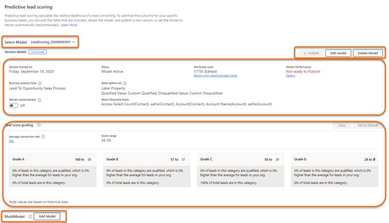

# Understand the predictive lead scoring configuration page

When a model is generated and published, the configuration summary page is displayed as shown in the following image.

> [!div class="mx-imgBorder"]
> 

The configuration page is organized into the following sections:

- [Select a model](#select-a-model)
- [Actions you can perform on the model](#actions-you-can-perform-on-the-model)
- [Version details](#version-details)
- [Lead score grading](#lead-score-grading)
- [MultiModel](#multimodel)

## License and role requirements

| Requirement type | You must have |
|-----------------------|---------|
| **License** | Dynamics 365 Sales Premium or Dynamics 365 Sales Enterprise  More information: [Dynamics 365 Sales pricing](https://dynamics.microsoft.com/sales/pricing/) |
| **Security roles** | System Administrator    More information: [Predefined security roles for Sales](security-roles-for-sales.md)|

## Select a model

In the upper-left corner of the page, you can use the **Select model** dropdown list to choose the model you want to view, edit, or delete. The list consists of both published and unpublished models.

> [!div class="mx-imgBorder"]
> 

## Actions you can perform on the model

In the upper-right corner of the page, you can choose from actions that you can perform on the model.

> [!div class="mx-imgBorder"]
> 

- **Publish**: When you publish a model in your organization, users in your organization can see the My Open Leads Scored system view and the Lead score widget on lead forms. After you publish, this button appears dimmed and will be available only after you retrain or edit the model.
- **Edit model**: You can update or add fields that affect the prediction accuracy score. This is useful when you want to modify fields to consider or include a unique business process. More information: [Edit and retrain a lead scoring model](pls-edit-and-retrain-model.md#edit-and-retrain-a-lead-scoring-model)
- **Revert version**: You can return the model to its previous version when the retrained model isn't satisfactory or doesn't meet an acceptable level of your organization's requirements. This action is only available when you've retrained the model but haven't published it yet.
- **Delete model**: You can delete models that aren't required in your organization. This option is displayed for published models. More information: [Delete a model](pls-duplicate-models.md#delete-a-model)

## Version details

The parameters displayed in this section show information about the status and performance of the model.

> [!div class="mx-imgBorder"]
> 

| Parameter | Description |
|-----------|-------------|
| Version trained on | Displays a date that lets you know when the model was last trained. |
| Status | Displays whether the model is active or inactive. |
| Attributes used | Displays the number of attributes used from the available list to train the model. If you're not satisfied with the outcome of the trained model, you can select **Retrain with recommended fields** to retrain the model with the standard (out-of-the-box) attributes. If the parameter displays **Edited** next to the number of attributes used, this specifies that the attributes used are custom-selected. |
| Model performance | Displays information about the model's accuracy and projected performance based on the data available and selected to train the model. **Note**: The range of the accuracy score is defined based on the area under the curve (AUC) classification measurements. - **Ready to publish** specifies that the model accuracy is above the range, and you can expect that the model will perform well. - **OK to publish** specifies that the model accuracy is within range, and you can expect that the model might perform reasonably well. - **Not ready to publish** specifies that the model accuracy is below the range, and you can expect that the model will perform poorly. |
| Business process flow | Displays the business process flow that's applied on the leads that are scored by this model. |
| Filter column and filter values | When multiple models are used, this selection defines which column and which values within that column correspond to the leads that this specific model should score. |
| State option set | Displays the option set that's used to qualify and disqualify leads in this model. |
| Retrain automatically | Allows you to set the model to be retrained automatically. More information: [Automatic retraining](pls-edit-and-retrain-model.md#automatic-retraining) |
| Most influential fields | Displays the top five attributes that most affect the outcome of the prediction accuracy score. |

## Lead score grading

When a model is published, the leads that are in your organization's pipeline are graded according to the range defined in this section. Each lead in the pipeline is graded A, B, C, or D, according to the lead score. Leads in the top score range are graded A while leads within the lowest score range are graded D. 

> [!div class="mx-imgBorder"]
> 

You can configure the range for the grading according to your organizational requirements. When you change the lead score range for a grade, the maximum range value for the adjacent grade changes automatically in accordance with the change in the minimum value. For example, when you change the minimum range value score for **Grade A** to 51, the maximum lead score range for **Grade B** changes to 50.

## MultiModel

In the lower-left corner of the page, you can use **Add model** to generate a new model to represent a line of business that might use different leads than your first model. The **Add model** command will be disabled as soon as you reach the maximum limit of 10 models (both published and unpublished).

[!INCLUDE[cant-find-option](../includes/cant-find-option.md)]