# Use the Sales Hub or Sales Professional app on Dynamics 365 for phones and tablets app 

Access your Sales Hub and Sales Professional data while you're on the go by using Dynamics 365 for phones or Dynamics 365 for tablets on your mobile device. The Sales Hub app and Sales Professional works the same whether you're using it on your mobile device or on a web browser on your computer.

## License and role requirements

| &nbsp; | &nbsp; |
|-----------------------|---------|
| **License** | Dynamics 365 Sales Premium, Dynamics 365 Sales Enterprise, or Dynamics 365 Sales Professional More information: [Dynamics 365 Sales pricing](https://dynamics.microsoft.com/sales/pricing/) |
| **Security roles** | All primary sales roles such as salesperson, sales manager, and so on.   More information: [Primary sales roles](security-roles-for-sales.md#primary-sales-roles)|
|||

## About the mobile app

Before you can start using the app, you need to install the Dynamics 365 for mobile app on your device. 

[!INCLUDE[proc_more_information](../includes/proc-more-information.md)] [Install Dynamics 365 for phones and tablets](../mobile-app/install-dynamics-365-for-phones-and-tablets.md)

> [!IMPORTANT]
> It is recommended for all Dynamics 365 Sales users who are using the Dynamics 365 for phones and tablet app to migrate and start using the Dynamics 365 Sales app instead. For more information about the Dynamics 365 Sales mobile app, go to [Overview of the Dynamics 365 Sales mobile app](sales-mobile/dynamics-365-sales-mobile-app.md)

## Basic navigation

1.	When you sign in, you'll see the MyApps page with all your apps listed. 
2.	Select **Sales Hub** or **Sales Professional** based on your license.

    > [!div class="mx-imgBorder"]
    > 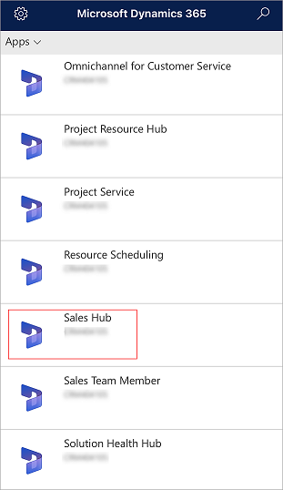

**The site map**

Use the site map to get to your work area, create a new record, search, or do other tasks. To access the site map, tap **Menu** () at the top-left of the screen.

   > [!div class="mx-imgBorder"]
   > 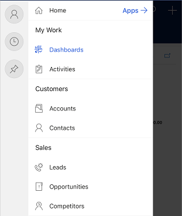

**Pinned and recently used records**

The **Pinned** and **Recent** sections provide quick access to your records, views, and dashboards. 

- To access these sections, tap **Menu**  at the top-left of the screen, and then tap either **Recent**  or **Pinned** .

- To pin an item, go to **Recent** list, and then tap the pin.

## How to use the Sales Hub or Sales Professional app on the go  

The Sales Hub or Sales Professional app on the Dynamics 365 for phones mobile app is designed to be your work assistant. The app helps you to engage with customers, close more deals, and acts as your office assistant.

Here are a few tasks that you can perform during your day-to-day activities by using the Sales Hub or Sales Professional app on the Dynamics 365 for phones mobile app:

- [Plan for your day](#plan-for-your-day)

- [Attend meetings with information at your fingertips](#attend-meetings-with-information-at-your-fingertips)

- [Send email](#send-email)

- [Take notes in a meeting](#take-notes-in-a-meeting)

- [Update deals and customer information after a meeting](#update-deals-and-customer-information-after-a-meeting)

- [Search for a record](#search-record)

- [Add and qualify leads](#add-and-qualify-lead)

- [Generate and share a quote or order](#generate-and-share-a-quote-or-order)

- [Manage your to-do list](#manage-your-to-do-list)

- [Work offline when you have intermittent connectivity](#work-offline-when-you-have-intermittent-connectivity)

### Plan for your day

As you start your day, go to **My Appointments** to find out how busy you're going to be. The **My Appointments** feature provides insights on your meetings, travel, and free time. With this information, you can plan for the day ahead by reviewing who you'll be meeting, where you'll need to travel, and how much free time you'll have left.

**To view your appointments**

*   On the site map, tap **Activities**, and then select the **My Appointments** view.

### Attend meetings with information at your fingertips

During your travels, you can open any appointment to view more details such as start time, duration, and description of the meeting. The following image shows an example.

> [!div class="mx-imgBorder"]
> 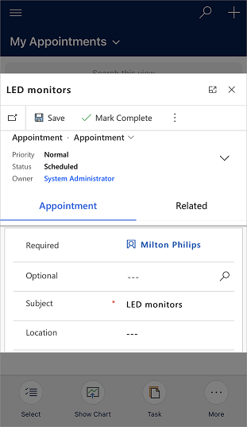

In addition, you can select the **Regarding** record to view which opportunity or account the meeting is about. As you view the opportunity or account, you can review the timeline of notes and past activities to ramp up on context before the meeting begins.

> [!div class="mx-imgBorder"]
> 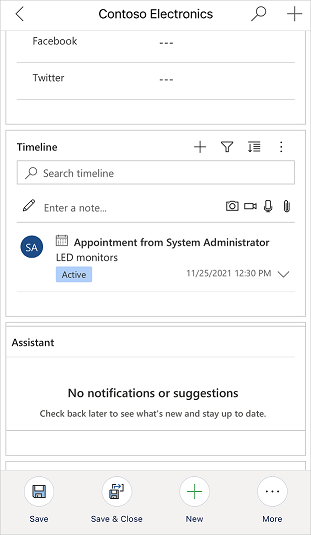

### Send email

Use the Dynamics 365 for phones and tablets app to compose an email within the app with the following capabilities:

- Full email editor formatting supported as available in Unified Interface apps.
- Add attachments to an email.
- Search for and apply a predefined template to an email. 

> [!NOTE]
> This feature isn't available for mobile offline.

1. You can create emails from home page grid or by using quick create. 

    1. **Home page grid**: On the home page, tap the site map button  at the the top-left corner, tap **Activities**, tap **More** at the bottom command bar, and then tap **Email**.
    
       > [!div class="mx-imgBorder"]
       > 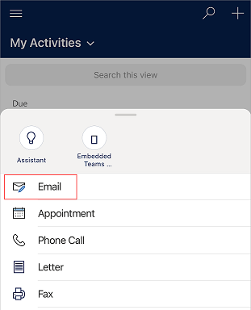

    2. **Quick create**: On the command bar at the top, tap **+** > **Activities** > **Email**. 

       > [!div class="mx-imgBorder"]
       > 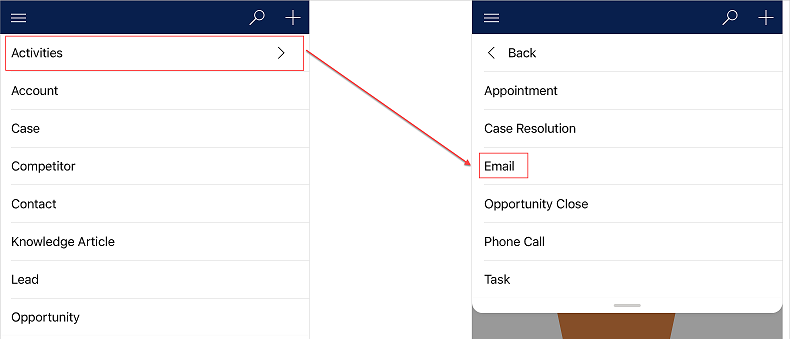

2. Fill in the subject of the email and use the space provided to write the email. You can tap the more option (**...**) on the formatting toolbar in the body area of the email to see the full formatting capabilities for your email. 

   > [!div class="mx-imgBorder"]
   > 

3. After writing the email, tap **Save** at the top-right to save your changes.

    The email is saved and a command bar is displayed at the bottom of the screen.

4. To add an attachment to the email, tap **More** at the bottom command bar, and then tap **Attach File**. Choose the file you want to attach to the email.

    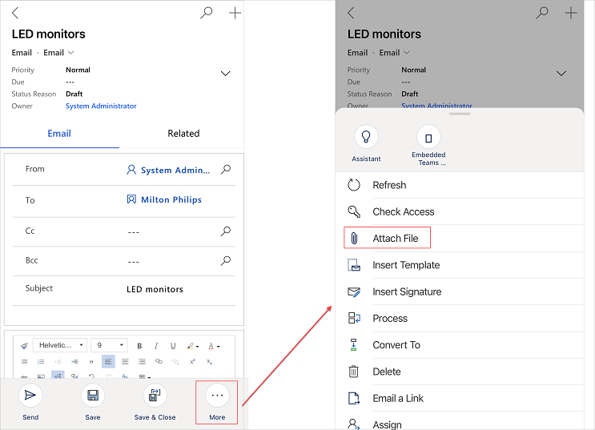
   
5. To use a template for the email body, tap **More** at the bottom command bar, and then tap **Insert Template**. Select or search for a template from the available templates, and tap **Select**.
   
6. When you're ready to send the email, tap **Send** at the bottom command bar.

### Take notes in a meeting

It's no longer necessary for you to open a laptop to add notes to an opportunity. You can use the Sales Hub mobile app to quickly add notes to an opportunity by using your mobile device.

**To add notes to an opportunity**

1. On the site map, tap **Opportunities** >  **My Open Opportunities**.

2. On the opportunity, go to **Timeline** section and add a note. 

    > [!div class="mx-imgBorder"]
    > 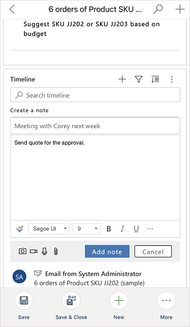

3. (Optional) If the customer shows interest in additional products, go to the **Products** tab, tap **More options** (...), and then tap **+ Add Product**.

    > [!div class="mx-imgBorder"]
    > 

4. Select an existing product from the catalog, or create a new product.

    > [!div class="mx-imgBorder"]
    > 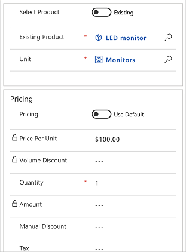

4. (Optional) If you've met a new stakeholder at the customer's office, on the **Summary** tab, go to the **Stakeholders** section, tap **More options** (...), and then tap **+ New Connection**. Then add the stakeholder. You can also add the contact from an account record.

### Update deals and customer information after a meeting

After you step out of a meeting, you can quickly update information about the deal or the opportunity.

**To update information after a meeting**

1. Open the opportunity from the relevant appointment.

    Or
    
    On the site map, tap **Opportunities**, and then select the **My Open Opportunities** view.
    
2. On the opportunity, you can update the forecasted revenue or move to the next stage. 

    > [!div class="mx-imgBorder"]
    > 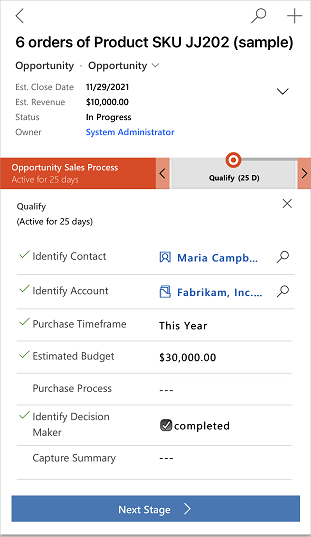

3. To create a follow-up appointment for the opportunity, go to the **Timeline** section, tap **Create a timeline record** (), and then tap **Appointment**.

    > [!div class="mx-imgBorder"]
    > 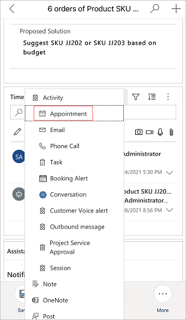

    On the **Quick Create: Appointment** form, enter the necessary information, and then save the appointment.

    > [!div class="mx-imgBorder"]
    > 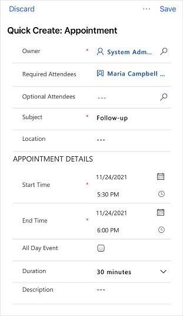

After you're done, you can open the appointment and mark it as complete.

### Search for a record 

You can search for records such as contacts, accounts, leads, and opportunities in the mobile app.

**To search for a record**

1. On the command bar at the top, tap the search icon.

2. On the **Search** page, enter text in the search box to find related information, and then tap the search icon.

    > [!div class="mx-imgBorder"]
    > 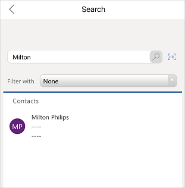

3. In the search results, tap and open the record to view more information.

### Add and qualify leads 

When you meet a new lead at an event, you can immediately add and qualify the lead with the app to make sure your team has visibility right away of the progress you've made.

**To add and qualify a lead**

1. On the site map, tap **Leads**.

2. On the leads page, tap **New** at the bottom command bar.

    > [!div class="mx-imgBorder"]
    > 

3. Enter the necessary information, and then save the lead.

4. To qualify a lead, open the lead, tap **More** at the bottom command bar, and then tap **Qualify**.

    > [!div class="mx-imgBorder"]
    > 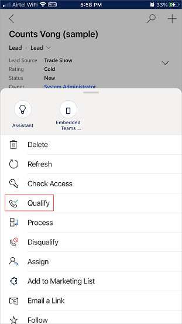

### Generate and share a quote or order

After a successful meeting, you can quickly generate a PDF of the quote from an opportunity or a PDF of the order related to an account and share it with the customer who requests it.

**To generate and share a quote or order**

1. On the site map, tap **Opportunities**, and then select the **My Open Opportunities** view.

2. Open the opportunity for which you want to generate a PDF of the quote, and then go to the **Quotes** tab. 

3. In the quote section, tap **More option** (...), and then tap **+ New Quote**.

    > [!div class="mx-imgBorder"]
    > 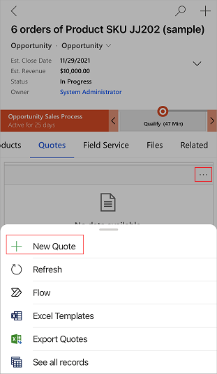

    A quote is generated.

4. From the quote page, tap **More** at the bottom command bar, tap **Email as PDF**, and then tap **Print quote for customer**.

    An email opens with the quote as an attachment. Verify the existing information and then save the email.

5. When you're ready to send the email, tap **Send** at the bottom command bar.

### Manage your to-do list

Before you wrap up the day, make sure your opportunity status is reflected correctly in the dashboards.

> [!div class="mx-imgBorder"]
> 

Quickly review pending tasks and close the ones you got to during the day.

**To manage your to-do list**

1. On the site map, tap **Activities**.

2. On the activities page, select the **My Tasks** view.

3. Review your tasks, and close any tasks that you've completed.

### Work offline when you have intermittent connectivity

You can use the Sales Hub app on Dynamics 365 for mobile in offline mode when you're experiencing intermittent connectivity. Select the **Enable Mobile Offline** option in the app module properties to access the Sales Hub or Sales Professional app offline. 

An administrator must have associated a mobile offline profile to your user record before you can work offline. The administrator can use the **Sample Sales Scenario** mobile offline profile that's shipped out of the box, or create your own profile. For more information, see [Set up mobile offline synchronization to allow users to work in offline mode on their mobile device](../mobile-app/setup-mobile-offline-for-admin.md).

[!INCLUDE[proc_more_information](../includes/proc-more-information.md)] [Work offline on your mobile device](../mobile-app/work-in-offline-mode.md)

The following table lists the actions that are supported in online and offline mode for entities.

| Record type	| Actions supported online | Actions supported offline |
|---------|--------------------------|---------------------------|
| Appointment | - New - Edit and save - Mark Complete - Close Appointment - Process - Email a link - Convert to opportunity - Delete - Assign - Word templates - Add to Queue - Queue Item Details - Flow - Word Templates - Run Report | - New - Edit and save - Mark Complete - Convert to opportunity - Delete |
| Opportunity | - New - Close as won - Close as lost - Recalculate Opportunity - Create PDF - Email as PDF - Assign - Email a link - Delete - Process - Unfollow - Flow - Word Templates - Run Report - Edit and save - Add product lines (both existing products and write-in products, through sub-grid) - Add related contacts (through sub-grid) - Add activities (from timeline or through sub-grid) - Add notes (from timeline) | - New - Close as won - Close as lost - Delete - Edit and save - Add product lines (both existing products and write-in products, through sub-grid) |
| Account | - New - Deactivate - Connect - Add to Marketing List - Assign - Email a Link - Delete - Create PDF - Email as PDF - Process - Follow - Flow - Word Templates - Edit and save - Add related contacts (through sub-grid) - Add activities (from timeline or through sub-grid) - Add notes (from timeline) | - New - Delete - Edit and save |
| Contact | - New - Deactivate - Connect - Add to Marketing List - Assign - Email a link - Delete - Process - Follow - Flow - Word Templates - Edit and save | - New - Delete - Edit and save |
| Lead | - New - Delete - Qualify - Process - Disqualify - Assign - Add to Marketing List - Email a Link - Follow - Flow - Word Templates - Run Report - Edit and save | - New - Delete - Qualify - Disqualify - Edit and save |
| Quote | - New - Delete - Look Up Address - Activate Quote - Create PDF - Email as PDF - Get Products - Process - Assign - Email a Link - Flow - Word Templates - Run Report - Edit and save - Add product lines (both existing products and write-in products, through sub-grid) | - New - Delete - Edit and save - Add product lines (both existing products and write-in products, through sub-grid) |
| Order | - New - Delete - Create Invoice - Create PDF - Email as PDF - Process - Fulfill Order - Cancel Order - Recalculate - Look Up Address - Use Current Pricing - Assign - Email a Link - Flow - Word Templates - Run Report - Edit and save - Add product lines (both existing products and write-in products, through sub-grid) | - New - Delete - Edit and save - Add product lines (both existing products and write-in products, through sub-grid) |
| Invoice | - New - Delete - Look Up Address - Invoice Paid - Cancel Invoice - Recalculate - Get Products - Lock Pricing - Create PDF - Email as PDF - Process - Assign - Email as Link - Flow - Word Templates - Edit and save - Add product lines (both existing products and write-in products, through sub-grid) | - New - Delete - Edit and save - Add product lines (both existing products and write-in products, through sub-grid) |
| Task | - Mark Complete - Close Task - Process - Delete - Email a Link - Assign - Add to Queue - Convert To - Queue Item Details - Flow - Word Templates - Run Report - Edit and save | - New - Mark Complete - Delete - Edit and save - Convert to Opportunity |
| Phone Call | - Mark Complete - Close Phone Call - Process - Delete - Email a Link - Assign - Add to Queue - Convert To - Queue Item Details - Flow - Word Templates - Run Report - Edit and save | - New - Delete - Edit and save |

## Frequently asked questions

**Are custom fields on forms available offline?**

Yes, custom fields of all types are available to use offline. For lookup fields, only downloaded records can be referenced.

## Known issues

-	**Business process flows**: Business process flows aren't supported for mobile offline. When you're offline, business process flows grids and views won't be available to be rendered on records that are opened in offline mode. If a record containing a business process flow was loaded prior to going offline, business process flow functions&mdash;such as move next or move previous&mdash;won't work. Business process flows support the ability to branch to a different set of stages, based on conditions defined on fields of the record. In offline mode, the conditions that determine the next set of stages in the business process flows won't be evaluated.

-	**Qualify a lead**: After you've created and qualified a lead in mobile offline, when you go back online the business process stage will still be shown as the qualify stage. You'll have to manually select **Next stage** to move the lead to next stage.

-	**Views**: Views aren't supported for the following entities in offline mode:
    -	Email
    -	Task
    -	Appointment
    -	Phonecall
    
    Any views that have linked entities (related entity) that aren't available offline are also not supported.

-	Adding stakeholders, competitors, and sales teams to opportunities isn't supported in offline mode.

-	Product suggestions (when you're adding product lines to opportunities, quotes, orders, or invoices) aren't supported in offline mode.

-   Product property&ndash;related entities (DynamicProperty, DynamicPropertyInstance, DynamicPropertyOptionSetItem, and ProductSubstitute) aren't enabled for offline out of the box. These entities must be enabled for offline and added to an offline profile if you want to use product properties in offline mode.

[!INCLUDE [cant-find-option](../includes/cant-find-option.md)]

### See also

[User Guide](user-guide.yml)

[!INCLUDE[footer-include](../includes/footer-banner.md)]
