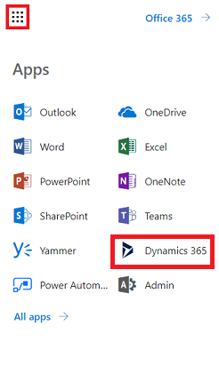

# Learn the basics of [!INCLUDE[pn-dyn-365-sales](../includes/pn-dyn-365-sales.md)] 

Learn how to access the Sales app, navigate the UI, and understand the data in the app, and some quick tips.

## License and role requirements

|  | |
|-----------------------|---------|
| **License** | Dynamics 365 Sales Premium, Dynamics 365 Sales Enterprise, or Dynamics 365 Sales Professional   More information: [Dynamics 365 Sales pricing](https://dynamics.microsoft.com/sales/pricing/) |
| **Security roles** | Salesperson and above    See [Predefined security roles for Sales](security-roles-for-sales.md)|
|||

## Go to the Sales apps 

1. Sign in to [!INCLUDE[pn-office-365](../includes/pn-office-365.md)], select the [!INCLUDE[pn-office-365](../includes/pn-office-365.md)] app launcher, and then select the icon for **[!INCLUDE[pn-dyn-365](../includes/pn-dyn-365.md)]**.

   > [!div class="mx-imgBorder"]
   >   

   > [!Note]
   > 
   > The apps available to you in the app launcher depend on your subscription.

2. Select one of the following tiles depending on your license: 
    1. For Sales Enterprise, select **Sales Hub**.
    1. For Sales Professional, select **Sales Professional**.  

## Navigate using the site map

The following image shows the site map or menu of the Sales app that helps you navigate to the different areas of the app.

|Number  |Description  |
|---------|---------|
|1     | Open or collapse the site map.        |
|2     | Access the recent items you've worked on or the customers you've pinned.        |
|3     | Access everything that you need to communicate with customers, manage your pipeline, and other sales-related records.     |
|4     | Use the change area to switch between **Sales** and other settings.        |
|5     | Access the command bar for quick actions.        |

   
## Understand the data in the app

Every day, you’ll work with different customer records and record types as you move customers through your business processes, collecting the data you need to fill in the fields for their records—and ultimately to win their business.

- What’s a record? In [!INCLUDE[pn-dyn-365-sales](../includes/pn-dyn-365-sales.md)], a **record** is a complete unit of information such as all the information about a single contact. You can think of it as a row in a table. For example, each time you add a new account to the app, you’re creating a new record in the Sales app.

- What’s a record type? Each record you add to the system belongs to a certain **record type**, such as an account, contact, lead, or opportunity.

## Quick create – Enter new records fast

The Quick Create command makes it fast and easy to enter almost any type of information into the system. The command is on the navigation bar (also referred to as the nav bar), so it’s always available whenever you need to enter new info into the system.

With Quick Create, you need to complete only a few fields. Later, when you have more time or more information, you can fill in more details.

1. On the nav bar, select the **New** button , and then select the item you want.  

   > [!TIP]
   > On a mobile device, from the nav bar, tap  and then tap **Quick Create Menu**.

2. Fill in the fields, and then select **Save**.

## Business processes in Dynamics 365 Sales

Business processes help everyone follow best practices, even when handling situations that don’t occur very often. You complete a step by entering data or
marking the step completed in the process bar at the top of the screen. When all the steps are done, you can move on to the next stage.

The following ready-to-use business processes are available that you can use as you move your leads through a sales process:

  -   Lead to invoice. This business process flow is available for:
      -   All leads.
      -   Opportunities created from leads
  -   Opportunity sales process. This business process flow is available for:
      -   All directly created opportunities (not originating from lead) forms

[!INCLUDE [cant-find-option](../includes/cant-find-option.md)]

[!INCLUDE[footer-include](../includes/footer-banner.md)]
