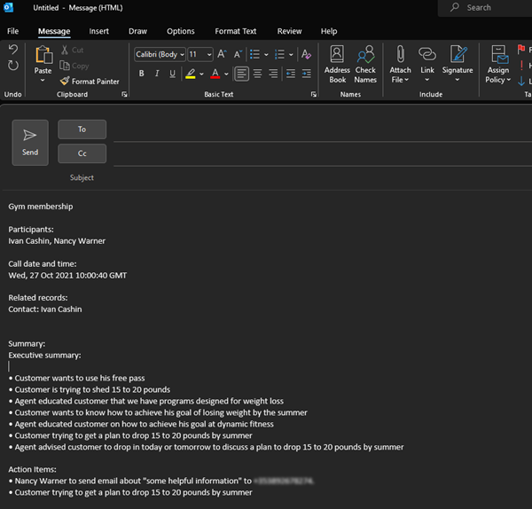
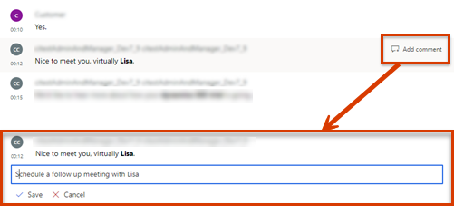
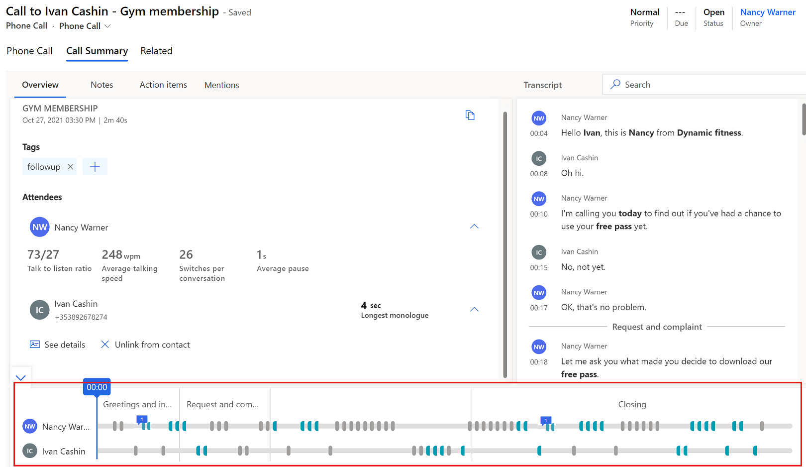

# View and understand call summary page in the Sales Hub app

Sellers and their managers need an easy way to review the conversations they've had with their customers and quickly find relevant talking points, keywords, and insights.  
The call summary page provides a high-level view of how the conversation with a customer went, and includes action items and relevant keywords, a timeline, a transcript of the call, and more.  

The information on the call summary page helps both sellers and managers:

- Sellers can quickly ramp up on past conversations with customers, and highlight important topics and commitments.
- Managers can get a high-level view of how their team manages their relationships with customers.  

Call summaries are available from the conversation intelligence capabilities of the Sales Insights Add-in for Dynamics 365 Sales.

## License and role requirements

| &nbsp; | $nbsp; |
|-----------------------|---------|
| **License** | Dynamics 365 Sales Premium or Dynamics 365 Sales Enterprise  More information: [Dynamics 365 Sales pricing](https://dynamics.microsoft.com/sales/pricing/) |
| **Security roles** | Any primary sales role, such as salesperson or sales manager   More information: [Primary sales roles](security-roles-for-sales.md#primary-sales-roles)|

## Prerequisites

- Configure conversation intelligence to process call recordings. More information: [Administer conversation intelligence](intro-admin-guide-sales-insights.md#administer-conversation-intelligence)
- To display the **Call summary** tab in Sales Hub, ensure that [the latest version of Sales Insights](https://appsource.microsoft.com/product/dynamics-365/mscrm.70b76f06-f739-4808-bd58-b5674a0a42d4?tab=Overview) is installed in your organization.

## View the call summary page

The **Call Insights** tab is available under activities for leads and opportunities. When a customer call about a lead or opportunity is processed in conversation intelligence, the **Call Insights** tab displays the information on the summary of the call.  
1. Sign in to Dynamics 365, and select **Change area** > **Sales**.  
2. On the site map, select **Activities**.
3. Select a phone call activity for which you want to view the call summary.  
4. Select the **Call summary** tab.   
    The call summary for the selected phone call activity is displayed. 
    > [!NOTE]
    > Select the **Related opportunity** tab to see a list of opportunities associated with the call. To add a related opportunity to the call, search for and select the opportunity.     

    > [!div class="mx-imgBorder"]
    >   

## Understand the call summary page

A call summary page includes the following sections:     
- [Overview, notes, action items, and mentions](#overview-notes-action-items-and-mentions)
- [Call transcript and translation](#call-transcript-and-translation)  
- [Call playback timeline and segmentation](#call-playback-timeline-and-segmentation)    

### Overview, notes, action items, and mentions

#### Overview tab

The **Overview** tab displays the names of the people who participated in a conversation, along with KPIs such as average talking speed, switch per conversations, average pause, and longest customer monologue. Also, you can see the tags that have been added to the conversation to improve searchability. 

##### View categorization tag for short duration calls (Preview)

[!INCLUDE [preview-disclaimer](../includes/preview-disclaimer.md)]

Conversation intelligence can detect and tag short duration calls for the following categories:

- Voicemail
- Contact is unavailable
- Short calls with reschedule requests
- Short calls in which the contact indicates the call is unwanted

If the tag is inappropriate, you can delete it.  

Your administrator must [enable the **Call categorization (preview)**](fre-setup-ci-sales-app.md#enable-call-categorization-for-short-calls-preview) feature for the system to tag short duration calls. You can also view these tags in the [Conversation intelligence app](https://sales.ai.dynamics.com/) under **Seller Details** > **Call History** section. For more information, see [View a seller’s performance to identify best practices and coaching opportunities](conversation-intelligence-seller-details.md).  

#### Notes tab

The **Notes** tab in the call summary page helps you reduce the time to summarize the call and add the provided intelligent suggestions to the summary, including action items, commitments, call minutes, and next steps.  

You can write  a quick and personalized summary without moving away from the context of the call in the **Notes** tab. Providing a summary of the call helps you to save time, focus on the customer’s call, quickly review the key points, and understand the next course of action.    
Further, you can share the saved summary with the stakeholders through an email.  

##### To write a call summary or notes

1. Go to the **Notes** tab.

   You would see any notes that you had taken during the meeting. 

2. Edit your notes or check out the **Suggested notes** pane for call highlights and action items. If you don't see the **Suggested notes** pane, select the bulb icon.  

    - To add notes from the call highlights and action items, select **Add** corresponding to the item. Call highlights won't be generated if the meeting recording duration exceeds 70 minutes.
    - To add all the suggested notes, select More options (…) corresponding to Suggested notes, and then select **Add all**.
    - To understand and know more about the context of the note, select the corresponding timestamp that will direct you to the section in the transcript and the playback. 

4. Select **Save**.  
    The call summary is saved. You can use the summary to:  
    - Share with the stakeholders.  
    - Keep as a reference.

##### Email call summary or notes to participants and stakeholders

1. From the notes section, select **Copy to clipboard**.

2. Open your email and paste the copied summary. The summary is pasted in the following format:
    - **Subject**: Specifies the subject of the call. For example, Gym membership.
    - **Participants**: Lists the players connected during the call.  
    - **Call date and time**: Specifies the date and time of the call.   
    - **Related records**: Lists the records that are related to the call, such as contact, lead, and opportunity.    
    - **Summary**: Specifies the summary of the call that you’ve provided.

    > [!div class="mx-imgBorder"]
    > 

#### Action items tab

Displays a list of items mentioned during the call that sellers will need to keep track of and take action on after the call ends&mdash;for example, "I'll send you an email" or "I'll follow up with Michelle tomorrow." When you select an action item, you can see where it was mentioned on the transcript. Actionable items include: **Set up a call**, **create a task**, **send an email**, and **set up a meeting**. 

The action items are highlighted in blue and a suggestion to create an appropriate action is displayed. Select the action item link to set up a call or meeting, create a task, or send an email, without losing context. The following screenshot depicts how a task is highlighted in the transcript and how you can create task right from the **Action items** tab:  

> [!div class="mx-imgBorder"]
> 

>[!NOTE]
>- If you want to enter more details while setting up a call or task, expand **Create** and then select **Create and Edit**.
>- If you think the action item would be better handled as a task than a call, meeting, or email, select **Create task**.  
>- You can view the call and task activities under the activities of the attached record entity and on the seller's activity list. 

#### Mentions tab

The **Mentions** tab displays talking points&mdash;such as keywords, stakeholders, questions, and competitors&mdash;that were mentioned during the call. 

The following image is an example of a **Mentions** tab.  
> [!div class="mx-imgBorder"]
>   

When you select any of the items listed in the following sections, you can see when that item was mentioned on the transcript and the playback.

- **Competitors mentioned**: Displays the predefined competitors that customers mentioned during the call.

- **Brands mentioned**: Displays brand and organization names (other than your own) that the customer mentioned during the call.  
- **Tracked keywords mentioned**: Displays the predefined keywords that customers mentioned during the call.
- **Keywords mentioned**: Displays the keywords and terms that were most frequently mentioned during the call.
- **People**: Displays the names of people mentioned during the call; for example, Sarah calling from Contoso.
- **Times**: Displays mentions related to time and date during the call; for example, let's talk next week.  
- **Prices**: Displays prices mentioned during the call; for example, the product will cost $50.
- **Questions asked by sellers**: Displays questions asked by the Dynamics 365 users during the call. For example, What do you think about the demo? 
- **Questions asked by others**: Displays the questions asked by the other participants during the call. 

### Call transcript and translation

The **Transcript** tab displays a written record of the call&mdash;which you can read, comment on, and translate&mdash;and the timeline of the call. The following image shows an example of a **Transcript** tab.

> [!div class="mx-imgBorder"]
>    
- As a manager, you can review the transcript and leave a comment&mdash;for example, suggesting how the seller might handle a similar situation in the future.   
- As a seller, you can review the transcript and comments that have been posted by your manager or coach.    
You can reply to comments, or add your own. Hover over the relevant area of the transcript, select **Add comment** to reply or make a comment yourself, and then select **Save**.  A comment icon is also added to the corresponding time in the timeline.
> [!div class="mx-imgBorder"]
>    
The brands, tracked keywords, and competitors mentioned in the conversation are formatted in bold in the transcript.
If the transcript is in a language other than English (and is one of the languages supported by Microsoft), you can select the translate icon  to convert the transcript into English.

### Call playback timeline and segmentation   

The following image shows an example of call playback timeline.    

> [!div class="mx-imgBorder"]
>    

Using the call playback feature, you can listen to the entire recorded call or choose a point on the timeline&mdash;by dragging the progress bar or selecting the specific point&mdash;at which you want to start listening. The call transcript will automatically scroll to that moment in the call. You can also pause, rewind, and move forward through the call, and adjust the volume as you like. The playback timeline also displays the sentiments detected in the conversation (positive, neutral, or negative).  

When you go to the **Mentions** tab and select a keyword or other mentions, a diamond icon appears on the playback timeline to indicate the time that the selected word was mentioned. Also, hovering over a keyword displays gray diamond icons on the timeline.  

You can also quickly go to the comments added by your colleagues from the timeline. Select the comment icon (:::image type="icon" source="media/comment-icon.png" border="false":::) on the timeline to go to the corresponding comment in the transcript.  

On the timeline, you can see how the conversation was segmented. The topics (if any) that were discussed in a segment are identified. To better drill down into the conversation, you can choose a specific segment and see the relevant insights. Some examples of segments are the introduction, solution, price quote, and call close. The transcript is adjusted to display the start of the segment, and highlight the playback timeline for the selected segment. If the selected segment contains any action items or keywords, they're displayed on their respective tabs.

[!INCLUDE [cant-find-option](../includes/cant-find-option.md)]

### See also

[Overview of Conversation Intelligence](../sales/dynamics365-sales-insights-app.md)      
[Track and manage activities](/dynamics365/sales-enterprise/manage-activities)  
[View call recordings and transcripts in Dynamics 365 Customer Service](../customer-service/voice-channel-call-recordings-transcripts.md)

[!INCLUDE[footer-include](../includes/footer-banner.md)]
