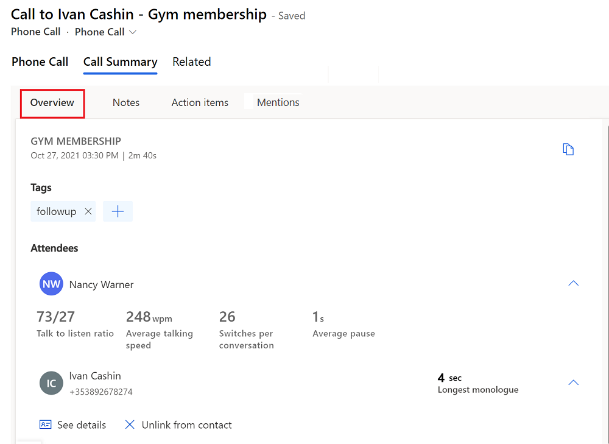
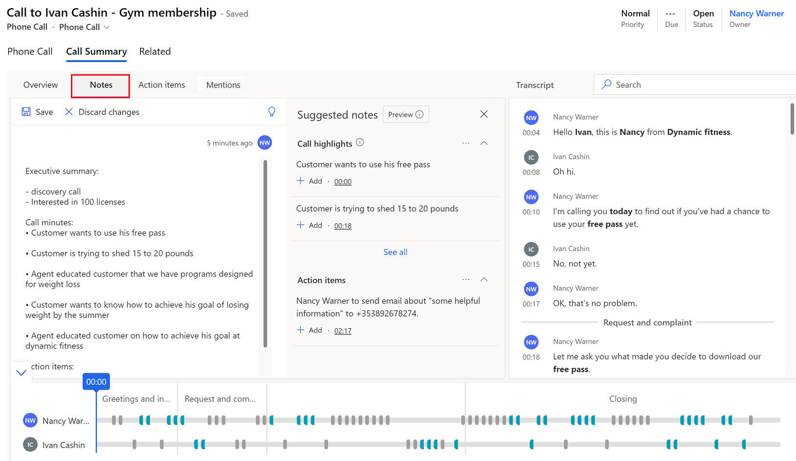
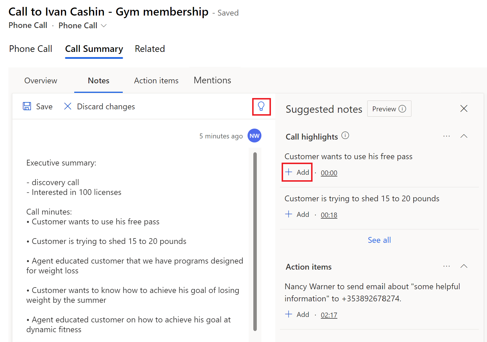
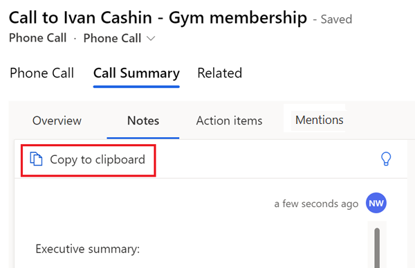
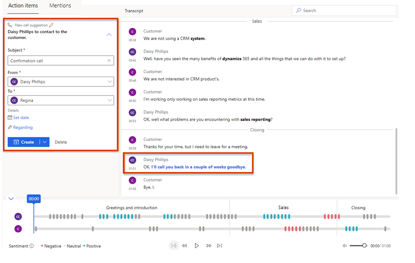
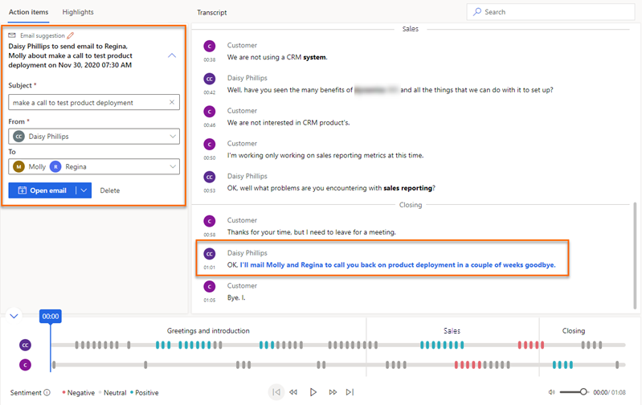
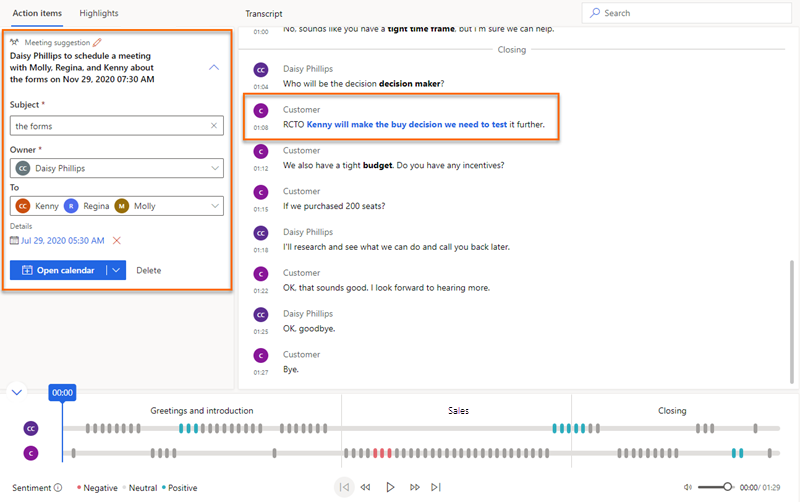
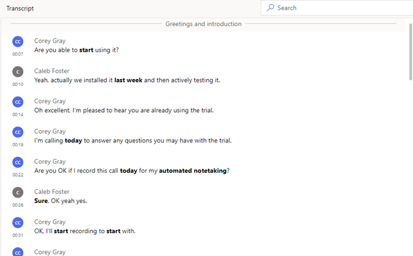

# View and understand call summary page in Conversation Intelligence app

Sellers and their managers need an easy way to review the conversations they've had with their customers and quickly find relevant talking points, keywords, and insights.  
The call summary page provides a high-level view of how the conversation with a customer went, and includes action items and relevant keywords, a timeline, a transcript of the call, and more.  

The information on the call summary page helps both sellers and managers:

- Sellers can quickly ramp up on past conversations with customers, and highlight important topics and commitments.
- Managers can get a high-level view of how their team is managing their relationships with customers.  

## License and role requirements
| Requirement type | You must have |
|-----------------------|---------|
| **License** | Dynamics 365 Sales Premium  More information: [Dynamics 365 Sales pricing](https://dynamics.microsoft.com/sales/pricing/) |
| **Security roles** | Any primary sales role, such as salesperson or sales manager   More information: [Primary sales roles](security-roles-for-sales.md#primary-sales-roles)|

## Prerequisites

- Configure conversation intelligence to process call recordings. More information: [Administer conversation intelligence](intro-admin-guide-sales-insights.md#administer-conversation-intelligence)
- [Configure conversation intelligence to connect call data](configure-conversation-intelligence-call-data.md) so you can process call recordings.
- To display the **Call Insights** tab in Sales Hub, ensure that [the latest version of Sales Insights](https://appsource.microsoft.com/product/dynamics-365/mscrm.70b76f06-f739-4808-bd58-b5674a0a42d4?tab=Overview) is installed in your organization.
- [Include and update the *CallPhoneCallCrmId* parameter](configure-conversation-intelligence-call-data.md#upload-call-recordings) with your Dynamics 365 organization's GUID to the metadata file while uploading the call recordings for processing. This helps to connect the call with the activity inside Dynamics 365.

## View the call summary page

1. In the [Conversation intelligence app](https://sales.ai.dynamics.com/), open the **Seller Details** page and go to the **Call history** section.
    
    If you don't see any call data, change the time period at the top of the page. 
1. Select a call to view its summary and other insights.  

## Understand the call summary page   

A call summary page includes the following sections:     
- [Overview, notes, action items, and highlights](#overview-notes-action-items-and-highlights)   
- [Call transcript and translation](#call-transcript-and-translation)  
- [Call playback timeline and segmentation](#call-playback-timeline-and-segmentation)    

### Overview, notes, action items, and highlights   

#### Overview tab

The **Overview** tab displays the names of the people who participated in a conversation, along with KPIs such as average talking speed, switch per conversations, average pause, and longest customer monologue. Also, you can see the tags that have been added to the conversation to improve searchability. The following image shows the **Overview** tab.    
> [!div class="mx-imgBorder"]
> 

#### Notes tab   

The **Notes** tab in the call summary page helps you reduce the time to summarize the call  and add the provided intelligent suggestions to the summary including action items, commitments, call minutes, and next steps.  

You can write  a quick and personalized summary without moving away from the context of the call in the **Notes** tab. Providing a summary of the call helps you to save time, focus on the customer’s call, quickly review the key points, and understand the next course of action.    
Further, you can share the saved summary with the stakeholders through an email.  

##### To write a call summary or notes

1. Go to the **Notes** tab.
    
    > [!div class="mx-imgBorder"]
    > 
    You would see any notes that you had taken during the meeting. 
         
2.	Edit your notes or check out the **Suggested notes** pane for call highlights and action items.

    -	To add notes from the call highlights and action items, select **Add** corresponding to the item. 
    
    -	To add all the suggested notes, select More options (…) corresponding to Suggested notes, and then select **Add all**.
    -	To understand and know more about the context of the note, select the timestamp corresponding to the notes and you are directed to the section in the transcript and the playback. 

    > [!div class="mx-imgBorder"]
    > 

4. Select **Save**.    
    The call summary is saved. You can use the summary to: 
    -	Share with the stakeholders.  
    -	Keep as a reference.

##### Email call summary or notes to participants and stakeholders

1.	From the notes section, select **Copy to clipboard**.

    > [!div class="mx-imgBorder"]
    > 

2.	Open your email and paste the copied summary. The summary is pasted in the following format:
    -	**Subject**: Specifies the subject of the call. For example, Gym membership.
    -	**Participants**: Lists the players who are connected during the call.  
    -	**Call date and time**: Specifies the date and time of the call.   
    -	**Related records**: Lists the records that are related to the call such as, contact, lead, and opportunity.    
    -	**Summary**: Specifies the summary of the call that you’ve provided.

    > [!div class="mx-imgBorder"]
    > 

#### Action items tab   

Displays a list of items mentioned during the call that sellers will need to keep track of and take action on after the call ends&mdash;for example, "I'll send you an email" or "I'll follow up with Michelle tomorrow." When you select an action item, you can see where it was mentioned on the transcript. Actionable items include: **Set up a call**, **create a task**, **send an email**, and **set up a meeting**.

##### Set up a call   
If a call is mentioned in the transcript, the transcript is highlighted in blue and a suggestion to create a call is displayed.   
> [!div class="mx-imgBorder"]
> 

1. Enter the following details:     
   - **Subject**: Summarize what the call is about. 
   - **From**: Select the name of the seller who will make a call to the contact that you add in the **To** field.
   - **To**: Select the name of the customer to call.
   - **Set date**: Select the date and time at which the call must be made.
   - **Regarding field**: Select a record from an entity&mdash;such as opportunity, lead, contact, or account&mdash;that gives relevant information about the call.   
2. Select **Create**.  
>[!NOTE]
>- If you want to enter more details while setting up a call, expand **Create** and then select **Create and Edit**.
>- If you think this action item would be better handled as a task than a call, select **Create task**.  
The call activity can be viewed under the activities of the attached record entity and on the seller's activity list. After the call activity is created, you can select the call under **See call** and the call activity will open in a browser tab.

##### Create a task   
If a piece of work that the seller must perform is mentioned in the transcript, the transcript is highlighted in blue and a suggestion to create a task is displayed.   
> [!div class="mx-imgBorder"]
>   
1. Enter the following details:  
   - **Subject**: Summarize what's involved in the task.
   - **Owner**: Select the owner of the task.
   - **Date and time**: Select a date by which the task must be completed.
   - **Regarding field**: Select a record from an entity&mdash;such as an opportunity, lead, contact, or account&mdash;that gives relevant information about the task.   
2. Select **Create**.  
>[!NOTE]
>If you want to enter more details while setting up the task activity, expand **Create** and then select **Create and Edit**.   
The task activity can be viewed under the activities of the attached record entity and on the owner's activity list. When the task activity is created, you can select the task under **See task** and the task activity will open in a browser tab.

##### Send an email  
If email is mentioned in the transcript, the transcript is highlighted in blue and a suggestion to send an email is displayed.  
> [!div class="mx-imgBorder"]
>   
1. Enter the following details:    
   - **Subject**: Summarize what the email is about.
   - **From**: By default, the name of the seller who participated in the call is selected.
   - **To**: Select the recipients to send the email to.   
2. Select **Open email**, and then compose and send the email.   
>[!NOTE]
>If you think this action item would be better handled as a task than an email, select **Create task**. 

##### Set up a meeting   
If a meeting is mentioned in the transcript, the transcript is highlighted in blue and a suggestion to set up a meeting is displayed.   
> [!div class="mx-imgBorder"]
>   
1. Enter the following details:   
   - **Subject**: Summarize the reason for the meeting. 
   - **Owner**: By default, the name of the seller who participated in the call is selected.
   - **To**: Select the contacts to meet with.
   - **Date and time**: Select a date and time on which you want to schedule the meeting.   
2. Select **Open calendar**.  
>[!NOTE]
>If you think this action item would be better handled as a task than a meeting, select **Create task**.

#### Highlights tab

The **Highlights** tab displays talking points&mdash;such as keywords, stakeholders, products, and competitors&mdash;that were mentioned during the call. When you select any of the items listed in the following sections, you can see when that item was mentioned on the transcript and the playback. 

- **Tracked keywords**: Displays the predefined keywords that customers mentioned during the call.

- **People**: Displays the names of people mentioned during the call; for example, Sarah calling from Contoso.
- **Products**: Displays the names of the products mentioned during the call; for example, "I only know how to use a Fabrikam LED TV."  
- **Competitors**: Displays the predefined competitors that customers mentioned during the call.
- **Best-practice keywords**: Displays keywords that can be used as best practices during the call.
- **Other brands and organizations**: Displays brand and organization names (other than your own) that the customer mentioned during the call.
- **Questions asked by sellers**: Displays questions asked by the Dynamics 365 users on the call. For example, What do you think about the demo? 
- **Questions asked by others**: Displays questions asked by the other participants during the call.  

The following image is an example of a **Highlights** tab.   
> [!div class="mx-imgBorder"]
>   

### Call transcript and translation    
The **Transcript** tab displays a written record of the call&mdash;which you can read, comment on, and translate&mdash;and the timeline of the call. The following image shows an example of a **Transcript** tab.    
> [!div class="mx-imgBorder"]
>    
- As a manager, you can review the transcript and leave a comment&mdash;for example, suggesting how the seller might handle a similar situation in the future.   
- As a seller, you can review the transcript and comments that have been posted by your manager or coach.    
You can reply to comments, or add your own. Hover over the relevant area of the transcript, select **Add comment** to reply or make a comment yourself, and then select **Save**. A comment icon is also added to the corresponding time in the timeline.

> [!div class="mx-imgBorder"]
>    

The brands, tracked keywords, and competitors mentioned in the conversation are formatted in bold in the transcript.
If the transcript is in a language other than English (and is one of the languages supported by Microsoft), you can select the translate icon  to convert the transcript into English.

### Call playback timeline and segmentation   

The following image shows an example of call playback timeline.    

> [!div class="mx-imgBorder"]
>    

Using the call playback feature, you can listen to the entire recorded call or choose a point on the timeline&mdash;by dragging the progress bar or selecting the specific point&mdash;at which you want to start listening. The call transcript will automatically scroll to that moment in the call. You can also pause, rewind, and move forward through the call, and adjust volume as you like. The playback timeline also displays the sentiments detected in the conversation (positive, neutral, or negative).  

When you go to the **Highlights** tab and select a keyword or other highlight, a diamond icon appears on the playback timeline to indicate the time that the selected highlight was mentioned. Also, hovering over a keyword displays gray diamond icons on the timeline. 

You can also quickly go to the comments added by your colleagues from the timeline. Select the comment icon (:::image type="icon" source="media/comment-icon.png" border="false":::) on the timeline to go to the corresponding comment in the transcript.  

On the timeline, you can see how the conversation was segmented. The topics (if any) that were discussed in a segment are identified. To better drill down into the conversation, you can choose a specific segment and see the insights that are relevant to it. Some examples of segments are introduction, solution, price quote, and call close. The transcript is adjusted to display the start of the segment, and the playback timeline is highlighted for the selected segment. If the selected segment contains any action items or keywords, they're displayed on their respective tabs.

[!INCLUDE [cant-find-option](../includes/cant-find-option.md)]

### See also

[Overview of Conversation Intelligence](../sales/dynamics365-sales-insights-app.md)      
[Track and manage activities](/dynamics365/sales-enterprise/manage-activities)

[!INCLUDE[footer-include](../includes/footer-banner.md)]
