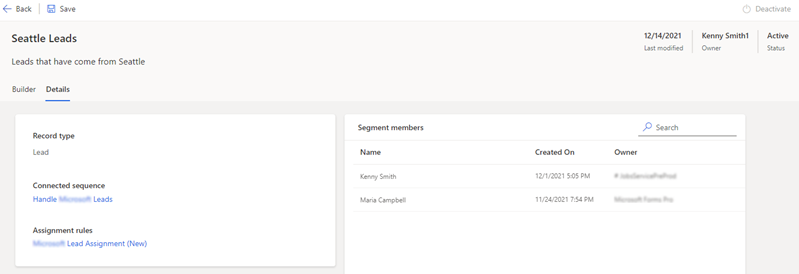

# View details of a segment

You can view the details of a segment, such as connected sequences, segment members, and assignment rules. 

## License and role requirements
| Requirement type | You must have |
|-----------------------|---------|
| **License** | Dynamics 365 Sales Premium or Dynamics 365 Sales Enterprise  More information: [Dynamics 365 Sales pricing](https://dynamics.microsoft.com/sales/pricing/) |
| **Security roles** | System Administrator or Sequence Manager    More information: [Predefined security roles for Sales](security-roles-for-sales.md)|

## Open and view details of a segment

1.	Sign in to your Dynamics 365 Sales Hub app.   

2.	Go to **Change area** in the lower-left corner of the page, and select **Sales Insights settings**.

3.	Under **Sales accelerator**, select **Segments**.   

    The **Segments** page opens with the list of available segments with details such as status, record type, and owner. The status of a segment specifies whether the segment is active, inactive, or paused. If a segment is paused, it means that the record type of the segment has been deleted from the sales accelerator configuration. You can't activate a paused segment. Add the record type to the configuration to move the segment back to its previous state (active or inactive). For more information about the record type configuration, go to [Choose content and layout](enable-configure-sales-accelerator.md#choose-content-and-layout). 
    
    The **Previously-segmented records** column displays, if the records are allowed to move from anther segment to this segment. Sequence and assignment rules that are related to this segment are automatically applied to the moved records.  

    >[!NOTE]
    >- The lead and opportunity record types won't be paused or deleted. By default, the lead and opportunity record types are always available in segments even if they're not added as record types.
    >- Records get assigned to the default segments when defined conditions in other segments doesn't match, an active sequence or assignment rule is associated with the default segment, and records are not segmented before.  

    >[!div class="mx-imgBorder"]
    >  

4.	Open a segment, and then select the **Details** tab. In this example, **Seattle leads** is selected.

    >[!div class="mx-imgBorder"]
    >  

    The following information about the segment is displayed:

    - **Record type**: The type of record that the segment supports.
    - **Connected sequence**: The sequence that the segment is connected to. When you select the connected sequence, the sequence opens in the sequence editor. You can view details of the connected sequence and perform actions such as adding records and segments. For more information, go to [Manage sequences](create-manage-sequences.md).
        When you select **Back** on the **Sequences** page, you're directed back to the segment details page. 
    - **Assignment rules**: The assignment rule that the segment is connected to. When you select the assignment rule, the rule opens in the editor. You can edit and update the rule as required. For more information, go to [Edit an assignment rule](edit-assignment-rule.md).
        When you save or cancel, you're directed back to the segment details page.   
    - **Segment members**: A list of records that are associated with the segment. You can edit the records without moving away from the details page. Select the record, and the record opens in a dialog. More information: [Edit a segment](edit-a-segment.md). 

[!INCLUDE[cant-find-option](../includes/cant-find-option.md)] 

### See also

[Manage segments](manage-segments.md)    
[Create and activate a segment](create-and-activate-a-segment.md)   

[!INCLUDE[footer-include](../includes/footer-banner.md)]
 
