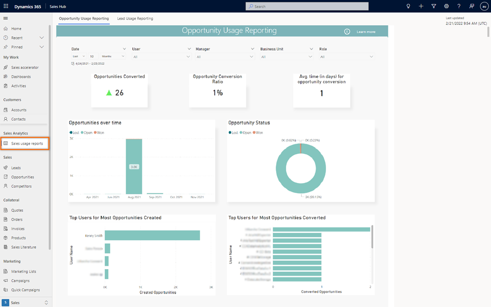
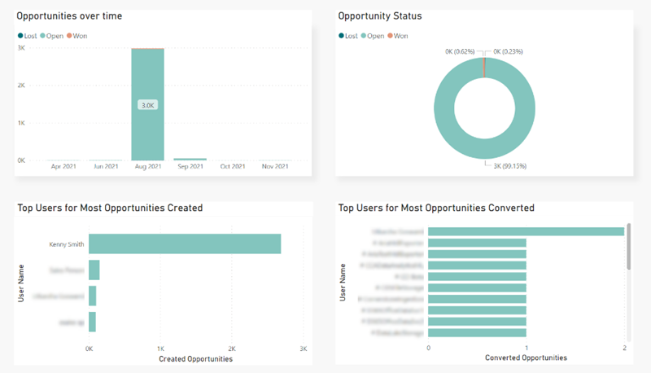

# View and understand the sales usage reports

The sales usage dashboard provides a snapshot view of the historical operational metrics and key performance indicators (KPIs) of opportunities and leads.

## License and role requirements
| &nbsp; | &nbsp; |
|-----------------------|---------|
| **License** | Dynamics 365 Sales Premium or Dynamics 365 Sales Enterprise More information: [Dynamics 365 Sales pricing](https://dynamics.microsoft.com/sales/pricing/) |
| **Security Role** | Sales Manager    See [Predefined security roles for Sales](security-roles-for-sales.md)|

## View the sales usage reports

>[!NOTE]
>When the administrator enables the reports, the application may take up to 24 hours to display the reports. Thereafter, reports are refreshed every 24 hours. 

1.	Sign in to your sales app, and in the lower-left corner of the page, go to **Change area** > **Sales Insights settings**.    
2.	Under **Sales analytics**, select **Sales usage reports**.

    >[!div class="mx-imgBorder"]
    >        
 
    The sales usage reports consist of the following dashboards:
    -	Opportunity usage reports
    -	Lead usage reports

## Understand the reports

The sales usage reports give you a broader overview of the performance of sales teams regarding leads and opportunities in your organization. The reports include KPIs and charts on how the leads and opportunities have performed over a period. 

The lead and opportunity dashboards can be categorized into the following sections:
-	[Data filters](#data-filters)
-	[KPI summary charts](#kpi-summary-charts)
-	[Metric charts](#metric-charts)

### Data filters
Use the data filtering options to select data for specific time periods, seller, sales manager, business unit, and role. By default, the data filters are selected for all and date range for the last 20 weeks.

>[!div class="mx-imgBorder"]
>   
 
### KPI summary charts
The KPI summary charts summarize the key performance indicators for the specified date and the percent change during the period. You can further filter these areas by seller, sales manager, business unit, and role. Also, a trend is displayed corresponding to the value specifying how the KPI is doing in the selected timeframe when compared with the previous timeframe. A green upward triangle indicates an improvement in the score, and a red downward triangle indicates a decline in the score.

>[!div class="mx-imgBorder"]
>  
 
The following table shows the KPIs that are displayed in the report. In this example, we are considering opportunity usage reports.

| KPI | Description |
|-----|-------------|
| Opportunities converted | The number of opportunities that are converted in to win deals. |
| Opportunity conversion rate | The percentage of opportunities that are successfully converted into win deals. |
| Avg.time (in days) for opportunity conversion | The average number of days that it takes for an opportunity to be converted into a win deal. |

### Metric charts
The metric chart provides a detailed view into the individual values of records, such as created date, status, and who created and converted them.    
To view specific data that's related to a value in the charts, select the value. Other metric charts in the report will be refreshed to show data that's related to the value you select. Drilling down into these values helps you to identify the areas of improvement.

>[!div class="mx-imgBorder"]
>  

The following table shows the metrics that are displayed in the report. In this example, we are considering opportunity usage reports.

| Metric chart | Description |
|--------------|-------------|
| Opportunities over time | A breakdown on how the opportunities are trending month-over-month in your organization. |
| Opportunity status | A breakdown of opportunities by their status: •	Open •	Won •	Lost |
| Top users for most opportunities created | A breakdown on users who created the most opportunities. |
| Top users for most opportunities converted | A breakdown of users who converted the opportunities in to win deals. |

[!INCLUDE[cant-find-option](../includes/cant-find-option.md)] 

### See also

[Enable sales usage reports](enable-sales-usage-reports.md)

