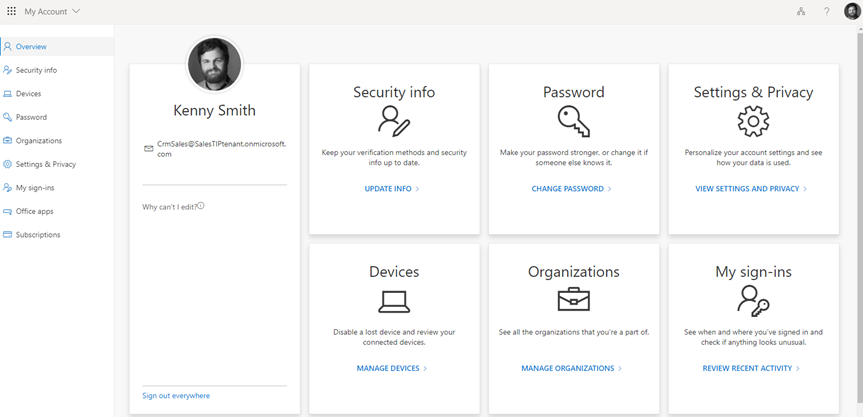

# How to get introduced to leads or contacts  

Use who knows whom to quickly identify colleagues who can introduce you to a lead or contact.

## License and role requirements

| Requirement type | You must have |  
|-----------------------|---------|
| **License** | Dynamics 365 Sales Enterprise or Dynamics 365 Sales Premium  More information: [Dynamics 365 Sales pricing](https://dynamics.microsoft.com/sales/pricing/) |
| **Security roles** | Any primary sales role, such as salesperson or sales manager   More information: [Primary sales roles](security-roles-for-sales.md#primary-sales-roles)|

## What is who knows whom?

As a sales representative, you often interact with leads whom you've never talked to or even met before. If only you knew someone who knew the lead, an introduction could increase the chances of a positive outcome. Who knows whom in Dynamics 365 Sales does exactly that. Who knows whom suggests the names and email addresses of your colleagues who had interacted with the lead through emails or meetings. It even helps you quickly email your colleagues to request an introduction.

### Basic who knows whom information

For Sales Enterprise users, the who knows whom information is populated based on emails and meeting data in Dynamics 365. This information is available out-of-the-box and doesn't require any setup.

### Enhanced who knows whom information

For Sales Premium users, the information is populated based on Exchange data, provided your administrator has [configured the integration](configure-who-knows-whom.md). If you don't want Dynamics 365 to collect your Exchange data, you can [opt out](#turn-off-data-sharing-with-dynamics-365-applications) of data sharing.  

## View who knows whom  

The Who knows whom information is available for contacts and leads.

1. In the Sales Hub app, select a lead or a contact. 

    The Who Knows Whom widget shows up to five people in your organization who have communicated with the lead or contact through calls and emails. It also shows you how strong their connection is. The widget is available in the **Sales Insights** form and in the main **Contact** or **Lead** form.

    :::image type="content" source="media/wkw-widget.png" alt-text="Screenshot of the Who Knows Whom tile.":::

    > [!NOTE]
    > If you see a message that you don't have sufficient privileges, ask your admin to provide [necessary permissions](grant-access-wkw.md). 

2. Select the icon in the upper-right corner of the **Who Knows Whom** tile to switch between graph and list views.
1. Based on the connection strength, identify a colleague who can introduce you to the lead and select **Get introduced**.
   
   > [!Note]
   > If you don't see the **Get introduced** button, contact your administrator to [set up server-side synchronization](/power-platform/admin/set-up-server-side-synchronization-of-email-appointments-contacts-and-tasks). 
   
   An email to the selected colleague is pre-populated with the template text. You can refine the email content and send it.
   
## Turn off data sharing with Dynamics 365 applications

You can choose to opt out if you don't want Dynamics 365 to collect and analyze your Exchange data. Your Office 365 organization must be in one of the [EMEA or Asia Pacific global geographies](/microsoft-365/enterprise/o365-data-locations?view=o365-worldwide&preserve-view=true) to opt out of who knows whom data collection.

1. Sign in to your [Office 365 account](https://myprofile.microsoft.com/).

    > [!div class="mx-imgBorder"]
    > 

2. Select **Settings & Privacy**, and then select the **Privacy** tab. 

3. In the **Services** section, select the arrow next to **Dynamics 365 applications**.  

4. Turn off the **Include my data in Dynamics 365 applications** toggle.

    > [!div class="mx-imgBorder"]
    > 

    Dynamics 365 applications can no longer access, collect, or analyze your data.  

### See also

[Configure who knows whom](configure-who-knows-whom.md)  
[Who knows whom FAQs](faqs-sales-insights.md#who-knows-whom)

[!INCLUDE[footer-include](../includes/footer-banner.md)]

