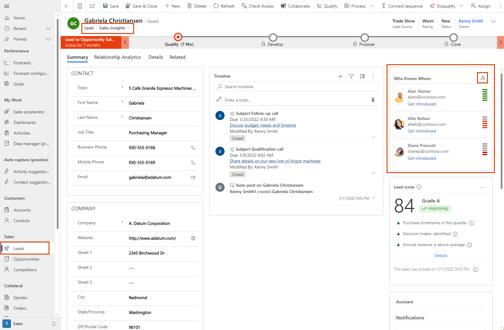
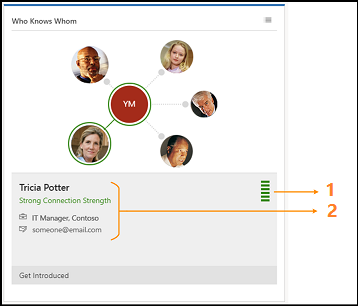
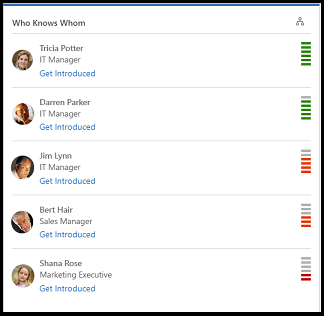
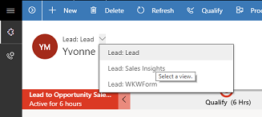
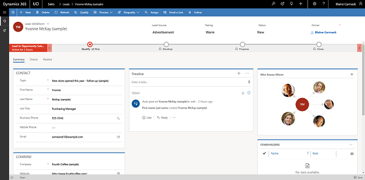

# How to get introduced to leads or contacts  

Use who knows whom to quickly identify colleagues within your organization who can introduce you to a lead or contact.

## License and role requirements
| Requirement type | You must have |  
|-----------------------|---------|
| **License** | Dynamics 365 Sales Premium  More information: [Dynamics 365 Sales pricing](https://dynamics.microsoft.com/sales/pricing/) |
| **Security roles** | Any primary sales role, such as salesperson or sales manager   More information: [Primary sales roles](security-roles-for-sales.md#primary-sales-roles)|

## What is who knows whom?

As a sales representative, you will interact with leads who you've never talked to or even met before. It can be difficult to turn these interactions into positive outcomes. To help in these situations, Dynamics 365 Sales provides a feature known as **Who knows whom**. This feature provides you with details such as names and email addresses of your colleagues who know the lead. With these details, you can contact your colleagues for help with getting introduced to a lead. Such introductions can increase the chances of a positive outcome during the interaction.

Who knows whom relationships are calculated from the communication and collaboration patterns of users in your Microsoft Exchange environment. This data helps connect you to others users within your Microsoft Exchange environment who can help make a connection. Contacts or leads who are outside of your Microsoft Exchange organization can be queried for and, in some cases, users internal to your Microsoft Exchange organization can also be queried for. For example, this is possible if a user within your Microsoft Exchange organization has added an internal user’s email address to their Microsoft Exchange address book.

Who knows whom is available in **Contact** and **Lead** forms. When you open a lead or contact and select the **Sales Insights** view, the **Who Knows Whom** tile is displayed.  

> [!NOTE]
> If you don't see the **Who Knows Whom** tile in the **Sales Insights** view of a contact or lead, ask your admin to enable this feature. To learn more, see [Configure who knows whom](configure-who-knows-whom.md).

> [!div class="mx-imgBorder"]
> 

1. **Contacts who know the lead.** These contacts are the people in your organization who have communicated with the lead through calls and emails. A maximum of five contacts are displayed for a lead. These contacts are displayed based on the most communication with the lead.

    > [!div class="mx-imgBorder"]
    > 

    When you select a contact, details of the contact are displayed along with the strength of connection to a lead.

    > [!div class="mx-imgBorder"]
    >  
      1. Strength of the connection
      2. Contact details
  
    To get introduced to the lead, you can send an email to the selected contact without leaving the page you're on. Select **Get Introduced**. This opens an email with a default request to introduce the lead. Select **Send** to send the email. If you want to customize the email with more options, select **Open Email Form**.

    > [!div class="mx-imgBorder"]
    > 

2. **List view.** Select this to see the people in your company who know your lead. The contacts are displayed based on the connection strength. Connections whose strength is strong are displayed first, followed by other connection strengths. You can also select **Get Introduced** to send an email request for an introduction to the lead.

    > [!div class="mx-imgBorder"]
    >  

Let’s look at an example. Blaine Carmack is a sales representative who sells coffee makers. He has a new lead, Yvonne McKay, who owns Fourth Coffee and has opened a new store. Blaine wants to sell coffee machines to Yvonne, but he has not met or spoken to her. Before Blaine makes a call to Yvonne, he wants to know if any of his colleagues know her so that they could introduce him to increase the positive outcome of the call. Blaine will perform the following steps:

1.	Open the Sales app and go to the **My Open Leads** view.
2.	Open the lead **Yvonne McKay** with the topic **New store opened this year - follow up**.  
    The summary of the lead displays.
3.	Select the **Lead:Sales Insights** view from the view dropdown list.

    > [!div class="mx-imgBorder"]
    > 

    The **Who Knows Whom** tile is displayed.

    > [!div class="mx-imgBorder"]
    > 

4.  Select each contact to view the details and verify the connection strength to increase the chances of an introduction to the lead. Here, Tricia Potter has a better chance to introduce Yvonne McKay because of her strong connection strength.

    > [!div class="mx-imgBorder"]
    > 

    Alternatively, select list view to verify the connection strengths.

5.	Select **Get Introduced** to send an email to Tricia requesting an introduction to Yvonne.

    > [!div class="mx-imgBorder"]
    > 
  
6.	Select **Send**. 
    The email is sent to Tricia to introduce Yvonne. 

## Turn off data sharing with Dynamics 365 applications

As a user, you can always choose to opt out if you don't want Dynamics 365 to analyze your communication and collaboration data. 

>[!NOTE]
>You can only opt out if your Office 365 organization is in the EMEA or Asia Pacific global geography. More information: [Datacenter locations](/microsoft-365/enterprise/o365-data-locations?view=o365-worldwide&preserve-view=true)

1. Sign in to your [Office 365 account](https://myprofile.microsoft.com/).

    > [!div class="mx-imgBorder"]
    > 

2. Select **Settings & Privacy**, and then select the **Privacy** tab. 

3. In the **Services** section, select the arrow next to **Dynamics 365 applications**.  

4. Turn off the **Include my data in Dynamics 365 applications** toggle.

    > [!div class="mx-imgBorder"]
    > 

    Dynamics 365 applications can no longer access, collect, or analyze your data.  

### See also

[Configure who knows whom](configure-who-knows-whom.md)  
[Who knows whom FAQs](faqs-sales-insights.md#who-knows-whom)

[!INCLUDE[footer-include](../includes/footer-banner.md)]
