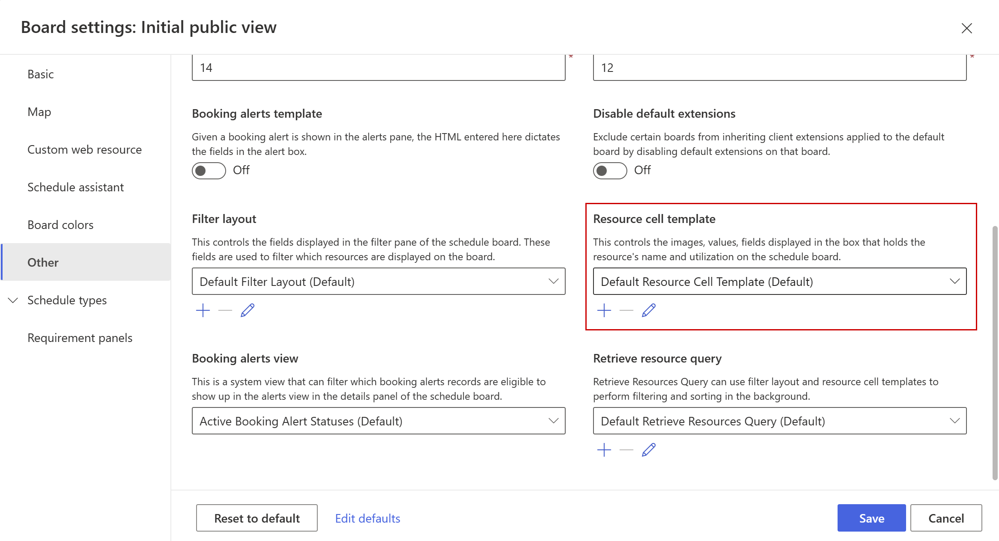
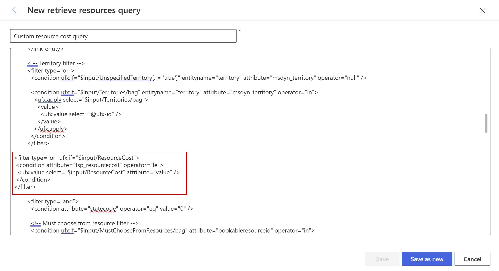

The schedule board can be customized and extended to meet business needs. For example, resource information, fields in the filter pane, or sort options.

Consider the following customization scenario:

Each bookable resource has a cost based on factors like seniority and certification level. Dispatchers would like to see the general cost of their resources, along with the ability to filter and sort by cost. Rather than use an exact resource cost, this scenario uses a relative cost score from 1 (lowest resource cost) to 10 (highest resource cost). we'll use the scope in the resource cell, the filter panel, and in the sort options.

## Step 1: Add the new attribute to the bookable resource entity

Go to **Customizations** > **Customize the System** > **Bookable Resource** > **Fields** and add a new field named **Resource Cost** with the schema name **tsp_resourcecost**.

> [!div class="mx-imgBorder"]
> 

Use the data type **Option Set** and select the existing option set **Level of Importance** to use a list of values from 1 to 10.

Add the newly created field to the form before you **Publish** the changes.

## Step 2: Create or update a schedule board

Go to the schedule board that you want to add the new resource cost attribute to.

## Step 3: Modify the resource cell template

The resource cost indicator should be displayed in the resource cell template. [Font Awesome](https://fontawesome.com/) can be used to display icons, such as €, $, £.

The HTML first draws five gray icons as a background, and then yellow icons as foreground. The number of the foreground icons is mapped to the value of the resource cost. For example, a resource cost value of 2 is 20%, so only one of the five yellow Euro icons will show.

Open the schedule board tab settings and under **Other Settings**, create a custom **Resource Cell Template**.

> [!div class="mx-imgBorder"]
> 

Insert the following code snippet into the custom resource cell template. Replace `fa-euro` to change the symbol.

```HTML
    <div class='resource-card-wrapper {{iif ResourceCellSelected "resource-cell-selected" ""}} {{iif ResourceUnavailable "resource-unavailable" ""}} {{iif IsMatchingAvailability "availability-match" ""}}'>
    {{#if imagepath}}
    
    {{else}}
    <div class='resource-image unknown-resource'></div>
    {{/if}}
    <div class='resource-info'>
        <div class='resource-name primary-text ellipsis' title='{{name}}'>{{name}}</div>

		<div class='secondary-text ellipsis'> 
			<div class="back-stars" style="color: #EEEEEE; position: relative; display: inline-block;">
				<i class="fa fa-euro" aria-hidden="true"></i>
				<i class="fa fa-euro" aria-hidden="true"></i>
				<i class="fa fa-euro" aria-hidden="true"></i>
				<i class="fa fa-euro" aria-hidden="true"></i>
				<i class="fa fa-euro" aria-hidden="true"></i>
				
				<div class="resourcecost" style="width: {{resourcecost}}0%; color: #FFBC0B; position: absolute; top: 0; left:0; display: inline-block; overflow: hidden;">
					<i class="fa fa-euro" aria-hidden="true"></i>
					<i class="fa fa-euro" aria-hidden="true"></i>
					<i class="fa fa-euro" aria-hidden="true"></i>
					<i class="fa fa-euro" aria-hidden="true"></i>
					<i class="fa fa-euro" aria-hidden="true"></i>
				</div>
			</div>
		</div>

        <div class='secondary-text ellipsis'>
            {{#if (eq (is-sa-grid-view) false) }}
            <div class='booked-duration'>{{BookedDuration}}<div class='fo-sch-clock'></div></div>
            <div class='booked-percentage'>{{BookedPercentage}}%</div>
            {{/if}}
        </div>
        {{#if (eq (is-sa-grid-view) false) }}
        <div class='matching-indicator'></div>
        {{/if}}
    </div>
    {{#if (eq (is-sa-grid-view) false) }}
    {{> resource-map-pin-template this }}
    {{/if}}
    </div>
```

## Step 4: Modify the filter layout

In this step, we define a maximum cost score when filtering and searching for resources and sorting by cost score.

On the schedule board tab settings, go to **Filter Layout** and create a custom template.

Insert the following code snippet into the custom filter layout template.

```XML
    <?xml version="1.0" encoding="utf-8" ?>
    <filter>
    <controls>
    <control type="characteristic" key="Characteristics" label-id="ScheduleAssistant.West.Skills" />

	<control type="combo" source="optionset" key="ResourceCost" label-id="Resource Cost Limit" entity="bookableresource" attribute="tsp_resourcecost" multi="false">
    </control>

    <control type="combo" source="entity" key="Roles" inactive-state="1" label-id="ScheduleAssistant.West.Roles" entity="bookableresourcecategory" multi="true" />
    <control type="combo" source="entity" key="Territories" unspecified-key="UnspecifiedTerritory" label-id="ScheduleAssistant.West.Territories" entity="territory" multi="true" />
    <control type="combo" source="entity" key="OrganizationalUnits" label-id="SB_FilterPanel_OrganizationalUnitsFilter_Title" inactive-state="1" entity="msdyn_organizationalunit" multi="true" />
    <control type="combo" source="optionset" key="ResourceTypes" label-id="SB_FilterPanel_ResourceTypesFilter_Title" entity="bookableresource" attribute="resourcetype" multi="true">
      <data>
        <value id="2" />
        <value id="3" />
        <value id="4" />
        <value id="5" />
      </data>
    </control>
    <control type="combo" source="entity" key="Teams" label-id="SB_FilterPanel_TeamsFilter_Title" entity="team" multi="true" />
    <control type="combo" source="entity" key="BusinessUnits" label-id="SB_FilterPanel_BusinessUnitsFilter_Title" entity="businessunit" multi="true" />
    <control type="order" key="Orders" label-id="FilterControl_OrderLabel">
      <order name="name" entity="bookableresource" attribute="name" />

      <order name="resourcecost" entity="bookableresource" attribute="tsp_resourcecost" />

      <order name="proficiencyscore" entity="bookableresourcecharacteristic" attribute="ratingvalue" />
    </control>
    </controls>
    </filter>
 ```

## Step 5: Modify the query

Finally, we'll modify the actual query and include the new filter. In the schedule tab settings, go to **Retrieve Resources Query** and create a custom template. The existing code is lengthy, so below are only the code snippets to paste within an existing resource query.

After `<entity name="bookableresource">`, insert `<attribute name="tsp_resourcecost" alias="resourcecost" groupby="true"/>`

After `the last </filter> tag of the <!-- Territory filter -->`, insert the following code snippet:

```UFX
<filter type="or" ufx:if="$input/ResourceCost">
 <condition attribute="tsp_resourcecost" operator="le">
  <ufx:value select="$input/ResourceCost" attribute="value" />
 </condition>
</filter>

```

> [!div class="mx-imgBorder"]
> 

## Step 6: Test your new schedule board

On the schedule board, we've defined a maximum cost factor of 5 and an ascending sort order based on cost.

## Next steps

- [Overview of scheduling extensibility](/dynamics365/customer-engagement/common-scheduler/developer/understanding-and-customizing-resource-matching-in-urs)
