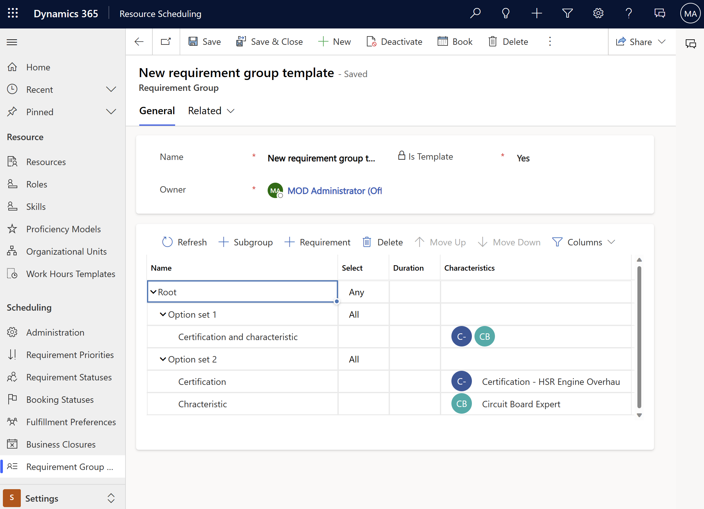

Requirement groups bundle resources commonly scheduled together. Mix and match the different types of resources needed for a job.

For example, use a requirement group to bundle resources that have specific characteristics.

Updating a requirement group template doesn't update previously created requirements from that template, only new requirements.

## Create a requirement group template

1. In Universal Resource Scheduling, open the **Settings** area. Under **Scheduling**, select **Requirement Group Templates**, and then select **New**.

1. Enter a **Name** for the requirement group and **Save** it. The table shows requirement details with a root requirement named after the template.

1. Add a requirement and fill in the fields in the columns. All requirements within a requirement group must have the same duration. Change the duration of individual bookings after booking the requirement group.

   To add more details to a resource requirement, select **Open Form**. <!-- why can't I add existing resource reqs? -->

   > [!div class="mx-imgBorder"]
   > 

1. In the **Select** column on the root requirement, choose the preferred option. The **All** option means that resources must fulfill all requirements. **Any** means that the system searches for resources that can fulfill any requirement and that fulfilling one requirement fulfills the entire requirement group.

   These settings are especially useful when you add multiple option sets to a requirement group using subgroups. For example, if a job requires a certain skill and a specific certification. One resource can fulfill both requirements (option set 1) or two resources can fulfill one requirement each (option set 2). Any of these combinations would fulfill the requirement group.

1. **Save** the requirement group template.

## Create a requirement group

1. In Universal Resource Scheduling, open the **Resource Scheduling** area. Under **Scheduling**, select **Requirement Groups**, and then select **New**.

2. Enter a **Name**, choose a **Requirement Group Template**, and select **Save**.

## Book a requirement group

Open a requirement group and select **Book** to launch the schedule assistant and get available options that fulfill the requirement group.

Booking an option for multiple requirements creates multiple bookings.
