Resource crews allow dispatchers to search and schedule multiple resources at once. This can include a group of employees, subcontractors, equipment, facilities, or any combination thereof who will perform the same work during a period of time. Crews speed up and simplify the scheduling process and allow team members to work together more consistently.

Crews are ideal for scenarios where:
- a group of resources will work together for a set number of days, weeks, or months.
- a crew meets at a location in the morning, shares a vehicle, and is together all day from job to job.
- a new employee is shadowing a veteran to learn new skills.

**The primary use case** for booking crews is scheduling a requirement group with multiple requirements to multiple resources, though single requirements can be manually scheduled to crews as well.

**Without crews**, dispatchers can schedule the same requirements multiple times manually by using the schedule board (or with the schedule assistant), but that takes more time. If your scenario involves assembling resources together for one job, and then disbanding everyone, crew scheduling is not applicable.

Scheduling a crew automatically creates bookings for all crew members; rescheduling bookings will reschedule all crew bookings according to cascading settings on the bookings.

In this topic, we'll walk through how to use resource crews, and then explore a few additional considerations.

## Prerequisites

- Field Service v8.0+
- Universal Resource Scheduling v3.0+

## Instructions

### 1. Create a "crew" resource type
A crew consists of a crew resource. The crew resource serves as a container for the crew, and child resources who are the members of the crew for a given time frame.

To create a crew resource, navigate to **Universal Resource Scheduling > Resources > +New** and set the resource type to **Crew**.

On the **General** tab, assign a **Name**.

> [!div class="mx-imgBorder"]
> 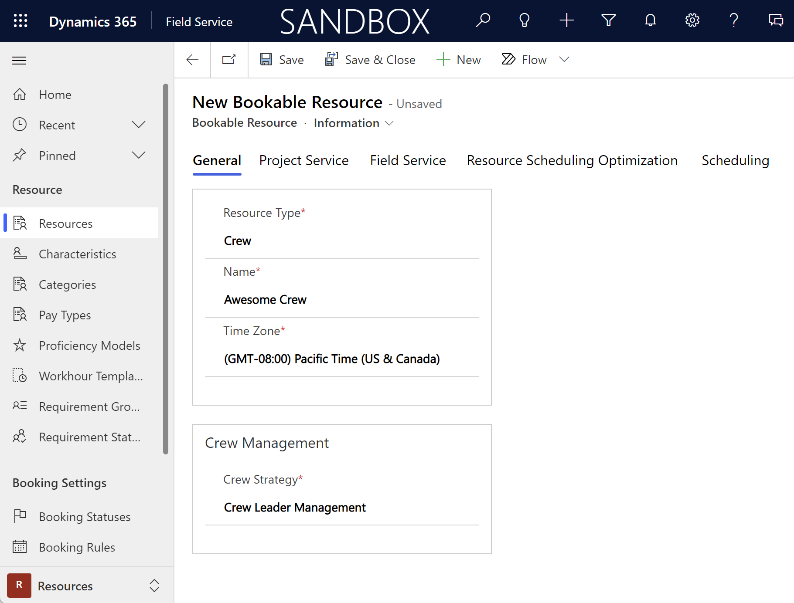

You can also assign a **Crew Strategy.** Crew strategy determines how the crew manages its work. There are 3 options:

- **Cascade and Accept Cascade Completely**: All resources on a crew can manage all the work. This is useful when a crew is made up of one user and the rest of the crew is equipment.
- **Crew Leader Management**: There is a designated person (or persons) can manage the work of a crew. This is useful when a crew is made up of multiple users. You can designate more than one person to be a leader and manage the work.
- **Crew Member Self-Management**: Resources can manage their own work. This is useful when a crew is made up of users who regularly work together, but may not always work together at the same place or time. Self-management also means better time capturing 

Set the **Start and End Locations**.

Note that start and end location must be the same and can be set to either:

- **Location Agnostic**, meaning the crew only appears as a schedule assistant option for location agnostic requirements; related bookings will not include any travel time.
- **Organizational Unit Address**, meaning the crew shows as available for onsite work; however, routing and travel times are calculated at the individual level based on each crew member's start and end location. The organizational unit must be geocoded.

> [!div class="mx-imgBorder"]
> 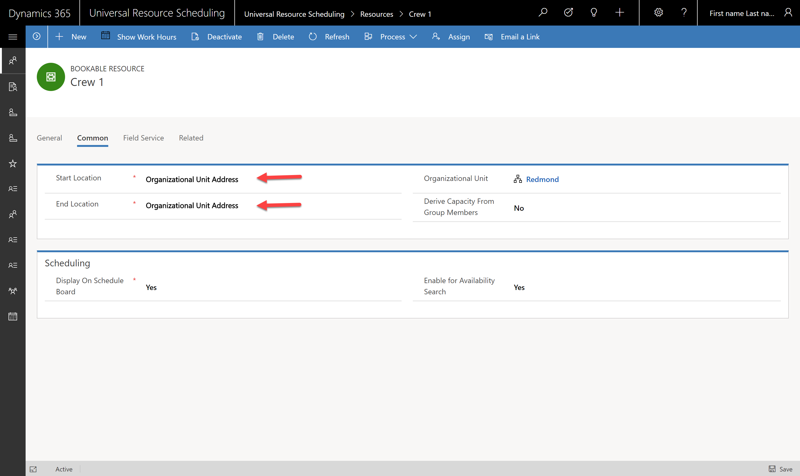

 
### 2. Add resource children to the crew

Now that the crew resource exists, we will relate other bookable resources to the crew as crew members. First, create the bookable resources and set up the profile to include working hours, characteristics, start/end location, etc. 

Then from the crew header, navigate to **Related > Resource Children** to link each bookable resource as a child resource to the crew. 

This is set up on the **bookableresourcegroup** entity.

> [!div class="mx-imgBorder"]
> 

Add a **Date Range** to indicate when each resource will be part of the crew. It can be variable for each resource.

### 3. Add the crew to the schedule board 

Crew members are also visualized on the schedule board as any resource would be. 

Add crews to the schedule board by manipulating schedule board filters to match the service territory, roles, business unit, characteristics etc. of the crew header. Or, manually add the crew to the board from **Options > Select Resources**.

> [!div class="mx-imgBorder"]
> 

For example, if a schedule board is filtered to show resources for the Washington territory, and the crew header resource is part of that territory, it will be displayed. This is true even if resource children are not part of that territory.

> [!div class="mx-imgBorder"]
> 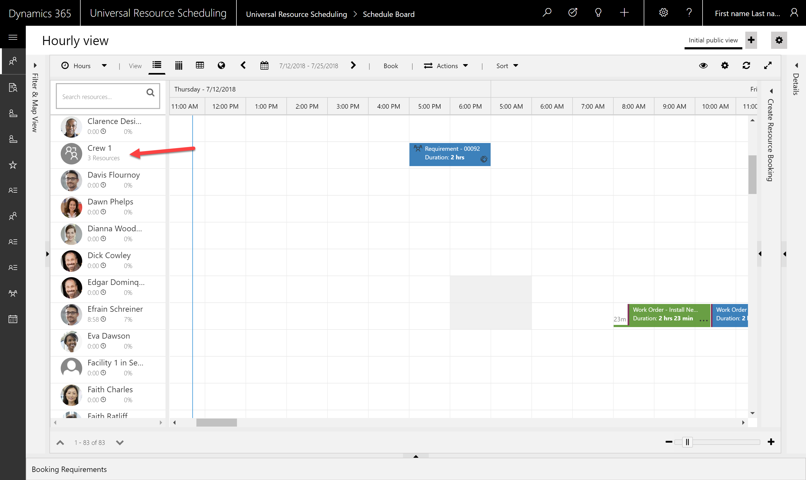

Crew resources have a different resource cell layout on the schedule board. You will notice a different icon and a resource count indicating how many resources are in the crew during the range displayed on the schedule board.

> [!div class="mx-imgBorder"]
> 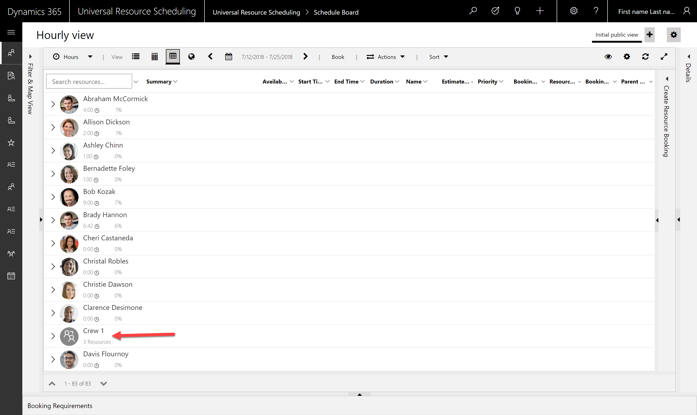

On the hourly list view, you can expand the crew resource to see the members of the crew.

> [!div class="mx-imgBorder"]
> 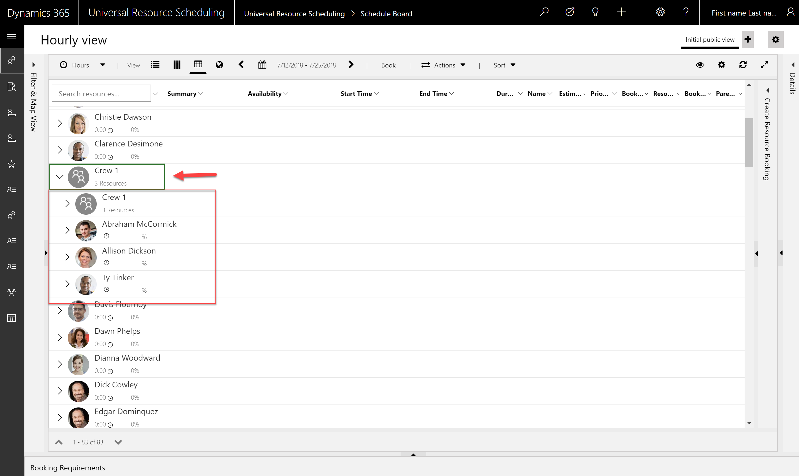

For the time range a resource is part of a crew, there is a grey area displayed on the board. This serves to:
 1. Remind dispatchers and resource managers that the resource is part of a crew. 
 2. Understand that moving their bookings will likely affect other bookings because crew bookings are kept in sync unless specified otherwise. 
 3. Understand that scheduling a job to the resource without the crew will likely affect the crew’s ability to be matched for future jobs. 

> [!div class="mx-imgBorder"]
> 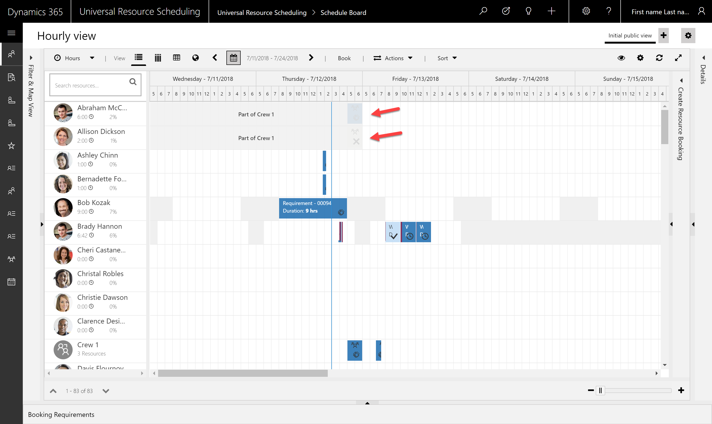

### 4. Manually schedule the crew

Dragging a single requirement to the crew header resource will create a booking for the crew header resource, along with all child resources that are associated to the crew during that time.

Note that requirement groups can't be manually scheduled to crews; only single requirements can be manually scheduled. 

> [!div class="mx-imgBorder"]
> 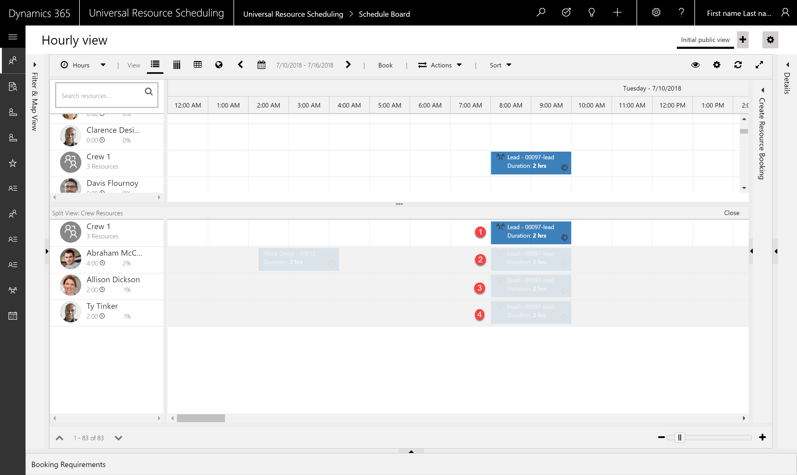

### 5. Schedule the crew with the schedule assistant (single requirement)

When using the schedule assistant, each crew member can appear in results as non-crew individuals; if booked, only that single resource will have a booking. The crew resource can also return in the results if the working hours and other constraints match up. If a crew resource is booked though the schedule assistant, all crew members will be booked along with the crew. 

If you select the crew resource itself and book the crew, the crew and its members will all be booked. 

### 6. Schedule the crew with the schedule assistant (requirement group)

The primary use case for scheduling crews is when you have a set of requirements that need to be done together. Therefore, a crew, which consists of multiple resources, may be a perfect fit. 

The schedule assistant can return a both a group of individual resources and a crew to complete a requirement group. 

> [!div class="mx-imgBorder"]
> 

When the schedule assistant searches, it assembles a team of resources in which there is a relevant resource for every requirement in the requirement group. The crew resource itself is just a container and is not considered a resource when it comes to matching. Each individual resource needs to match with a requirement in the requirement group.

The ideal scenario would be matching three requirements to a crew of three resources. 

> [!div class="mx-imgBorder"]
> 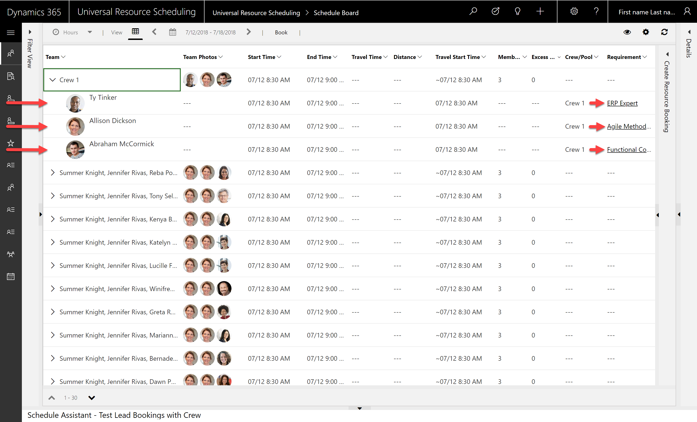

As you can see in the preceding screenshot, the entire crew is presented as an option to book, along with additional non-crew options like teams.

If you expand the crew, you will see that each member of the crew matched with a requirement within the requirement group being scheduled.

When the crew is selected and booked, each booking for each crew member will relate to the requirement that they were matched to, and will also relate to the requirement group. The crew resource gets a booking as well to make it easy to manage the crew as a single unit.

> [!Note]
> Scheduling a crew can be better than scheduling a collection of individual resources because crew members work with each other frequently; this can boost productivity.

#### More crew members than requirements
A crew with more resources than needed by the requirement group will show as a result in the schedule assistant, but lower in the search results because it is less optimal. 

 For example, the requirement group may have two requirements, but there are no combinations of resources that can be assembled to handle the work. Therefore, a crew of three resources can be presented as an option to book. 

 Below are the results showing a crew with more resources than required.

> [!div class="mx-imgBorder"]
> 

Additionally, there's a column called **Excess resources** that shows how choosing this team will book more resources than you need.

When you expand the crew, it separates the resources that are not matched for any requirement into a separate section called **Non-Matching Resources**, making it easy to separate the required resources and those who will be considered extra for that job.

By default, the schedule assistant results are sorted by **Fewest Resources First**, followed by earliest start time. If there are teams that can be assembled for the requirement group that only consist of two resources, the crew will not show until the end of the results.

You can change the sort order in the schedule assistant filter panel by choosing **Earliest Time First**, creating a higher likelihood of seeing a crew with excess resources. 

> [!div class="mx-imgBorder"]
> 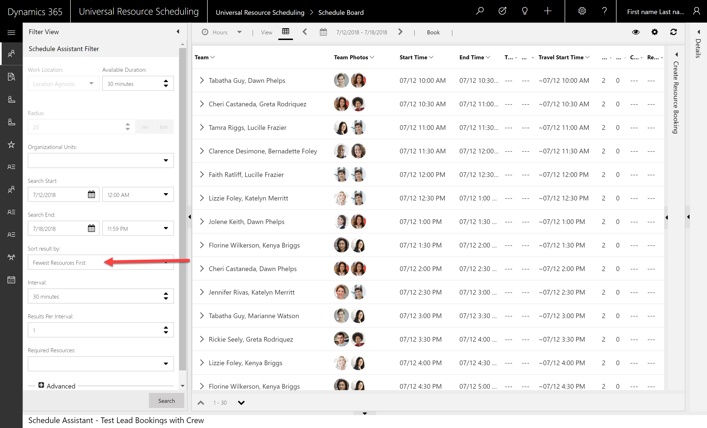

> [!Note]
> When you book a team or crew with excess resources, all of the bookings will link to the requirement group, but the bookings for non-matching resources will not have a link to a requirement.

#### Fewer crew members than requirements

Sometimes when searching for availability, the crew may need additional resources in order to meet the requirements. For example, the crew may have three resources, but the requirement group has four requirements. The crew can be combined with resources outside the crew. 

The schedule assistant will combine crews and individual resources to fulfill a requirement group and even note which resources are part of the crew. 

> [!div class="mx-imgBorder"]
> 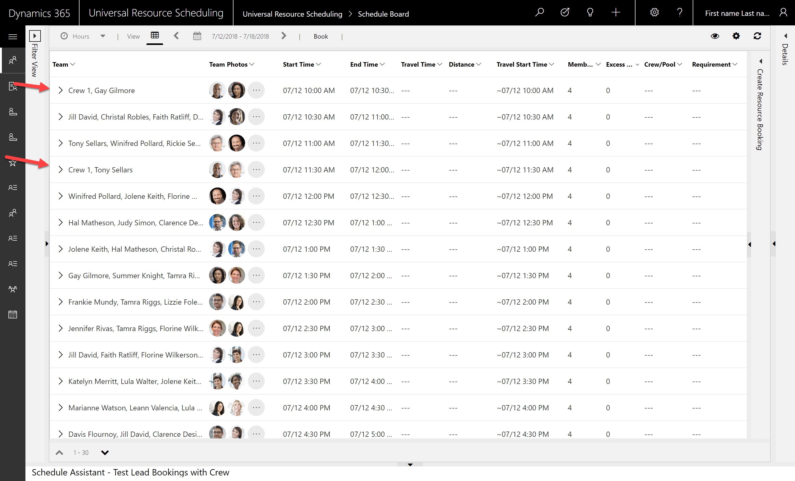

> [!div class="mx-imgBorder"]
> 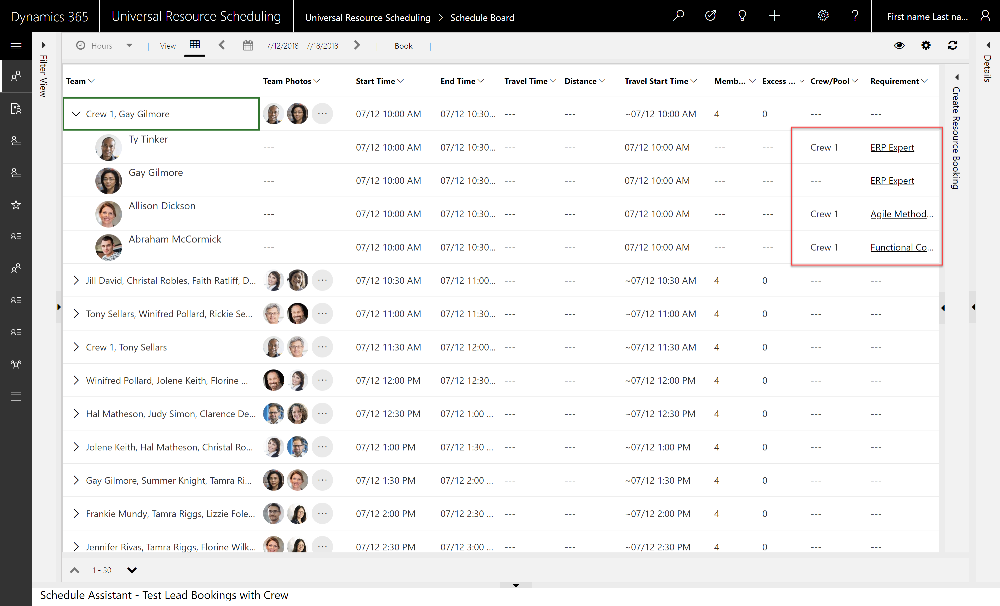

### 7. View crews and related bookings on the schedule board

Once a crew has been scheduled, there are scenarios where you may want to drill in and see the entire crew together at once. By default, each resource is still listed individually on the schedule board. If you want to drill into a crew, right-click the crew resource and select **View Crew Resources in Split View**.

> [!div class="mx-imgBorder"]
> 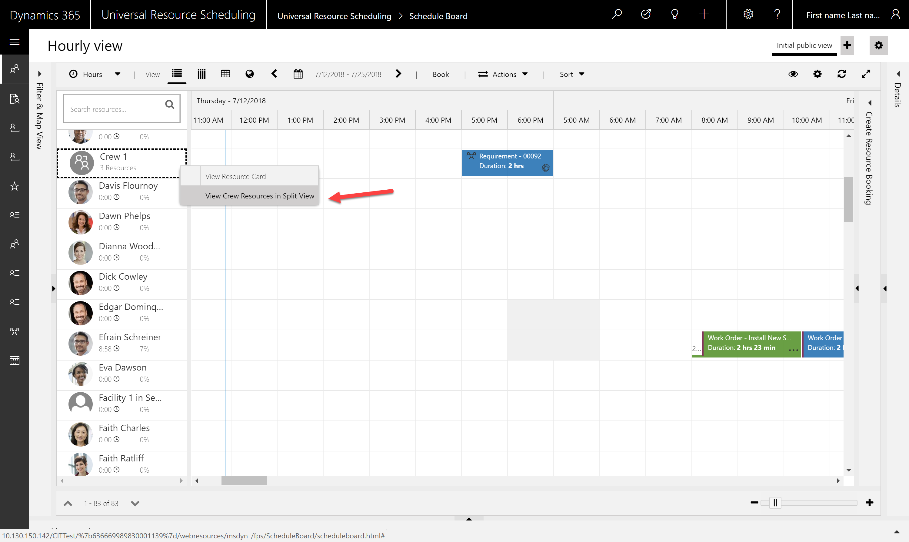

This will split the schedule board into two boards. The top board is the same board you were on before, and the bottom schedule board shows only the crew and crew members.

> [!div class="mx-imgBorder"]
> 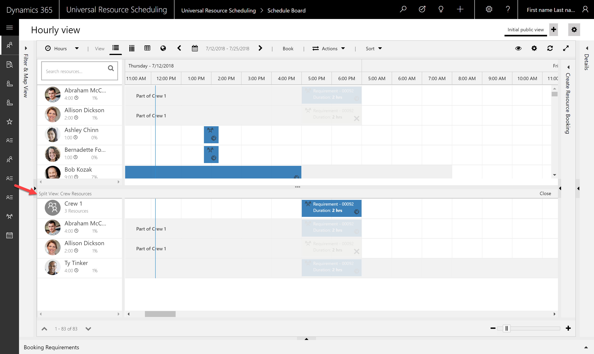

#### Filtering and sorting with split view
Filtering only applies to the main schedule board and not the Split View. Sorting will apply within each schedule board. However, the crew header resource will always remain on top in the split view regardless of the sort.

## Configuration considerations 

### Location of crew and crew members 
The schedule assistant needs to understand the starting and ending location of resources when it books onsite requirements for Field Service. Crew member locations are taken from their individual resource profiles and not from the parent crew. It's important that you change the location of the crew member resource if a resource jumps between crews. For example, if you want a crew to meet at a central location in the morning to travel together, specify start/end location as organization unit address for the crew header resource *and* the resource children crew members.

### Resource type filter on requirements

The resource type filter on a requirement controls which resources can be searched as part of the schedule assistant search. If no values are set, then all resources can be searched. If only “Crew” is selected, then only members of a crew can return in the results. The option “Crew” will be renamed to “Crew Member” in an update to help articulate the meaning better. This also applies to Resource Scheduling Optimization.

If both crew and user are selected, then only resources that are set to resource type “User” *or* are a member of a crew can be searched.

> [!div class="mx-imgBorder"]
> 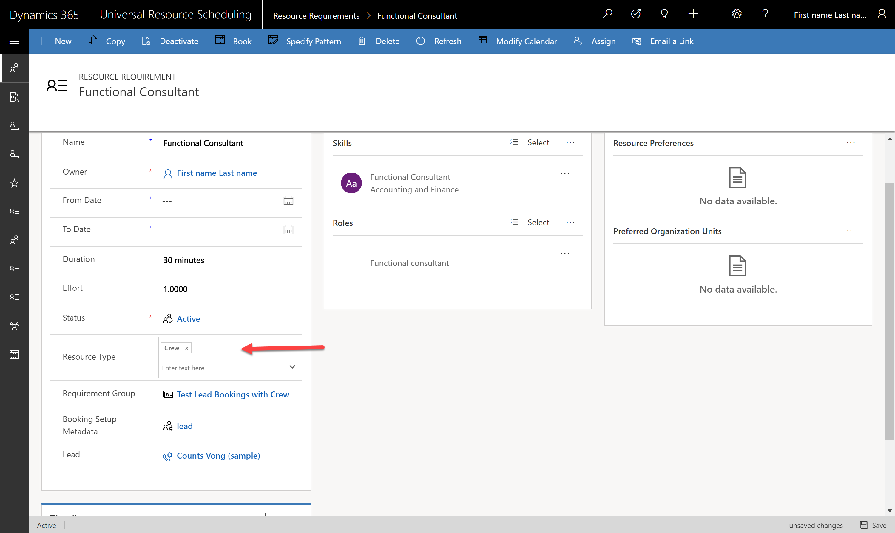

### Auto group type

**Scheduling single requirements to crews**

When a single requirement is booked to a crew (regardless if manually or with the schedule assistant), a requirement group is auto created and all bookings are related to the requirement group. This ensures that crew bookings are in sync when moved/rescheduled/canceled.

> [!div class="mx-imgBorder"]
> 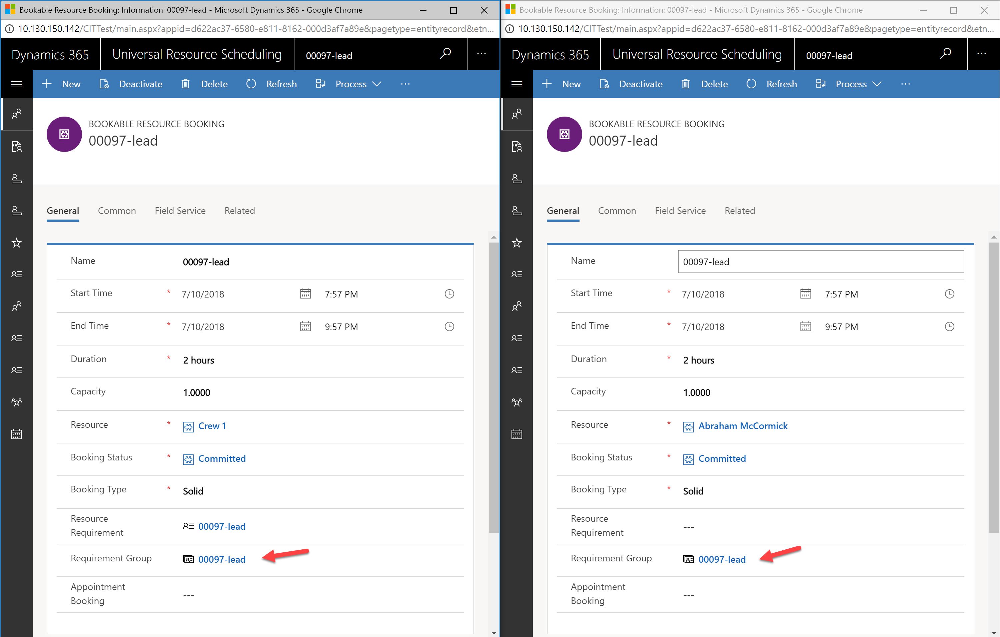

However, only the crew header resource is linked to the single requirement in the newly created requirement group.

> [!div class="mx-imgBorder"]
> 

Additionally, the newly created requirement group is tagged with an **Auto Group Type of “Crew”**. 

> [!div class="mx-imgBorder"]
> 

## Additional notes

**Attempting to book a resource that is part of a crew**

If you select a resource that is part of a crew, a warning message will be presented warning the scheduler that this resource is part of a crew, so it may impact the crews ability to handle future jobs.

> [!div class="mx-imgBorder"]
> 

**Multiday schedule boards not supported for crews** 

Daily, weekly, and monthly schedule boards do not have specific support for crew scenarios.
