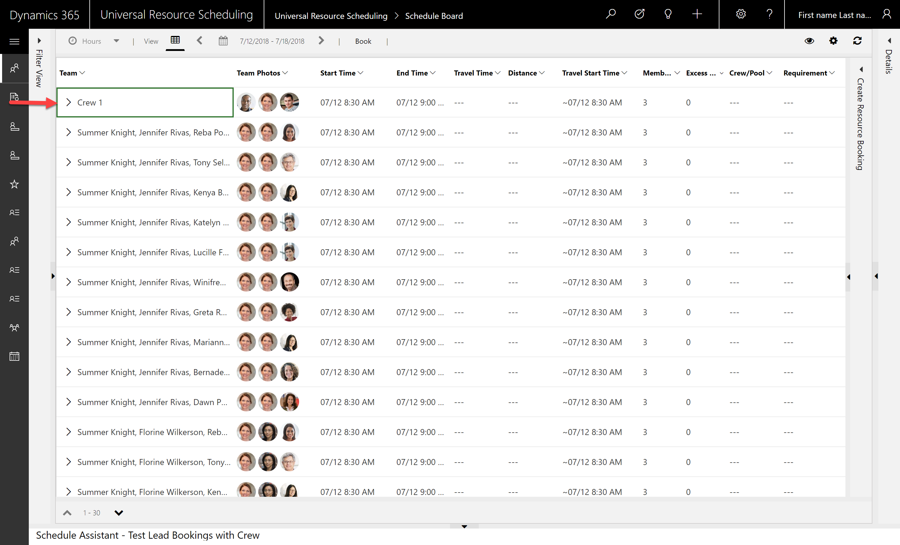
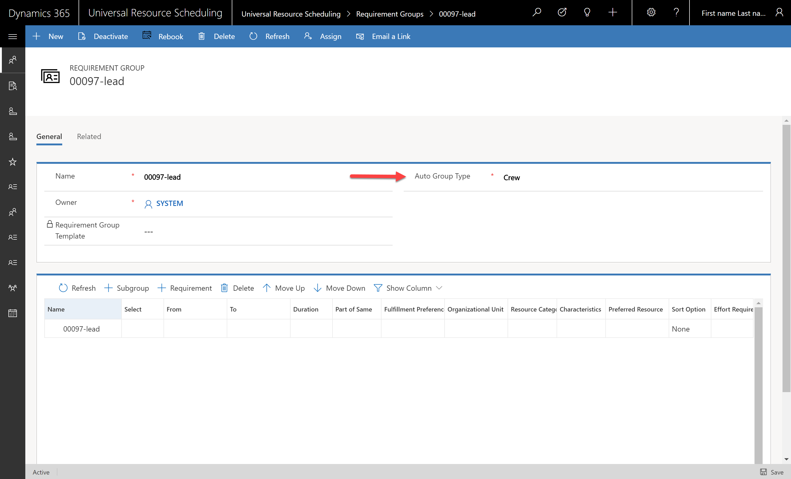

Resource crews allow dispatchers to search and schedule multiple resources at once. Resource crews can include a group of employees, subcontractors, equipment, facilities, or any combination thereof who will perform the same work during a period of time. Crews speed up and simplify the scheduling process and allow team members to work together more consistently.

Crews are ideal for scenarios where:

- a group of resources will work together for some time.
- a crew meets at a location in the morning, shares a vehicle, and is together all day from job to job.
- a new employee is shadowing an experienced co-worker to learn new skills.

**The primary use case** for booking crews is scheduling a requirement group with multiple requirements to multiple resources, though single requirements can be manually scheduled to crews as well.

**Without crews**, dispatchers can schedule the same requirements multiple times manually by using the schedule board (or with the schedule assistant), but that takes more time. If your scenario involves assembling resources together for one job, and then disbanding everyone, crew scheduling isn't applicable.

Scheduling a crew automatically creates bookings for all crew members. Rescheduling bookings will reschedule all crew bookings according to cascading settings on the bookings.

In this article, we'll walk through how to use resource crews.

## Prerequisites

- Field Service v8.0+
- Universal Resource Scheduling v3.0+

## Create a Crew

A crew consists of a bookable resource with the resource type "Crew". The crew resource serves as a container for the crew, and child resources who are the members of the crew for a given time frame.

1. In Field Service or Resource Scheduling, change to the **Resources** area.

1. In the **Resource** section, go to **Resources** and select **New**.

1. Choose **Crew** as the **Resource Type**.

1. Provide a **Name** and choose the **Time Zone** for the crew.

1. Choose a **Crew Strategy**. For more information, go to [Crew strategy options](#crew-strategy-options).

   :::image type="content" source="../../common-scheduler/media/scheduling-crew-header.png" alt-text="Screenshot of a bookable resource set to crew.":::

1. On the **Scheduling** tab, set the **Start Location** and **End Location**. For detailed descriptions of the location options, go to [Set up bookable resources](../../field-service/set-up-bookable-resources.md).

1. Select **Save**.

### Crew strategy options

The crew strategy determines how the crew manages its work. There are three options:

- **Crew Leader Management**: Crew leader manages the work of a crew. Consider this option when a crew is made up of multiple people. You can designate more than one user to be a leader and manage the work.
- **Crew Member Self-Management**: Resources can manage their own work. Choose this option for crews that are made up of users who regularly work together, but may not always work together at the same place or time. Self-management also means better time capturing, which is good for organizations who bill for time spent on work.
- **Cascade and Accept Cascade Completely**: All resources on a crew can manage all the work. It's the ideal option when a crew is made up of one user and the rest of the crew is equipment.

> [!NOTE]
> The logic associated with crew strategies will only impact work order related bookable resource bookings.
>
> Crew strategies affect if and how a crew booking is rescheduled. For instance, if a crew leader's bookings change, all bookings of the crew are moved.

## Add resource children to a crew

Relate other bookable resources to the crew as crew members. If not done already, [create the bookable resources](../../field-service/set-up-bookable-resources.md).

1. Open the Crew resource.

1. Select **Related > Resource's Children**.

1. Select **New Bookable Resource Group**.

1. Choose the **Child Resource** and set the data range when the resource will be part of the crew.

1. Select **Save & Close**.

:::image type="content" source="../../common-scheduler/media/scheduling-crew-resource-children.png" alt-text="Screenshot of child resources of a resource crew.":::

## Work with the crew on the schedule board

Crew members are visualized on the schedule board like any other resource.

Add crews to the schedule board by changing schedule board filters to match the service territory, roles, business unit, characteristics etc. of the crew header. Or, manually add the crew to the board from **Options > Select Resources**.

> [!div class="mx-imgBorder"]
> 

For example, if a schedule board has filters set for a territory, and the crew header resource is part of that territory, it shows on the board. Crews match the filter even if resource children aren't part of that territory.

> [!div class="mx-imgBorder"]
> 

Crew resources have a different visual representation on the schedule board. They use a different icon and the resource count indicates the crew size.

On the hourly list view, you can expand the crew resource to see the members of the crew.

The time range a resource is part of a crew shows as a grey area on the board. It reminds dispatchers and resource managers that the resource is part of a crew.

Keep in mind that booking changes likely has an effect of other bookings of the crew.

Scheduling a job to a resource without the crew will likely affect the crew’s ability to be matched for other jobs.

> [!div class="mx-imgBorder"]
> 

## Manually schedule single requirements to the crew

Assign a single requirement to the crew header resource to create a booking for the entire crew. Bookings won't be created for child resources that aren't working.

Requirement groups can't be manually scheduled to crews. Only single requirements can be manually scheduled.

## Schedule single requirements for the crew with the schedule assistant

When using the schedule assistant, each crew member can appear in results as non-crew individuals. If booked, only that single resource will have a booking. The crew resource can also return in the results if the working hours and other constraints match. If a crew resource is booked though the schedule assistant, all crew members will be booked along with the crew.

## Schedule requirement groups for the crew with the schedule assistant

The primary use case for scheduling crews is when you have a set of requirements that need to be done together. Therefore, a crew, which consists of multiple resources, may be a perfect fit.

The schedule assistant can return suggest a group of individual resources and a crew to complete a requirement group.

> [!div class="mx-imgBorder"]
> 

When the schedule assistant searches, it assembles a group of resources in which there's a relevant resource for every requirement in the requirement group. The crew resource itself is just a container and isn't considered a resource when it comes to matching. Each individual resource needs to match with a requirement in the requirement group.

The ideal scenario would be matching three requirements to a crew of three resources.

If you expand the crew, you'll see that each member of the crew matched with a requirement within the requirement group being scheduled.

When you select and book a crew, the booking for each crew member relates to the requirement that they match. It also relates to the requirement group. The crew resource gets a booking too, which makes it easy to manage the crew as a single unit.

### More crew members than requirements

A crew with more resources than needed by the requirement group will show as a result in the schedule assistant, but lower in the search results because it's less optimal.

For example, the requirement group may have two requirements, but there are no combinations of resources that can be assembled to handle the work. Therefore, a crew of three resources can be presented as an option to book.

Additionally, there's a column called **Excess resources** that shows how choosing this team will book more resources than you need.

When you expand the crew, it separates the resources that aren't matched for any requirement into a separate section called **Non-Matching Resources**. It lets you easily separate the required resources and resources considered extra for that job.

By default, the schedule assistant results are sorted by **Fewest Resources First**, followed by earliest start time. If there are teams that can be assembled for the requirement group that only consist of two resources, the crew won't show until the end of the results.

You can change the sort order in the schedule assistant filter panel by choosing **Earliest Time First**, creating a higher likelihood of seeing a crew with excess resources.

> [!NOTE]
> When you book a team or crew with excess resources, all of the bookings will link to the requirement group, but the bookings for non-matching resources will not have a link to a requirement.

### Fewer crew members than requirements

Sometimes when searching for availability, the crew may need more resources in order to meet the requirements. For example, the crew may have three resources, but the requirement group has four requirements. The crew can be combined with resources outside the crew.

The schedule assistant will combine crews and individual resources to fulfill a requirement group and even note which resources are part of the crew.

## View crews and related bookings on the schedule board

Once a crew has been scheduled, there are scenarios where you may want to drill in and see the entire crew together at once. By default, each resource is still listed individually on the schedule board. If you want to drill into a crew, right-click the crew resource and select **View Crew Resources in Split View**.

The split view divides the schedule board into two boards. The top board is the same board you were on before, and the bottom schedule board shows only the crew and crew members.

> [!div class="mx-imgBorder"]
> 

Filtering only applies to the main schedule board and not the split view.

## Configuration considerations

### Location of crew and crew members

The schedule assistant needs to understand the start and end location of resources when it books onsite requirements for Field Service. Crew member locations are taken from their individual resource profiles and not from the parent crew. It's important that you change the location of the crew member resource if a resource jumps between crews. For example, if you want a crew to meet at a central location in the morning, specify start and end location as organization unit address for the crew header resource *and* the resource children crew members.

### Scheduling single requirements to crews

When a single requirement is booked to a crew, manually or with the schedule assistant, a requirement group is automatically created and all bookings are related to the requirement group. It ensures that crew bookings are in sync when moved/rescheduled/canceled.

However, only the crew header resource is linked to the single requirement in the newly created requirement group.

Additionally, the newly created requirement group is tagged with an **Auto Group Type** of “Crew”.

> [!div class="mx-imgBorder"]
> 

## Known limitations

### Multiday schedule boards not supported for crews

Daily, weekly, and monthly schedule boards don't support crew scenarios.

### Attempting to book a crew multiple times on the same work order

Since crews involve multiple resources working together to complete a job, multi-resource scheduling uses the requirement groups. A crew can't be booked multiple times against the same work order.
