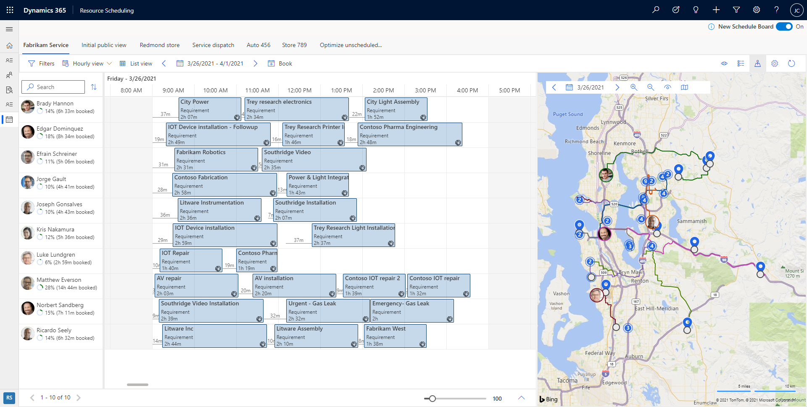
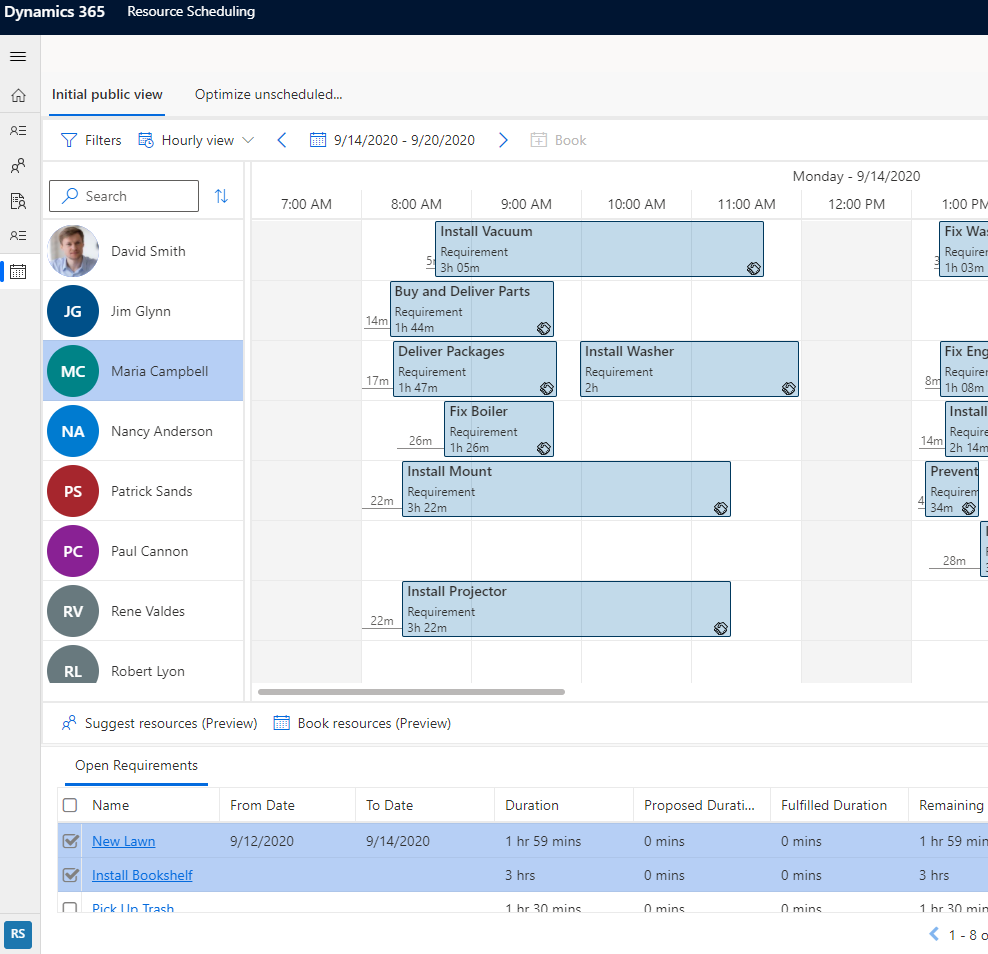

This article discusses the main features and concepts of the schedule board for dispatchers and other users.

:::image type="content" source="../../field-service/media/schedule-board-new.png" alt-text="Screenshot of the new schedule board in Dynamics 365, showing the resources.":::

## Actions area

### Filters

Apply filters to define which resources show on the schedule board. You can [configure the board settings so filters also apply to requirements](../../common-scheduler/schedule-board-tab-settings.md).

Filter values are pulled from the *Bookable Resource* entity.

Select the three dots (**...**) > **Select Resources** to choose a subset of all resources for the schedule board. Applying filters then only filters the selected resources.

To make the applied filter configuration the default for all schedule boards, select **...** > **Save as default**.

Select **Reset to default** to remove all applied filters. The list of selected resources won't reset unless you remove the resources from the selection.

You always have to select **Apply** to see the changes on the schedule board.

### Time scale

Switch between hourly, daily, weekly, and monthly view on the board. Choose the weekly or monthly views to see scheduled jobs at a higher level.

### View type

- **Gantt**: A Gantt chart is a type of bar chart that illustrates a schedule. It is commonly used in show activities displayed against time. Each activity is represented by a bar. The position and length of the bar reflects the start date, duration and end date of the activity.
- **List**: Shows resources in a list. Expanding a resource shows the selected time granularity in the selected time frame. You can change columns in the list.

### Date range

Set the time frame that shows on the board. Use the arrows to move between time frames.

### Book

Book a requirement manually. Select a requirement and a resource, start date/time, end date/time, booking status, and booking method.

### Move bookings

Select (**...**) > **Move bookings** to move bookings of a specific status to a different day. Moving bookings preserves times and other parameters.

### Print schedule board

Select (**...**) > **Print schdedule board** to open the print settings where you can set schedule range, pagination, paper format, and orientation. Select **Print** open the system print options.

## Resource cards

Right-click a resource's name and then choose **View Resource Card** to see more, like the resource's skill set (characteristics) and roles. From here, you can also initiate a message, email, or phone call.

## Map view of requirements and resources

Select the map icon in the upper right of the schedule board to display the resources and requirements on a map.

> [!div class="mx-imgBorder"]
> 

After expanding the map view, select a resource's name to see their route. The numbers indicate the order the resource is scheduled to arrive at each job (requirement) location.

At a zoomed-out view of the map, the requirements and resources are grouped together, and you can see a count of requirements and resources. This count helps you quickly identify a geographical area with more unscheduled jobs, and then start scheduling the jobs to nearest resources. 

You can drag an unscheduled requirement pin from the map to the resource timeline and schedule it to that resource. 

You can also drag the resource route to a nearby unscheduled requirement to schedule it and add it to the resource route. 

## Find availability (schedule assistant)

The schedule assistant is also available in the new schedule board experience. By selecting a booking requirement from the bottom panel, and then **Find availability**, you'll trigger the schedule assistant. 

From the schedule assistant, you'll see available resources and can plan accordingly for the work.

## Move bookings to a new resource, a new start date and time, or both

The new schedule board provides an easy way to reassign and reschedule bookings in the same action. Bookings can be moved to resources on the current schedule board tab or to resources on other schedule board tabs.

### Move a booking to a resource on the current schedule board tab, or change the start date/time, or both

Right-click on a booking and select **Move to**.

Then reassign this booking to any resource on the current schedule board tab, or change the start date and the start time of the booking. 

Select **Update** to apply the changes.

### Move a booking to a resource on a different schedule board tab, or change the start date or time, or both

Right-click on a booking and select **Move to**. Select the filter icon in the resource field and change the filter from *Resources on this tab* to *All resources*.

Now you can reassign this booking to any resource on any tab, and change the start date and start time of the booking. Select **Update** to apply the changes.

## Booking details panel

To see more details about a booking on the schedule board, open the details panel by selecting the details icon, as seen in the following screenshot. 


## Booking alerts panel

To see a list of active booking alerts, select the **Bell** icon, as seen in the following screenshot.

From the booking alerts panel, you can also create a new booking alert, close an existing booking alert, or dismiss all booking alerts. See the following screenshot for reference.

## Full screen mode

Full screen mode on the new schedule board makes it easier for dispatchers and schedulers to focus on the details and make the most of their screen space.

Select the **Expand** icon in the top-right of the new schedule board to enter into full screen mode.

## Get driving directions

From the new schedule board, you can get driving directions for a frontline worker between their last job site to their next job site.

To get driving directions, right-click on the booking, and select **Get driving directions**.

A map view will open, showing directions between the frontline worker's last job site to the next.

You can also get driving directions for a frontline worker's entire day of bookings. Right-click on the resource in the resource list, and select **Get driving directions**.

Select the day for which you'd like to generate driving directions for the selected resource.

A map view will open showing the day's worth of bookings for the selected resource.

## Edit multi-day bookings

Dispatchers can right-click a multi-day booking, select edit and change how many hours are assigned for each day, week, or month. 

## Create a new schedule board tab

To create a new schedule board tab, select the **[+] icon** in the tab list on the schedule board, as seen in the following screenshot.

Fill in the relevant details about your new schedule board tab, and then **Add** when done.

Rearranging schedule board tabs is currently not supported.

## Custom web resource panel

Use the Schedule Board **Client Extension Framework** to add custom web resources to the schedule board, which could be HTML, JavaScript, a custom app built on Power Apps, and so on. 

To see a custom web resource, select the web resource icon in the menu, as seen in the following screenshot.

## Schedule board settings

Use the **Gear icon** to open the schedule board settings panel on the new schedule board.

## Automated Scheduling (Resource Scheduling Optimization)

> [!Note]
> The following features like **suggest resources, book resources, single resource optimization, and optimization goals** are only available for organizations using [Resource Scheduling Optimization](../../field-service/rso-overview.md).

Organizations using [Resource Scheduling Optimization](../../field-service/rso-overview.md) will find more capabilities in the schedule board. 

### Suggest resources

> [!div class="mx-imgBorder"]
> 

Selecting **Suggest resources** will display recommended resources in the right panel for the dispatcher to book.

### Book resources

Selecting **Book resources** will find the most optimal resources and book them without further actions from the dispatcher.

### Single Resource Optimization 

Sometimes you might need to optimize only a single resource's schedule, rather than a set of available resources. Single resource optimization provides a quick way to reoptimize a resource's schedule and travel route after schedule changes have occurred during the day - this functionality is now available on the new schedule board. You can right-click a resource from any schedule board view and select Optimize Schedule.

### Optimization goals

The schedule board supports optimization goals. After selecting suggested resources, dispatchers can edit the optimization goal, which dictates how resources are recommended.

There's a default optimization goal that applies to the entire system and serves as the default for optimization requests. Dispatchers can also edit the default optimization goal for each schedule board. Finally, dispatchers can edit the optimization goal for a single optimization request by selecting **Suggest Resources**. 

### Add new schedule board to custom sitemap area

When using a custom sitemap or an app module, you'll need to update the sitemap to consume the new schedule board preview.

```<SubArea Id="msdyn_ScheduleBoardSubArea" ResourceId="SitemapDesigner.NewSubArea" VectorIcon="$webresource:msdyn_/Icons/SVG/Calendar.svg" Url="/main.aspx?pagetype=entitylist&amp;etn=msdyn_scheduleboardsetting" Client="All,Outlook,OutlookLaptopClient,OutlookWorkstationClient,Web" AvailableOffline="true" PassParams="false" Sku="All,OnPremise,Live,SPLA">```

**URL:**

```/main.aspx?pagetype=entitylist&etn=msdyn_scheduleboardsetting```

**ID:**

```msdyn_scheduleboardtoggle```
